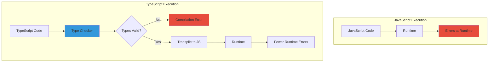
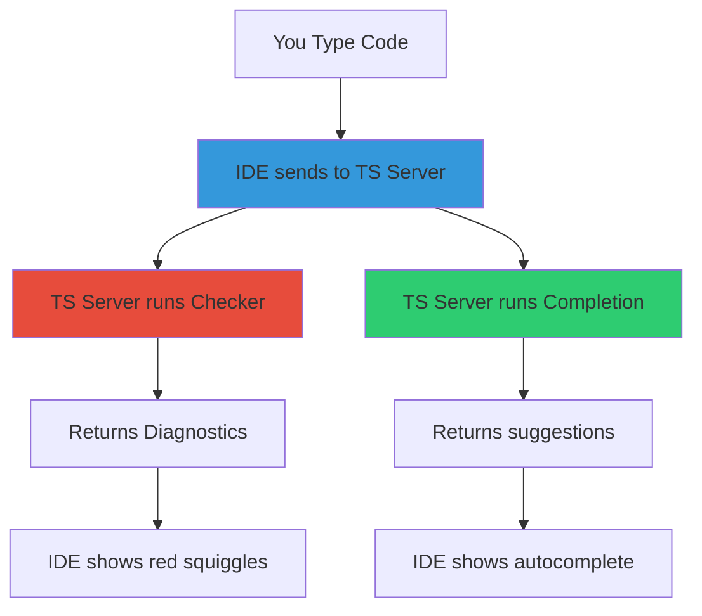

---
---
# TypeScript: Complete Professional Guide

**Static Type Checking for JavaScript**


## TypeScript Fundamentals

### What is TypeScript

TypeScript is a **statically-typed superset of JavaScript** that compiles to plain JavaScript.

**Definition:**

```
TypeScript = JavaScript + Static Type System
```

**Core Properties:**

|Property|Description|
|---|---|
|Superset|All valid JS is valid TS|
|Static typing|Types checked before runtime|
|Transpiled|Converted to JavaScript|
|Optional|Can gradually adopt|
|Tooling|Better IDE support|

### TypeScript vs JavaScript



**Comparison:**

```
JavaScript (Runtime Errors)
━━━━━━━━━━━━━━━━━━━━━━━━━━━━━━━━━━━━━━━━━━━━━━━━━━━━
function add(a, b) {
    return a + b;
}

add(5, "10");        // Returns "510" (string concatenation)
add(5);              // Returns NaN (undefined + number)
add({}, []);         // Returns "[object Object]"

Problems:
- No error until runtime
- Silent type coercion
- Bugs discovered by users


TypeScript (Compile-Time Errors)
━━━━━━━━━━━━━━━━━━━━━━━━━━━━━━━━━━━━━━━━━━━━━━━━━━━━
function add(a: number, b: number): number {
    return a + b;
}

add(5, "10");        // ERROR: Argument type 'string' not assignable
add(5);              // ERROR: Expected 2 arguments, got 1
add({}, []);         // ERROR: Type '{}' not assignable to 'number'

Benefits:
- Errors caught during development
- IDE shows errors immediately
- Bugs found before deployment
```

### What TypeScript Adds

```
┌────────────────────────────────────────────────────────┐
│          TypeScript Additional Features                │
├────────────────────────────────────────────────────────┤
│                                                        │
│  1. Type Annotations                                   │
│     let name: string = "mukul";                        │
│                                                        │
│  2. Interfaces                                         │
│     interface User { name: string; age: number; }      │
│                                                        │
│  3. Type Inference                                     │
│     let count = 5;  // Inferred as number              │
│                                                        │
│  4. Generics                                           │
│     function identity<T>(arg: T): T { return arg; }    │
│                                                        │
│  5. Enums                                              │
│     enum Color { Red, Green, Blue }                    │
│                                                        │
│  6. Type Aliases                                       │
│     type ID = string | number;                         │
│                                                        │
│  7. Union Types                                        │
│     let value: string | number;                        │
│                                                        │
│  8. Intersection Types                                 │
│     type Combined = TypeA & TypeB;                     │
│                                                        │
│  9. Access Modifiers                                   │
│     class Person { private age: number; }              │
│                                                        │
│  10. Decorators (Experimental)                         │
│     @Component class MyComponent {}                    │
│                                                        │
└────────────────────────────────────────────────────────┘
```


## Type System Basics

### Primitive Types

```typescript
// Boolean
let isDone: boolean = false;

// Number
let decimal: number = 6;
let hex: number = 0xf00d;
let binary: number = 0b1010;

// String
let color: string = "blue";
let fullName: string = `Bob Bobbington`;

// Array
let list: number[] = [1, 2, 3];
let list2: Array<number> = [1, 2, 3];

// Tuple (fixed length, typed array)
let x: [string, number] = ["hello", 10];

// Enum
enum Color {
    Red,
    Green,
    Blue
}
let c: Color = Color.Green;

// Any (opt-out of type checking)
let notSure: any = 4;
notSure = "maybe a string";

// Unknown (type-safe 'any')
let uncertain: unknown = 4;
// uncertain.toFixed();  // ERROR: Must check type first
if (typeof uncertain === "number") {
    uncertain.toFixed();  // OK
}

// Void (no return value)
function warnUser(): void {
    console.log("Warning!");
}

// Null and Undefined
let u: undefined = undefined;
let n: null = null;

// Never (never returns)
function error(message: string): never {
    throw new Error(message);
}
```

### Type Inference

```typescript
// TypeScript infers types automatically
let num = 5;           // Inferred as number
let str = "hello";     // Inferred as string
let arr = [1, 2, 3];   // Inferred as number[]

// No need to annotate obvious types
let x = 10;            // number
let y = x + 5;         // number (inferred from x)

// Function return type inferred
function add(a: number, b: number) {
    return a + b;      // Inferred as number
}
```

### Union and Intersection Types

```typescript
// Union: can be one of several types
let value: string | number;
value = "hello";  // OK
value = 42;       // OK
value = true;     // ERROR

// Intersection: combines multiple types
interface Person {
    name: string;
}

interface Employee {
    employeeId: number;
}

type Worker = Person & Employee;

const worker: Worker = {
    name: "John",
    employeeId: 123
};
```

### Interfaces vs Type Aliases

```typescript
// Interface
interface User {
    name: string;
    age: number;
}

// Type alias
type User2 = {
    name: string;
    age: number;
};

// Both work similarly, but interfaces can be extended
interface Admin extends User {
    role: string;
}

// Type aliases support unions
type ID = string | number;
```


## Abstract Syntax Tree

### What is an AST

An Abstract Syntax Tree represents code structure as a tree of nodes.

**Example code:**

```typescript
function add(a: number, b: number) {
    return a + b;
}
```

**AST representation:**

```
Program
└── FunctionDeclaration
    ├── Identifier: "add"
    ├── Parameters
    │   ├── Parameter
    │   │   ├── Identifier: "a"
    │   │   └── TypeAnnotation: NumberKeyword
    │   └── Parameter
    │       ├── Identifier: "b"
    │       └── TypeAnnotation: NumberKeyword
    ├── ReturnType: (inferred)
    └── Block
        └── ReturnStatement
            └── BinaryExpression
                ├── Left: Identifier("a")
                ├── Operator: "+"
                └── Right: Identifier("b")
```

### AST vs Parser Diagnostic

```
┌────────────────────────────────────────────────────────┐
│              AST vs Parse Diagnostics                  │
├────────────────────────────────────────────────────────┤
│                                                        │
│  AST (Abstract Syntax Tree)                            │
│  ─────────────────────────────                         │
│  - Represents valid code structure                     │
│  - Used for type checking                              │
│  - Used for code generation                            │
│  - Created by parser                                   │
│                                                        │
│  Parser Diagnostics                                    │
│  ──────────────────────                                │
│  - Syntax errors detected                              │
│  - Position information                                │
│  - Error messages                                      │
│  - Recovery strategies                                 │
│                                                        │
│  Example:                                              │
│                                                        │
│  Code: function add(a: number                          │
│                      ^                                 │
│  Parser Diagnostic:                                    │
│  - Error: Expected ')'                                 │
│  - Location: Line 1, Column 23                         │
│  - Suggestion: Add missing parenthesis                 │
│                                                        │
│  Parser still attempts to build AST with errors        │
│  to enable IDE features on incomplete code             │
│                                                        │
└────────────────────────────────────────────────────────┘
```

### Short Circuiting in Parsing

```typescript
// Short-circuit evaluation example
function example() {
    const result = null && null.property;
    // TypeScript short-circuits type checking here
    // Knows null.property won't execute
}

/*
Parser short-circuiting:

1. Parse "null"
2. See "&&" operator
3. Know right side won't execute if left is falsy
4. Don't error on null.property access
5. This is semantic analysis, not syntax error

Contrast with:
*/

const value = null.property;
// ERROR: Cannot read property of null

/*
Why different?

null && null.property
- Short-circuit: right side conditional
- Type checker allows this pattern

null.property
- Direct access: will always error
- Type checker prevents this
*/
```


## IDE Integration

### How IDEs Use TypeScript



**Architecture:**

```
┌────────────────────────────────────────────────────────┐
│           TypeScript Language Server                   │
├────────────────────────────────────────────────────────┤
│                                                        │
│  IDE (VS Code, WebStorm, etc)                          │
│     │                                                  │
│     ├─→ Language Server Protocol (LSP)                 │
│     │                                                  │
│     ├─→ TypeScript Server (tsserver)                   │
│         │                                              │
│         ├─→ Parser: Creates AST                        │
│         ├─→ Binder: Builds symbol table                │
│         ├─→ Checker: Validates types                   │
│         │   └─→ Returns errors to IDE                  │
│         │                                              │
│         ├─→ Completion Provider                        │
│         │   └─→ Suggests available symbols             │
│         │                                              │
│         ├─→ Definition Provider                        │
│         │   └─→ Jumps to symbol definition             │
│         │                                              │
│         └─→ Rename Provider                            │
│             └─→ Renames symbol everywhere              │
│                                                        │
└────────────────────────────────────────────────────────┘
```

**Real-time checking:**

```typescript
// As you type...
function add(a: number, b: number) {
    return a + b;
}

add(5, "10")
//      ^^^^ IDE shows error immediately
//           without saving file

/*
How it works:

1. You type: add(5, "
2. IDE sends current buffer to tsserver
3. Parser creates AST (even with incomplete code)
4. Checker validates types
5. Checker finds type error
6. tsserver sends diagnostic to IDE
7. IDE shows red squiggle
8. All in ~50ms
*/
```

**Built-in checker usage:**

```typescript
// When you request autocomplete (Ctrl+Space)
const user = {
    name: "John",
    age: 30
};

user.
//   ^ IDE shows: name, age, toString, valueOf, etc

/*
How autocomplete works:

1. User types "user."
2. IDE sends: getCompletionsAtPosition
3. Checker looks up "user" in symbol table
4. Retrieves type information: { name: string, age: number }
5. Adds Object.prototype members
6. Returns completion list
7. IDE displays suggestions
*/
```


## Setup Guide

### Basic TypeScript Setup

**1. Install TypeScript:**

```bash
# Global installation
npm install -g typescript

# Project installation (recommended)
npm install --save-dev typescript

# Verify installation
tsc --version
```

**2. Initialize TypeScript project:**

```bash
# Create tsconfig.json
tsc --init

# Or manually create
mkdir my-ts-project
cd my-ts-project
npm init -y
npm install --save-dev typescript @types/node
```

**3. Configure tsconfig.json:**

```json
{
  "compilerOptions": {
    "target": "ES2022",
    "module": "commonjs",
    "lib": ["ES2022"],
    "outDir": "./dist",
    "rootDir": "./src",
    "strict": true,
    "esModuleInterop": true,
    "skipLibCheck": true,
    "forceConsistentCasingInFileNames": true,
    "resolveJsonModule": true,
    "declaration": true,
    "declarationMap": true,
    "sourceMap": true,
    "removeComments": true
  },
  "include": ["src/**/*"],
  "exclude": ["node_modules", "dist"]
}
```

**4. Project structure:**

```
my-ts-project/
├── src/
│   ├── index.ts
│   └── utils.ts
├── dist/               # Generated by tsc
├── node_modules/
├── package.json
├── tsconfig.json
└── .gitignore
```

**5. Create source files:**

```typescript
// src/index.ts
import { greet } from './utils';

const name: string = "Mukul";
console.log(greet(name));
```

```typescript
// src/utils.ts
export function greet(name: string): string {
    return `Hello, ${name}!`;
}
```

**6. Compile and run:**

```bash
# Compile
tsc

# Run
node dist/index.js

# Or watch mode
tsc --watch
```

### Setup with Node.js

**Using ts-node:**

```bash
# Install
npm install --save-dev ts-node

# Run directly
npx ts-node src/index.ts

# Add to package.json scripts
{
  "scripts": {
    "dev": "ts-node src/index.ts",
    "build": "tsc",
    "start": "node dist/index.js"
  }
}
```

**Using tsx (recommended):**

```bash
# Install
npm install --save-dev tsx

# Run
npx tsx src/index.ts

# Package.json scripts
{
  "scripts": {
    "dev": "tsx watch src/index.ts",
    "build": "tsc",
    "start": "node dist/index.js"
  }
}
```

### Setup with Bun

```bash
# Install Bun
curl -fsSL https://bun.sh/install | bash

# Initialize project
bun init

# Run TypeScript directly
bun run src/index.ts

# Install dependencies
bun add package-name

# Build
bun build src/index.ts --outdir ./dist

# Package.json scripts
{
  "scripts": {
    "dev": "bun run src/index.ts",
    "build": "bun build src/index.ts --outdir ./dist",
    "start": "bun run dist/index.js"
  }
}
```

### Production Configuration

```json
// tsconfig.json (production)
{
  "compilerOptions": {
    "target": "ES2022",
    "module": "commonjs",
    "outDir": "./dist",
    "rootDir": "./src",
    
    // Strict checking
    "strict": true,
    "noUnusedLocals": true,
    "noUnusedParameters": true,
    "noImplicitReturns": true,
    "noFallthroughCasesInSwitch": true,
    
    // Output options
    "declaration": true,
    "sourceMap": false,
    "removeComments": true,
    "importHelpers": true,
    
    // Interop
    "esModuleInterop": true,
    "allowSyntheticDefaultImports": true,
    "forceConsistentCasingInFileNames": true,
    
    // Skip type checking of declaration files
    "skipLibCheck": true
  },
  "include": ["src/**/*"],
  "exclude": ["node_modules", "dist", "**/*.test.ts"]
}
```

### ESLint & Prettier Setup

```bash
# Install
npm install --save-dev eslint @typescript-eslint/parser @typescript-eslint/eslint-plugin prettier eslint-config-prettier

# Initialize ESLint
npx eslint --init
```

**.eslintrc.json:**

```json
{
  "parser": "@typescript-eslint/parser",
  "extends": [
    "eslint:recommended",
    "plugin:@typescript-eslint/recommended",
    "prettier"
  ],
  "plugins": ["@typescript-eslint"],
  "env": {
    "node": true,
    "es6": true
  },
  "rules": {
    "@typescript-eslint/explicit-function-return-type": "error",
    "@typescript-eslint/no-explicit-any": "error",
    "@typescript-eslint/no-unused-vars": "error"
  }
}
```

**.prettierrc:**

```json
{
  "semi": true,
  "trailingComma": "es5",
  "singleQuote": true,
  "printWidth": 80,
  "tabWidth": 2
}
```


## Summary

### Key Concepts

**What TypeScript is:**

- JavaScript with static types
- Transpiled, not compiled (traditional sense)
- Types erased at runtime
- IDE integration for better DX

**Compilation pipeline:**

1. Lexer: Source → Tokens
2. Parser: Tokens → AST
3. Binder: AST → Symbol Table
4. Checker: Validate types
5. Emitter: Generate JavaScript

**Runtime limitations:**

- No type checking at runtime
- All types erased in output
- Need runtime validation for external data
- Can bypass type system with `any`

**Execution:**

- Node.js: Requires transpilation (tsc/ts-node/tsx)
- Bun: Native TS support, faster
- Both produce same JavaScript
- Type checking separate from execution

**Best practices:**

- Use strict mode
- Avoid `any`
- Validate external data at runtime
- Type your functions explicitly
- Use ESLint for code quality
