---
---


## Table of Contents

1. [IP Addressing & Types](https://claude.ai/chat/2bb45d7a-775d-4e65-b19f-b464be367530#ip-addressing--types)
2. [DHCP (Dynamic Host Configuration Protocol)](https://claude.ai/chat/2bb45d7a-775d-4e65-b19f-b464be367530#dhcp-dynamic-host-configuration-protocol)
3. [NAT (Network Address Translation)](https://claude.ai/chat/2bb45d7a-775d-4e65-b19f-b464be367530#nat-network-address-translation)
4. [Ports & Port Forwarding](https://claude.ai/chat/2bb45d7a-775d-4e65-b19f-b464be367530#ports--port-forwarding)
5. [ISP (Internet Service Provider)](https://claude.ai/chat/2bb45d7a-775d-4e65-b19f-b464be367530#isp-internet-service-provider)
6. [Network Types: LAN, MAN, WAN](https://claude.ai/chat/2bb45d7a-775d-4e65-b19f-b464be367530#network-types-lan-man-wan)
7. [SONET & Frame Relay](https://claude.ai/chat/2bb45d7a-775d-4e65-b19f-b464be367530#sonet--frame-relay)
8. [Network Devices: Modems & Routers](https://claude.ai/chat/2bb45d7a-775d-4e65-b19f-b464be367530#network-devices-modems--routers)
9. [Network Topologies](https://claude.ai/chat/2bb45d7a-775d-4e65-b19f-b464be367530#network-topologies)
10. [OSI Model (7 Layers)](https://claude.ai/chat/2bb45d7a-775d-4e65-b19f-b464be367530#osi-model-7-layers)
11. [Transport Layer Protocols: TCP vs UDP](https://claude.ai/chat/2bb45d7a-775d-4e65-b19f-b464be367530#transport-layer-protocols-tcp-vs-udp)
12. [Packets, Subnets & Addressing](https://claude.ai/chat/2bb45d7a-775d-4e65-b19f-b464be367530#packets-subnets--addressing)
13. [IPv4 vs IPv6](https://claude.ai/chat/2bb45d7a-775d-4e65-b19f-b464be367530#ipv4-vs-ipv6)


## DHCP (Dynamic Host Configuration Protocol)

DHCP automates the assignment of IP addresses and network configuration parameters to devices on a network.

### DHCP Process (DORA)

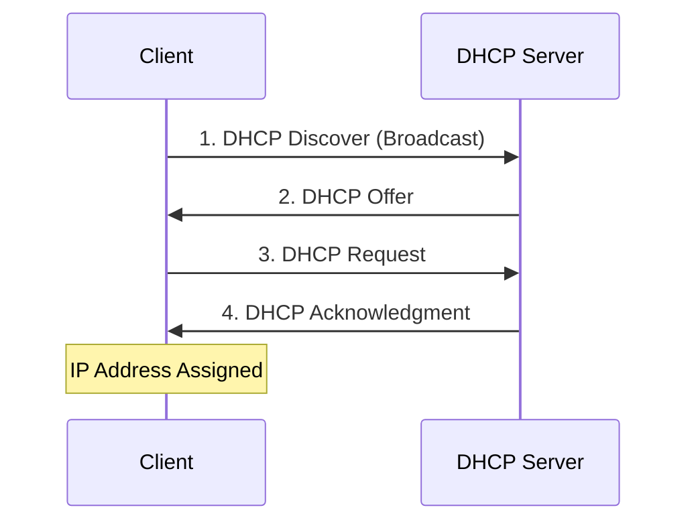

### DHCP Components

|Component|Description|
|---|---|
|**DHCP Server**|Manages IP address pool and assigns addresses|
|**DHCP Client**|Device requesting network configuration|
|**IP Address Pool**|Range of available IP addresses|
|**Lease Time**|Duration for which IP is assigned|
|**Scope**|Range of IPs available for distribution|

### Configuration Parameters Provided by DHCP

- IP Address
- Subnet Mask
- Default Gateway
- DNS Server addresses
- Domain Name
- Lease Duration

### DevOps Relevance

In cloud environments (AWS, Azure, GCP), DHCP is managed by the cloud provider's VPC. In on-premise infrastructure automation (Ansible, Terraform), understanding DHCP is essential for network provisioning.


## Ports & Port Forwarding

**Ports** are virtual endpoints for network communication, allowing multiple services to run on a single IP address.

### Port Ranges

|Range|Type|Usage|
|---|---|---|
|**0-1023**|Well-Known Ports|System/privileged services (HTTP:80, HTTPS:443, SSH:22)|
|**1024-49151**|Registered Ports|User/application services (MySQL:3306, PostgreSQL:5432)|
|**49152-65535**|Dynamic/Private|Temporary client-side ports|

### Common Ports for DevOps

|Service|Port|Protocol|Description|
|---|---|---|---|
|SSH|22|TCP|Secure Shell access|
|HTTP|80|TCP|Web traffic|
|HTTPS|443|TCP|Secure web traffic|
|DNS|53|UDP/TCP|Domain Name System|
|SMTP|25|TCP|Email sending|
|MySQL|3306|TCP|Database|
|PostgreSQL|5432|TCP|Database|
|MongoDB|27017|TCP|NoSQL Database|
|Redis|6379|TCP|Cache/Data store|
|Elasticsearch|9200|TCP|Search engine|
|Kubernetes API|6443|TCP|K8s control plane|
|Docker|2375/2376|TCP|Docker daemon|
|Jenkins|8080|TCP|CI/CD|
|Prometheus|9090|TCP|Monitoring|
|Grafana|3000|TCP|Visualization|

### Port Forwarding

Port forwarding redirects traffic from one port to another, often used to expose internal services.

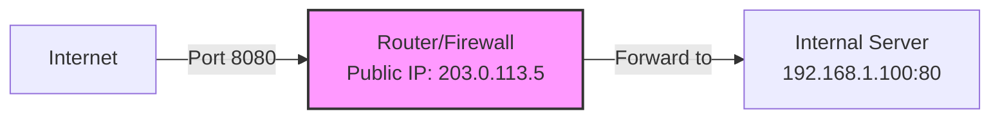

### DevOps Application

Configuring security groups (AWS), Network Security Groups (Azure), or firewall rules requires deep understanding of ports. Kubernetes Services use port mapping extensively.


## Network Types: LAN, MAN, WAN

### Comparison Table

|Feature|LAN|MAN|WAN|
|---|---|---|---|
|**Full Form**|Local Area Network|Metropolitan Area Network|Wide Area Network|
|**Coverage**|Single building/campus|City or large campus|Countries/continents|
|**Range**|Up to 1-2 km|5-50 km|Unlimited|
|**Speed**|100 Mbps - 10 Gbps+|10 Mbps - 1 Gbps|1 Mbps - 100 Gbps|
|**Ownership**|Private (organization)|Private/Public|Service provider|
|**Technology**|Ethernet, Wi-Fi|Fiber optics, WiMAX|MPLS, Leased lines, Internet|
|**Latency**|Very Low (<1ms)|Low (1-10ms)|Variable (10-500ms+)|
|**Cost**|Low|Medium|High|
|**Example**|Office network|City-wide cable network|Internet, Corporate WAN|

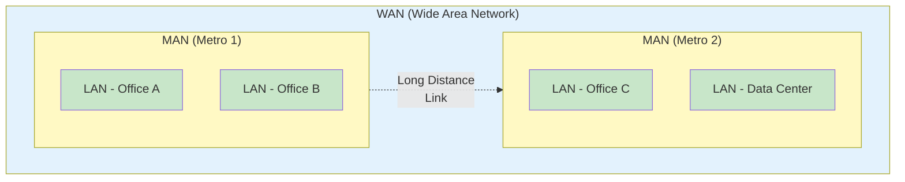

### DevOps Context

- **LAN**: Container networks, Kubernetes pod networks
- **MAN**: Multi-datacenter setups in the same city
- **WAN**: Multi-region cloud deployments, hybrid cloud architectures


## Network Devices: Modems & Routers

### Modem (Modulator-Demodulator)

Converts digital signals to analog (and vice versa) for transmission over phone lines, cable, or fiber.

**Types:**

- **DSL Modem**: Uses telephone lines
- **Cable Modem**: Uses coaxial cable
- **Fiber Modem (ONT)**: Optical Network Terminal for fiber connections
- **Wireless Modem**: Cellular (4G/5G) connections

### Router

Routes data packets between networks, determines the best path for data transmission.

**Functions:**

- Packet forwarding
- Routing table management
- NAT implementation
- Firewall capabilities
- DHCP server
- QoS (Quality of Service)

### Comparison

|Feature|Modem|Router|
|---|---|---|
|**Primary Function**|Signal conversion|Packet routing|
|**OSI Layer**|Layer 1-2 (Physical/Data Link)|Layer 3 (Network)|
|**Connects**|Network to ISP|Multiple devices to network|
|**IP Assignment**|Single public IP|Manages multiple private IPs|
|**Network Creation**|No|Yes (creates LAN)|

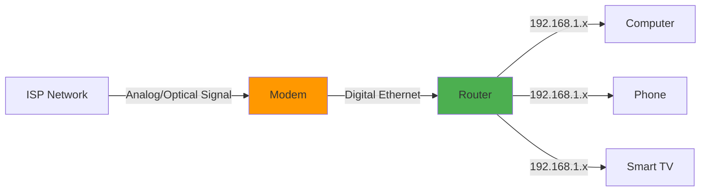

### Modern Context

In cloud environments, software-defined routers (like AWS Transit Gateway, Azure Virtual WAN) replace physical routers. Understanding routing principles remains crucial.


## OSI Model (7 Layers)

The OSI (Open Systems Interconnection) model is a conceptual framework for understanding network communication.

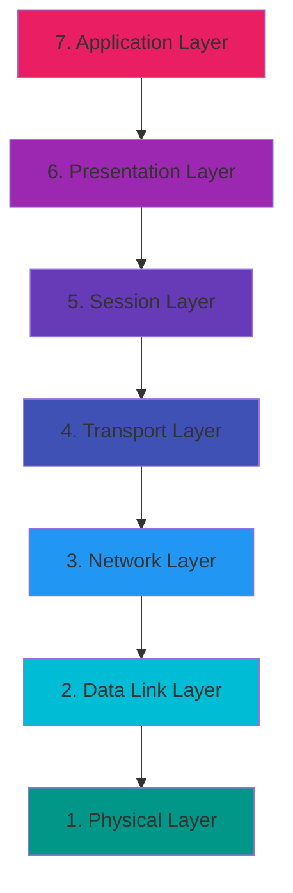

### Layer-by-Layer Breakdown


### Layer 6: Presentation Layer

**Function:** Data translation, encryption, compression.

**Responsibilities:**

- Character encoding (ASCII, Unicode)
- Data encryption/decryption (SSL/TLS)
- Data compression
- Format conversion (JPEG, GIF, MPEG)

**Protocols/Standards:**

- SSL/TLS
- MIME
- ASCII, EBCDIC
- JPEG, GIF, PNG

**Data Unit:** Data

**DevOps Relevance:** SSL/TLS certificates for HTTPS, data serialization formats (JSON, XML, Protocol Buffers).
- **Encryption**: Secures data confidentiality using **symmetric algorithms** like **AES** (e.g., AES-128 or AES-256) during data transfer. 
    
- **Key Exchange**: Uses **asymmetric encryption** (e.g., RSA, ECC) to securely exchange the symmetric key. 
    
- **Hashing (e.g., SHA-256)**: Ensures **data integrity** and **authenticates certificates**, but **does not encrypt data**.


### Layer 4: Transport Layer

**Function:** Reliable data transfer, flow control, error recovery.

**Key Protocols:**

#### TCP (Transmission Control Protocol)

- Connection-oriented
- Reliable delivery
- Ordered packets
- Flow control
- Error checking

#### UDP (User Datagram Protocol)

- Connectionless
- Unreliable (no delivery guarantee)
- No ordering
- Faster than TCP
- Minimal overhead

**Port Numbers:** Identifies applications (0-65535)

**Data Unit:** Segment (TCP) / Datagram (UDP)

**Sublayers:** None at this layer

**Key Concepts:**

**TCP Three-Way Handshake:**

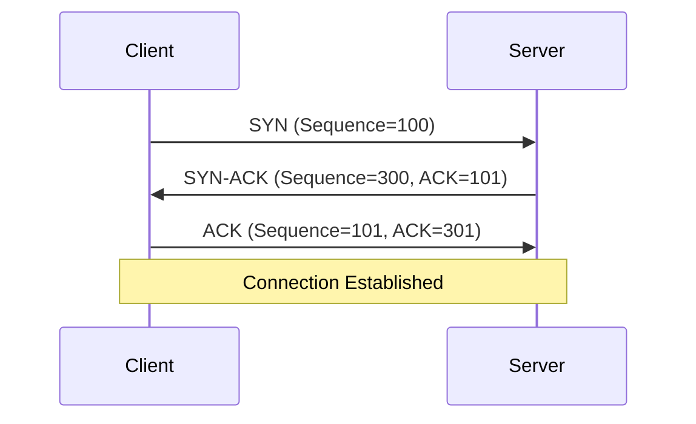

**Checksum:** Error detection mechanism

- Computed at sender
- Verified at receiver
- Detects corrupted data in transit

**Flow Control:** Window size management to prevent overwhelming receiver

**DevOps Tools:**

- netcat (nc)
- telnet
- tcpdump (packet analysis)
- Load balancers (operate at L4)


### Layer 2: Data Link Layer

**Function:** Node-to-node data transfer, physical addressing (MAC), error detection.

**Sublayers:**

#### 1. LLC (Logical Link Control)

- Flow control
- Error control
- Framing
- Protocol multiplexing

#### 2. MAC (Media Access Control)

- Physical addressing (MAC addresses)
- Channel access control
- Frame transmission/reception

**Protocols:**

- **Ethernet (IEEE 802.3)**
- **Wi-Fi (IEEE 802.11)**
- **PPP (Point-to-Point Protocol)**
- **ARP (Address Resolution Protocol)** - Maps IP to MAC
- **Spanning Tree Protocol (STP)**
- **VLAN (IEEE 802.1Q)**

**Data Unit:** Frame

**Devices:**

- **Switch** (primary device) Multi Port Bridge 
- **Bridge**:- A Repeator 
- **NIC (Network Interface Card)**

**MAC Address:**

- 48-bit address (6 bytes)
- Unique hardware identifier
- Format: `00:1A:2B:3C:4D:5E`
- First 3 bytes: OUI (Organizationally Unique Identifier)
- Last 3 bytes: Device-specific

**Ethernet Frame Structure:**

```
+----------+-------------+----------+----------+--------+-----+
| Preamble | Destination | Source   | Type/    | Data   | FCS |
| (7 bytes)| MAC (6)     | MAC (6)  | Length   |(46-1500| (4) |
+----------+-------------+----------+----------+--------+-----+

FCS = Frame Check Sequence (CRC for error detection)
```

**ARP (Address Resolution Protocol):** Maps IP addresses to MAC addresses within a LAN.

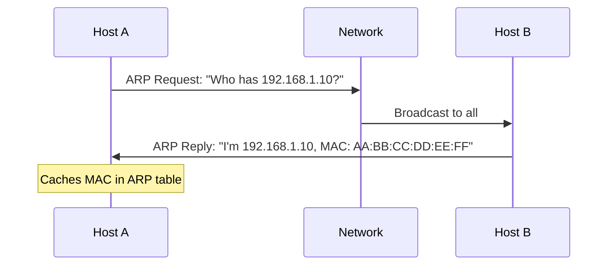

**VLAN (Virtual LAN):** Segments a physical network into multiple logical networks.

**DevOps Context:**

- Docker bridge networks use Layer 2
- Kubernetes uses virtual Ethernet pairs
- VLAN tagging in data centers
- Switch configuration in bare-metal provisioning

**Commands:**

```bash
# View MAC address
ip link show
ifconfig

# View ARP cache
arp -a
ip neigh show

# View switch MAC address table (on switch)
show mac address-table
```


### OSI Model Summary Table

|Layer|Name|Data Unit|Key Function|Protocols|Devices|DevOps Relevance|
|---|---|---|---|---|---|---|
|7|Application|Data|User interface, application services|HTTP, SSH, DNS, SMTP|-|APIs, web services, monitoring|
|6|Presentation|Data|Data formatting, encryption|SSL/TLS, MIME|-|Certificate management|
|5|Session|Data|Session management|NetBIOS, RPC|-|Connection pooling|
|4|Transport|Segment/Datagram|Reliable delivery, ports|TCP, UDP|-|Load balancing, microservices|
|3|Network|Packet|Routing, logical addressing|IP, ICMP, OSPF, BGP|Router|VPC routing, VPNs|
|2|Data Link|Frame|Physical addressing, switching|Ethernet, ARP, VLAN|Switch, Bridge|Container networking|
|1|Physical|Bits|Physical transmission|Ethernet, Fiber|Hub, Cables|Infrastructure setup|


## Packets, Subnets & Addressing

### What is a Packet?

A **packet** is a formatted unit of data carried by a network. It contains both header information and payload data.

**Generic Packet Structure:**

```
+------------------+----------------------+
|     Headers      |       Payload        |
+------------------+----------------------+
| Layer 3 (IP)     |                      |
| Layer 4 (TCP/UDP)|    Application Data  |
| Layer 2 (Ethernet)|                      |
+------------------+----------------------+
```

**Encapsulation Process:**

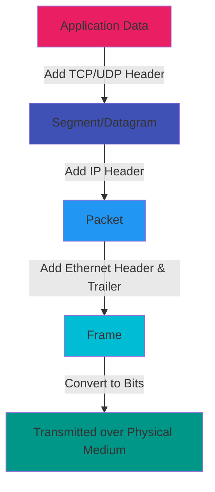

**Example: HTTP Request Packet**

```
[Ethernet Header: Src MAC | Dst MAC | Type]
  [IP Header: Src IP: 192.168.1.10 | Dst IP: 93.184.216.34 | Protocol: TCP]
    [TCP Header: Src Port: 54321 | Dst Port: 80 | Flags: PSH,ACK]
      [HTTP Data: GET /index.html HTTP/1.1...]
[Ethernet Trailer: FCS]
```

### Subnet Mask

A **subnet mask** divides an IP address into network and host portions, defining which portion identifies the network and which identifies the host.

**Purpose:**

- Network segmentation
- Efficient IP address allocation
- Routing optimization
- Security boundaries

**Subnet Mask Formats:**

```
Dotted Decimal: 255.255.255.0
Binary: 11111111.11111111.11111111.00000000
CIDR Notation: /24 (24 bits for network, 8 bits for hosts)
```

**Subnet Calculation Example:**

```
IP Address:    192.168.1.100
Subnet Mask:   255.255.255.0 (/24)

Binary Representation:
IP:            11000000.10101000.00000001.01100100
Mask:          11111111.11111111.11111111.00000000
               ─────────────────────────── ────────
Network Portion (24 bits)                  Host (8 bits)

Network Address:    192.168.1.0
Broadcast Address:  192.168.1.255
Usable Host Range:  192.168.1.1 - 192.168.1.254
Total Hosts:        256 (254 usable, 2 reserved)
```

**Common Subnet Masks:**

|CIDR|Subnet Mask|Hosts|Networks|Use Case|
|---|---|---|---|---|
|/8|255.0.0.0|16,777,214|126|Class A, very large|
|/16|255.255.0.0|65,534|16,384|Class B, large org|
|/24|255.255.255.0|254|2,097,152|Class C, typical LAN|
|/25|255.255.255.128|126|-|Small segments|
|/26|255.255.255.192|62|-|Department networks|
|/27|255.255.255.224|30|-|Small teams|
|/28|255.255.255.240|14|-|Tiny segments|
|/30|255.255.255.252|2|-|Point-to-point links|
|/32|255.255.255.255|1|-|Single host|

**VLSM (Variable Length Subnet Masking):** Allows different subnet masks within the same network for efficient IP utilization.

**Example:**

```
Organization has 192.168.1.0/24

Department A needs 100 hosts: 192.168.1.0/25 (126 hosts)
Department B needs 50 hosts:  192.168.1.128/26 (62 hosts)
Department C needs 20 hosts:  192.168.1.192/27 (30 hosts)
Point-to-point link:          192.168.1.224/30 (2 hosts)
```

### Logical Address (IP Address)

A **logical address** is a Layer 3 (Network Layer) address assigned to a device, typically an IPv4 or IPv6 address.

**Characteristics:**

- Assigned by administrator or DHCP
- Can change (especially with DHCP)
- Routable across networks
- Hierarchical structure (network + host)
- Used for end-to-end communication

**IPv4 Address Classes:**

|Class|Range|Default Mask|Networks|Hosts/Network|Usage|
|---|---|---|---|---|---|
|A|1.0.0.0 - 126.255.255.255|/8|126|16,777,214|Large organizations|
|B|128.0.0.0 - 191.255.255.255|/16|16,384|65,534|Medium organizations|
|C|192.0.0.0 - 223.255.255.255|/24|2,097,152|254|Small organizations|
|D|224.0.0.0 - 239.255.255.255|-|-|-|Multicast|
|E|240.0.0.0 - 255.255.255.255|-|-|-|Reserved/Experimental|

**Special IP Addresses:**

|Address|Purpose|
|---|---|
|0.0.0.0|Unspecified address|
|127.0.0.1|Loopback (localhost)|
|169.254.0.0/16|APIPA (Automatic Private IP Addressing)|
|255.255.255.255|Broadcast (all hosts)|
|Network Address|First IP in subnet (e.g., 192.168.1.0)|
|Broadcast Address|Last IP in subnet (e.g., 192.168.1.255)|

### MAC Address (Physical Address)

A **MAC (Media Access Control) address** is a Layer 2 (Data Link Layer) unique hardware identifier.

**Characteristics:**

- 48-bit address (6 bytes)
- Burned into NIC (Network Interface Card)
- Permanent (generally)
- Not routable (local segment only)
- Format: `XX:XX:XX:XX:XX:XX` or `XX-XX-XX-XX-XX-XX`

**Structure:**

```
MAC Address: 00:1A:2B:3C:4D:5E
             └─┬─┘ └────┬────┘
               │         │
               │         └─ Device Unique Identifier
               │
               └─ OUI (Organizationally Unique Identifier)
                  Assigned to manufacturer by IEEE
```

**Example Manufacturers:**

- `00:1A:2B` - Cisco
- `00:50:56` - VMware
- `08:00:27` - VirtualBox

**MAC Address Types:**

|Type|Description|Example|
|---|---|---|
|Unicast|Single destination|00:1A:2B:3C:4D:5E|
|Multicast|Group of devices|01:00:5E:xx:xx:xx|
|Broadcast|All devices on segment|FF:FF:FF:FF:FF:FF|

### Logical vs Physical Address Comparison

|Feature|Logical (IP) Address|Physical (MAC) Address|
|---|---|---|
|**Layer**|Layer 3 (Network)|Layer 2 (Data Link)|
|**Length**|32-bit (IPv4) or 128-bit (IPv6)|48-bit|
|**Assignment**|Dynamic (DHCP) or Static|Manufacturer (burned-in)|
|**Scope**|Global (routable)|Local (segment-only)|
|**Changeability**|Can change|Generally permanent|
|**Format**|192.168.1.10 or 2001:db8::1|00:1A:2B:3C:4D:5E|
|**Purpose**|End-to-end routing|Hop-to-hop delivery|
|**Used by**|Routers|Switches|

### Address Resolution Flow

```mermaid
sequenceDiagram
    participant Host A<br/>IP: 192.168.1.10<br/>MAC: AA:BB:CC:DD:EE:FF
    participant Switch
    participant Router<br/>IP: 192.168.1.1<br/>MAC: 11:22:33:44:55:66
    participant Internet
    
    Note over Host A: Wants to reach 8.8.8.8
    Host A->>Host A: Is 8.8.8.8 in my subnet? No
    Host A->>Host A: Need MAC of default gateway (192.168.1.1)
    Host A->>Switch: ARP: "Who has 192.168.1.1?"
    Switch->>Router: Forward ARP request
    Router->>Switch: ARP Reply: "I'm 192.168.1.1, MAC: 11:22:33:44:55:66"
    Switch->>Host A: Forward ARP reply
    Host A->>Router: Ethernet Frame<br/>Dst MAC: 11:22:33:44:55:66<br/>IP Packet to 8.8.8.8
    Router->>Internet: Routes packet with new Ethernet header
```

### DevOps Subnetting Example

**AWS VPC Subnet Design:**

```
VPC: 10.0.0.0/16 (65,536 IPs)

├─ Public Subnet 1 (AZ-1):  10.0.1.0/24  (256 IPs) - Web servers
├─ Public Subnet 2 (AZ-2):  10.0.2.0/24  (256 IPs) - Web servers
├─ Private Subnet 1 (AZ-1): 10.0.11.0/24 (256 IPs) - App servers
├─ Private Subnet 2 (AZ-2): 10.0.12.0/24 (256 IPs) - App servers
├─ Database Subnet 1 (AZ-1): 10.0.21.0/24 (256 IPs) - RDS
├─ Database Subnet 2 (AZ-2): 10.0.22.0/24 (256 IPs) - RDS
└─ Reserved for future use: 10.0.100.0/22 (1,024 IPs)
```

**Kubernetes Pod CIDR:**

```
Node 1: 10.244.1.0/24 (254 pods)
Node 2: 10.244.2.0/24 (254 pods)
Node 3: 10.244.3.0/24 (254 pods)
Service CIDR: 10.96.0.0/12
```


## Complete Data Flow: How Data Travels Across the Internet

### End-to-End Communication Flow

This diagram shows how data flows from one person to another across the internet, traversing through multiple layers and devices.

```mermaid
graph TB
    subgraph User_A["👤 User A (Sender)<br/>IP: 192.168.1.10<br/>MAC: AA:BB:CC:DD:EE:FF"]
        A1[Application Layer<br/>Email Client/Browser]
        A2[Presentation Layer<br/>SSL/TLS Encryption]
        A3[Session Layer<br/>Establish Session]
        A4[Transport Layer<br/>TCP Segment<br/>Port: 443]
        A5[Network Layer<br/>Add IP Header<br/>Src: 192.168.1.10<br/>Dst: 203.0.113.50]
        A6[Data Link Layer<br/>Add MAC Header<br/>Dst: Router MAC]
        A7[Physical Layer<br/>Convert to Bits]
    end

    subgraph Home_Network_A["🏠 Home Network A"]
        R1[Home Router<br/>Private: 192.168.1.1<br/>Public: 98.76.54.32]
        R1_NAT[NAT Translation<br/>Maps internal IP:Port<br/>to Public IP:Port]
    end

    subgraph ISP_A["🌐 ISP A Network"]
        ISP1[ISP Router 1]
        ISP2[ISP Router 2]
    end

    subgraph Internet_Core["☁️ Internet Core<br/>Backbone"]
        CORE1[Tier 1 ISP Router<br/>BGP Routing]
        CORE2[Tier 1 ISP Router]
        CORE3[Internet Exchange Point]
    end

    subgraph ISP_B["🌐 ISP B Network"]
        ISP3[ISP Router 3]
        ISP4[ISP Router 4]
    end

    subgraph Server_Network["🖥️ Server Network<br/>Data Center"]
        FW[Firewall<br/>Port Filtering]
        LB[Load Balancer<br/>Distributes Traffic]
        R2[Server Router<br/>Public: 203.0.113.1]
        R2_NAT[Reverse NAT<br/>Maps to Internal Server]
    end

    subgraph Web_Server["💻 Web Server<br/>IP: 10.0.1.100<br/>MAC: 11:22:33:44:55:66"]
        S7[Physical Layer<br/>Receive Bits]
        S6[Data Link Layer<br/>Remove MAC Header]
        S5[Network Layer<br/>Remove IP Header<br/>Route to Application]
        S4[Transport Layer<br/>TCP Reassembly<br/>Port: 443]
        S3[Session Layer<br/>Manage Session]
        S2[Presentation Layer<br/>SSL/TLS Decryption]
        S1[Application Layer<br/>Web Server Process<br/>Apache/Nginx]
    end

    %% Forward Path (Request)
    A1 -->|HTTP Request| A2
    A2 -->|Encrypt| A3
    A3 -->|Session Setup| A4
    A4 -->|Add TCP Header| A5
    A5 -->|Add IP Header| A6
    A6 -->|Add Ethernet Frame| A7
    A7 -->|Electrical Signals| R1

    R1 -->|Routing Decision| R1_NAT
    R1_NAT -->|Translate to Public IP| ISP1
    ISP1 -->|Layer 3 Routing| ISP2
    ISP2 -->|Route via BGP| CORE1
    
    CORE1 -->|Backbone Routing| CORE2
    CORE2 -->|Peering| CORE3
    CORE3 -->|Route to Destination| ISP3
    
    ISP3 -->|Layer 3 Routing| ISP4
    ISP4 -->|Deliver to Server Network| FW
    FW -->|Security Check<br/>Allow Port 443| LB
    LB -->|Health Check<br/>Select Server| R2
    R2 -->|Internal Routing| R2_NAT
    R2_NAT -->|Translate to 10.0.1.100| S7

    S7 -->|Convert to Digital| S6
    S6 -->|Remove Frame<br/>Check MAC| S5
    S5 -->|Remove IP Header<br/>Verify Checksum| S4
    S4 -->|Remove TCP Header<br/>Reassemble| S3
    S3 -->|Session Handling| S2
    S2 -->|Decrypt SSL/TLS| S1
    S1 -->|Process Request<br/>Generate Response| S1

    %% Styling
    style User_A fill:#e3f2fd,stroke:#1976d2,stroke-width:3px
    style Home_Network_A fill:#fff3e0,stroke:#f57c00,stroke-width:2px
    style ISP_A fill:#f3e5f5,stroke:#7b1fa2,stroke-width:2px
    style Internet_Core fill:#fce4ec,stroke:#c2185b,stroke-width:3px
    style ISP_B fill:#f3e5f5,stroke:#7b1fa2,stroke-width:2px
    style Server_Network fill:#fff3e0,stroke:#f57c00,stroke-width:2px
    style Web_Server fill:#e8f5e9,stroke:#388e3c,stroke-width:3px

    style A1 fill:#ef5350
    style A2 fill:#ec407a
    style A3 fill:#ab47bc
    style A4 fill:#5c6bc0
    style A5 fill:#42a5f5
    style A6 fill:#26c6da
    style A7 fill:#26a69a

    style S7 fill:#26a69a
    style S6 fill:#26c6da
    style S5 fill:#42a5f5
    style S4 fill:#5c6bc0
    style S3 fill:#ab47bc
    style S2 fill:#ec407a
    style S1 fill:#ef5350

    style R1_NAT fill:#ffb74d
    style R2_NAT fill:#ffb74d
    style FW fill:#e53935
    style LB fill:#43a047
    style CORE3 fill:#d81b60
```

### Detailed Step-by-Step Data Flow

#### **Phase 1: Data Encapsulation (User A's Device)**

1. **Application Layer (L7)**: User types `https://example.com` in browser, HTTP request created
2. **Presentation Layer (L6)**: SSL/TLS encrypts the data for security
3. **Session Layer (L5)**: Establishes and manages the communication session
4. **Transport Layer (L4)**:
    - Adds TCP header with source port (e.g., 54321) and destination port (443)
    - Adds sequence numbers for reliability
    - Calculates checksum
5. **Network Layer (L3)**:
    - Adds IP header with source IP (192.168.1.10) and destination IP (203.0.113.50)
    - Determines routing (destination not in local network)
6. **Data Link Layer (L2)**:
    - Performs ARP to find default gateway MAC
    - Adds Ethernet frame with source MAC and router's MAC as destination
7. **Physical Layer (L1)**: Converts frame to electrical/optical signals

#### **Phase 2: Home Network (NAT)**

8. **Home Router**:
    - Receives frame, removes Ethernet header
    - Examines IP packet
    - Performs NAT: translates private IP (192.168.1.10:54321) to public IP (98.76.54.32:54321)
    - Creates new Ethernet frame for ISP link
    - Forwards to ISP

#### **Phase 3: ISP Network (Routing)**

9. **ISP Routers**:
    - Each router examines destination IP (203.0.113.50)
    - Consults routing table
    - Forwards to next hop based on longest prefix match
    - TTL decremented at each hop
    - At each hop: old Ethernet frame removed, new one added

#### **Phase 4: Internet Core (Backbone Routing)**

10. **Tier 1 ISP Routers**:
    - Use BGP (Border Gateway Protocol) to determine best path
    - Route across internet backbone
    - May traverse multiple autonomous systems
    - Peering at Internet Exchange Points (IXP)

#### **Phase 5: Destination ISP**

11. **Destination ISP Routers**:
    - Recognize destination network (203.0.113.0/24)
    - Route to appropriate data center
    - Forward to server network edge

#### **Phase 6: Server Network (Security & Load Balancing)**

12. **Firewall**:
    
    - Inspects packet
    - Checks security rules
    - Allows port 443 (HTTPS)
    - Blocks malicious traffic
13. **Load Balancer**:
    
    - Distributes traffic across multiple servers
    - Performs health checks
    - Selects healthy server (10.0.1.100)
    - May perform SSL termination
14. **Server Router**:
    
    - Reverse NAT: translates public IP to private server IP
    - Routes to specific server

#### **Phase 7: Data Decapsulation (Web Server)**

15. **Physical Layer (L1)**: Receives signals, converts to bits
16. **Data Link Layer (L2)**:
    - Removes Ethernet frame
    - Verifies MAC address matches
    - Checks Frame Check Sequence (FCS)
17. **Network Layer (L3)**:
    - Removes IP header
    - Verifies IP address and checksum
    - Determines this is final destination
18. **Transport Layer (L4)**:
    - Removes TCP header
    - Verifies checksum
    - Reassembles segments in correct order
    - Sends ACK back to sender
19. **Session Layer (L5)**: Manages ongoing session state
20. **Presentation Layer (L6)**: Decrypts SSL/TLS encrypted data
21. **Application Layer (L7)**:
    - Web server (Apache/Nginx) processes HTTP request
    - Generates response (HTML page)

#### **Phase 8: Response (Return Path)**

The response follows the same path in reverse:

- Web server → Router → Load Balancer → Firewall → ISP → Internet Core → ISP → Home Router → User's Device
- Each device performs appropriate processing
- NAT mappings used to route back to correct internal device
- TCP ensures reliable delivery with ACK packets

### Key Protocols at Each Stage

|Stage|Layer|Key Protocols|Purpose|
|---|---|---|---|
|User Device|L1-L7|HTTP, TLS, TCP, IP, Ethernet|Data creation & encapsulation|
|Home Router|L3|NAT, IP, DHCP|Address translation|
|ISP Network|L3|IP, OSPF, MPLS|Internal routing|
|Internet Core|L3|BGP, IP|Inter-domain routing|
|Firewall|L3-L4|IP, TCP/UDP|Security filtering|
|Load Balancer|L4-L7|TCP, HTTP|Traffic distribution|
|Web Server|L1-L7|Ethernet, IP, TCP, TLS, HTTP|Request processing|

### Timing & Performance

**Typical Round-Trip Time (RTT) Breakdown:**

```
Component               Time
────────────────────────────────────
Local Network          <1 ms
ISP Network            5-20 ms
Internet Core          30-100 ms
Destination ISP        5-20 ms
Server Processing      10-50 ms
────────────────────────────────────
Total RTT:             50-200 ms
```

### What Happens at Each Router?

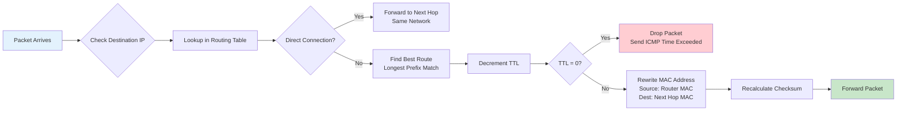

### NAT Translation Table Example

**At Home Router (Outbound):**

|Internal IP:Port|Public IP:Port|Destination|State|
|---|---|---|---|
|192.168.1.10:54321|98.76.54.32:54321|203.0.113.50:443|ESTABLISHED|
|192.168.1.15:49152|98.76.54.32:49152|142.250.185.46:443|ESTABLISHED|
|192.168.1.10:54322|98.76.54.32:54322|151.101.1.140:80|ESTABLISHED|

**At Server Load Balancer (Inbound):**

|Public IP:Port|Internal Server:Port|Client|State|
|---|---|---|---|
|203.0.113.50:443|10.0.1.100:443|98.76.54.32:54321|ESTABLISHED|
|203.0.113.50:443|10.0.1.101:443|203.45.67.89:49152|ESTABLISHED|
|203.0.113.50:443|10.0.1.102:443|198.51.100.23:51234|ESTABLISHED|

### DevOps Troubleshooting Using This Flow

When troubleshooting connectivity issues, work through each layer:

```bash
# Layer 1: Physical connectivity
ethtool eth0
ip link show

# Layer 2: MAC address resolution
arp -a
ip neigh show

# Layer 3: IP routing
ip route show
traceroute example.com
ping example.com

# Layer 4: Port connectivity
telnet example.com 443
nc -zv example.com 443

# Layer 7: Application
curl -v https://example.com
openssl s_client -connect example.com:443
```

### Common Failure Points

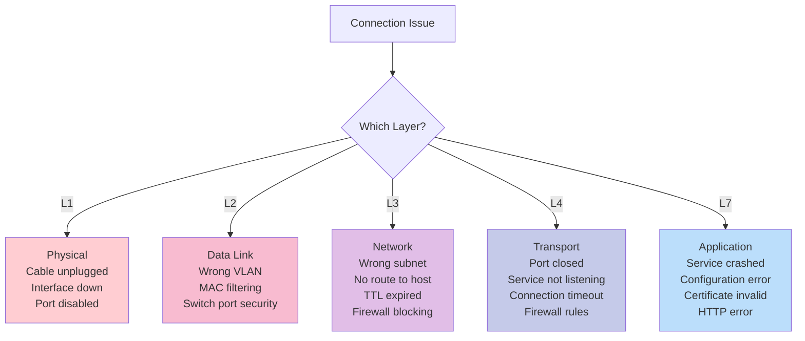


**Document Version:** 1.0  
**Last Updated:** December 2025  
**Target Audience:** DevOps Engineers, SREs, Cloud Engineers

_This document is designed for interview preparation and practical DevOps work. For production deployments, always consult official documentation and follow organizational standards._+-
