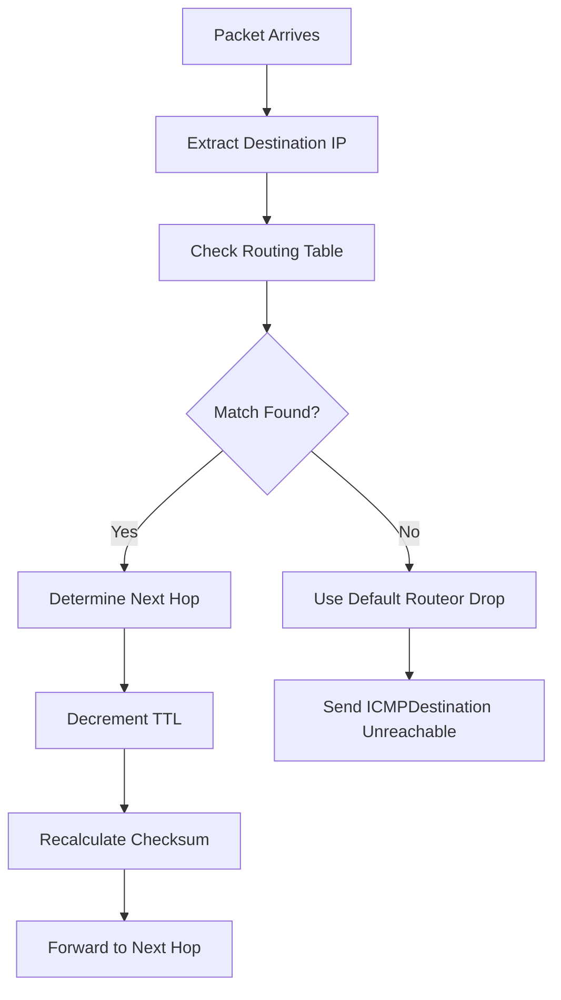

---
---
23
## Table of Contents
1. [Introduction to Physical Layer](#introduction)
2. [Network Topology Design](#network-topology)
3. [Networking Devices](#networking-devices)

## 1. Introduction to Physical Layer {#introduction}

The **Physical Layer** is the first and foundational layer of the OSI model. It deals with the actual physical connection between devices and the transmission of raw bits over a communication channel.

```
┌─────────────────────────────────────────────────────────────┐
│  PHYSICAL LAYER RESPONSIBILITIES                            │
├─────────────────────────────────────────────────────────────┤
│  • Bit-by-bit delivery                                      │
│  • Physical topology definition                             │
│  • Transmission mode (simplex, half-duplex, full-duplex)   │
│  • Signal encoding and modulation                           │
│  • Physical medium specifications                           │
│  • Data rate and synchronization                            │
└─────────────────────────────────────────────────────────────┘
```

**Key Concepts:**
- **Bandwidth**: Amount of data that can be transmitted (measured in bits per second - bps)
- **Frequency**: Speed/rate of signal oscillation (measured in Hertz - Hz)
- **Wavelength**: Physical length of one signal cycle
- **Attenuation**: Signal strength loss over distance


## 3. Networking Devices {#networking-devices}

### 3.1 Hub (Physical Layer Device)

```
┌──────────────────────────────────────────────────────┐
│                    HUB (Layer 1)                     │
│  ┌────────────────────────────────────────────────┐ │
│  │  Receives signal → Amplifies → Broadcasts to  │ │
│  │  ALL ports (flooding)                          │ │
│  └────────────────────────────────────────────────┘ │
│                                                      │
│   Port1   Port2   Port3   Port4   Port5   Port6    │
│     │       │       │       │       │       │       │
└─────┴───────┴───────┴───────┴───────┴───────┴───────┘
```

**How Hub Works:**
1. Receives electrical signal on one port
2. Regenerates/amplifies the signal
3. Broadcasts to **ALL** other ports
4. No intelligence - doesn't examine frames
5. Creates single collision domain
6. Half-duplex communication

**Types:**
- **Passive Hub**: Just connects cables, no signal regeneration
- **Active Hub**: Regenerates and amplifies signals
- **Intelligent Hub**: Has management capabilities

**Limitations:**
- ❌ High collision rate
- ❌ Wastes bandwidth
- ❌ Security issues (all devices see all traffic)
- ❌ No filtering capability

  1  | 00:1A:2B:3C:4D:5E | 10:30:45
  2  | 00:1A:2B:3C:4D:5F | 10:30:47
  3  | 00:1A:2B:3C:4D:60 | 10:30:50
```

**Functions:**
- ✅ Divides collision domains
- ✅ Filters traffic based on MAC addresses
- ✅ Learns MAC addresses automatically
- ✅ Forwards frames intelligently
- ✅ Can connect different media types


### 3.4 Router (Network Layer Device)

```
╔════════════════════════════════════════════════════════╗
║                ROUTER (Layer 3)                        ║
╠════════════════════════════════════════════════════════╣
║  ┌──────────────────────────────────────────────────┐ ║
║  │         Routing Table                            │ ║
║  │  Network      | Next Hop    | Interface | Metric│ ║
║  │  ────────────┼─────────────┼───────────┼────────│ ║
║  │  192.168.1.0 | Direct      | eth0      | 0     │ ║
║  │  192.168.2.0 | Direct      | eth1      | 0     │ ║
║  │  10.0.0.0    | 192.168.1.1 | eth0      | 10    │ ║
║  │  0.0.0.0     | 203.0.113.1 | wan0      | 20    │ ║
║  └──────────────────────────────────────────────────┘ ║
║                                                        ║
║   eth0 (LAN1)    eth1 (LAN2)    wan0 (Internet)      ║
║   192.168.1.1    192.168.2.1    203.0.113.50         ║
║       │              │               │                ║
╚═══════╧══════════════╧═══════════════╧════════════════╝
        │              │               │
    ┌───┴───┐      ┌───┴───┐      ┌────┴────┐
    │Network│      │Network│      │ Internet│
    │   A   │      │   B   │      │         │
    └───────┘      └───────┘      └─────────┘
```

**How Router Works:**



**Router Functions:**
- ✅ Connects different networks (different IP subnets)
- ✅ Makes path determination decisions
- ✅ Provides broadcast domain separation
- ✅ Implements access control lists (ACLs)
- ✅ Performs NAT (Network Address Translation)
- ✅ Can connect different media types

**Example: Connecting Wired and Wireless Networks**

```
┌──────────────────────────────────────────────────────────┐
│                    ROUTER                                │
│  ┌────────────────────────────────────────────────────┐ │
│  │  Wireless Interface (802.11ac)                     │ │
│  │  SSID: MyNetwork                                   │ │
│  │  Frequency: 5 GHz (5.180-5.825 GHz range)         │ │
│  │  Channel Width: 80 MHz                             │ │
│  │  IP: 192.168.1.1/24                               │ │
│  └──────────────────┬─────────────────────────────────┘ │
│                     │                                   │
│  ┌──────────────────┴─────────────────────────────────┐ │
│  │         Router Processing Unit                     │ │
│  │  • Receives WiFi signals (electromagnetic waves)   │ │
│  │  • Demodulates to digital data                     │ │
│  │  • Routes based on IP addresses                    │ │
│  │  • Converts to electrical signals for Ethernet     │ │
│  └──────────────────┬─────────────────────────────────┘ │
│                     │                                   │
│  ┌──────────────────┴─────────────────────────────────┐ │
│  │  Ethernet Interface (RJ-45)                        │ │
│  │  Standard: IEEE 802.3 (Gigabit Ethernet)          │ │
│  │  Frequency: Baseband (not frequency-based)         │ │
│  │  Encoding: Manchester/MLT-3                        │ │
│  │  IP: 192.168.2.1/24                               │ │
│  └────────────────────────────────────────────────────┘ │
└──────────────────────────────────────────────────────────┘
           │                              │
      (Wireless)                      (Wired)
           │                              │
    Laptop, Phone                    Desktop PC
    Tablet, etc.                     Server, etc.
```

**Media Conversion Process:**

1. **Wireless to Wired:**
   - Receives RF signal (5 GHz electromagnetic wave)
   - WiFi chipset demodulates to digital bits
   - Router processes packets (Layer 3)
   - Ethernet controller encodes bits using Manchester encoding
   - Sends electrical signals over Cat6 cable at baseband

2. **Wired to Wireless:**
   - Receives electrical signals from Ethernet cable
   - Decodes Manchester encoding to bits
   - Router processes packets
   - WiFi chipset modulates onto 5 GHz carrier
   - Transmits as electromagnetic waves


### 3.6 Wireless Access Point (WAP)

```
╔════════════════════════════════════════════════════════╗
║         WIRELESS ACCESS POINT (WAP)                    ║
╠════════════════════════════════════════════════════════╣
║                                                        ║
║              ((  ))  Wireless Signal                   ║
║           ((    /\    ))  Broadcasting                 ║
║        ((      /  \      ))                           ║
║      ((       /WAP \       ))                         ║
║                └──┘                                    ║
║                 │                                      ║
║                 │ Ethernet Cable                       ║
║                 │ (Wired Backhaul)                    ║
║                 ▼                                      ║
║            ┌─────────┐                                ║
║            │ Switch  │                                ║
║            └─────────┘                                ║
╚════════════════════════════════════════════════════════╝
```

**WAP Functions:**
- Converts wired network to wireless (802.11 WiFi)
- Broadcasts SSID (Service Set Identifier)
- Handles wireless authentication
- Operates on specific channels and frequencies

**WiFi Standards:**
```
Standard | Frequency   | Max Speed | Range
─────────┼─────────────┼───────────┼────────
802.11b  | 2.4 GHz     | 11 Mbps   | 35m
802.11g  | 2.4 GHz     | 54 Mbps   | 38m
802.11n  | 2.4/5 GHz   | 600 Mbps  | 70m
802.11ac | 5 GHz       | 1.3 Gbps  | 35m
802.11ax | 2.4/5/6 GHz | 9.6 Gbps  | 30m
(WiFi 6)
```


### 3.8 Gateway

```
┌──────────────────────────────────────────────────────┐
│                   GATEWAY                            │
│  ┌────────────────────────────────────────────────┐ │
│  │  Protocol Translation                          │ │
│  │  Network A  ◄──────────────►  Network B        │ │
│  │  (Protocol 1)                (Protocol 2)      │ │
│  │  Example: IPv4  ◄─────►  IPv6                 │ │
│  │          TCP/IP ◄─────►  OSI                  │ │
│  └────────────────────────────────────────────────┘ │
│                                                      │
│  Can operate at any layer (typically Layer 7)       │
└──────────────────────────────────────────────────────┘
```


### Enterprise Network Architecture

```
╔═══════════════════════════════════════════════════════════════════╗
║              ENTERPRISE NETWORK ARCHITECTURE                      ║
╠═══════════════════════════════════════════════════════════════════╣
║                                                                   ║
║                        INTERNET                                   ║
║                           │                                       ║
║                     ┌─────▼─────┐                                ║
║                     │ Firewall  │                                ║
║                     │           │                                ║
║                     └─────┬─────┘                                ║
║                           │                                       ║
║                  ┌────────▼────────┐                             ║
║                  │  Core Router    │                             ║
║                  │  Layer 3 Switch │                             ║
║                  └────────┬────────┘                             ║
║                           │                                       ║
║          ┌────────────────┼────────────────┐                     ║
║          │                │                │                     ║
║     ┌────▼────┐      ┌────▼────┐     ┌────▼────┐               ║
║     │Building │      │Building │     │Building │               ║
║     │ Switch1 │      │ Switch2 │     │ Switch3 │               ║
║     │(Layer 2)│      │(Layer 2)│     │(Layer 2)│               ║
║     └────┬────┘      └────┬────┘     └────┬────┘               ║
║          │                │                │                     ║
║  ┌───────┼─────┐   ┌──────┼──────┐  ┌──────┼──────┐            ║
║  │       │     │   │      │      │  │      │      │            ║
║ ┌▼─┐  ┌─▼┐  ┌─▼┐ ┌▼─┐  ┌─▼┐   ┌─▼┐┌▼─┐  ┌─▼┐  ┌─▼┐           ║
║ │PC│  │PC│  │AP│ │PC│  │PC│   │AP││PC│  │PC│  │AP│           ║
║ └──┘  └──┘  └──┘ └──┘  └──┘   └──┘└──┘  └──┘  └──┘           ║
║                                                                   ║
║ Data Center (Same site):                                          ║
║                  Core Router                                      ║
║                       │                                           ║
║              ┌────────┼────────┐                                 ║
║              │                 │                                 ║
║         ┌────▼────┐      ┌────▼────┐                            ║
║         │Top-of-  │      │Top-of-  │                            ║
║         │Rack Sw 1│      │Rack Sw 2│                            ║
║         └────┬────┘      └────┬────┘                            ║
║              │                 │                                 ║
║         ┌────┼────┐       ┌────┼────┐                           ║
║         │    │    │       │    │    │                           ║
║      ┌──▼┐┌──▼┐┌──▼┐  ┌──▼┐┌──▼┐┌──▼┐                         ║
║      │Svr││Svr││Svr│  │Svr││Svr││Svr│                         ║
║      └───┘└───┘└───┘  └───┘└───┘└───┘                         ║
║                                                                   ║
║ WAN Connection to Branch Office:                                 ║
║                                                                   ║
║ Main Office         WAN Link          Branch Office              ║
║ ┌────────┐         (T1/MPLS/         ┌────────┐                 ║
║ │ Router ├─────────Fiber)─────────────┤ Router │                ║
║ └───┬────┘                            └───┬────
