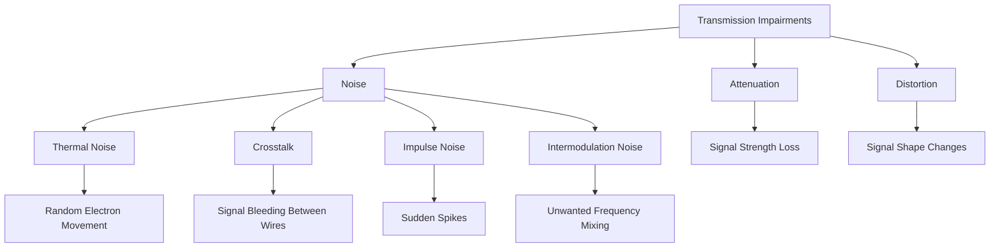
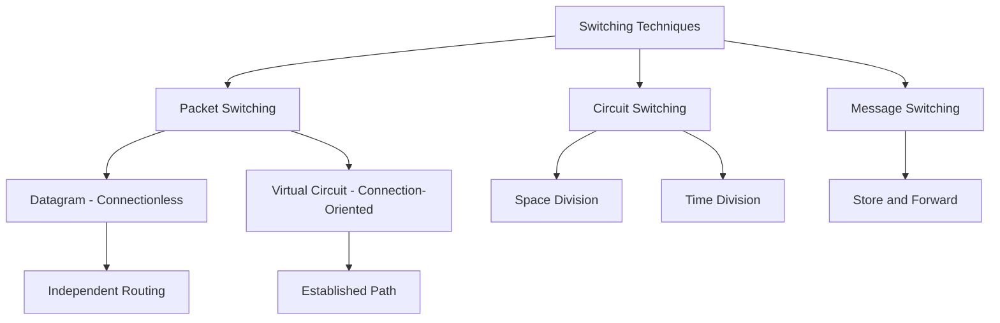

---
---

## Table of Contents

1. [Network Performance & Transmission Impairments](https://claude.ai/chat/1f251fa6-0735-438d-8a0e-209f2c147346#1-network-performance)
2. [Switching Techniques](https://claude.ai/chat/1f251fa6-0735-438d-8a0e-209f2c147346#2-switching-techniques)
3. [Complete System Integration](https://claude.ai/chat/1f251fa6-0735-438d-8a0e-209f2c147346#3-system-integration)


### B) Throughput

**Definition:** Throughput is the actual data transfer rate achieved in practice. It represents the real-world performance of a network.

**Key Characteristics:**

- Throughput is always less than or equal to bandwidth
- Measures actual successful data delivery rate
- Varies based on network conditions and congestion
- More realistic measure of network performance than bandwidth

**Relationship to Bandwidth:**

```
Bandwidth vs Throughput

Bandwidth: 100 Mbps  ┌─────────────────────┐
                     │ Available Capacity  │
                     │ (Theoretical Max)   │
                     └─────────────────────┘
                          ▲
Throughput: 75 Mbps  ┌────┴──────────┐
                     │ Actual Usage  │
                     │ (Real World)  │
                     └───────────────┘
```

**Factors Reducing Throughput:**

- Protocol overhead: Headers and control information reduce usable payload
- Network congestion: Multiple users competing for bandwidth
- Processing delays: Time spent in routers and switches
- Errors and retransmissions: Corrupted packets must be resent
- Hardware limitations: NIC, router, or switch processing capacity
- Distance: Signal degradation over long distances

**Calculating Efficiency:**

- Efficiency = (Throughput / Bandwidth) × 100%
- Example: 75 Mbps throughput on 100 Mbps bandwidth = 75% efficiency


### D) Jitter

**Definition:** Jitter is the variation in packet delay over time. It represents inconsistency in latency between consecutive packets.

**Characteristics:**

- Measured as the variance in packet arrival times
- Caused by network congestion, route changes, and queuing delays
- Particularly problematic for real-time applications
- Can make latency unpredictable

**Jitter Visualization:**

```
Expected Packet Arrival (No Jitter):
───50ms───50ms───50ms───50ms───
Packet 1  Packet 2  Packet 3  Packet 4
Consistent, predictable timing

With Jitter (Variable Latency):
───50ms───45ms───55ms───48ms───52ms───
Packet 1  Packet 2  Packet 3  Packet 4  Packet 5
Inconsistent, unpredictable timing
```

**Impact on Applications:**

- Voice over IP (VoIP): Choppy audio, gaps in conversation
- Video conferencing: Frozen frames, audio-video desynchronization
- Online gaming: Lag spikes, inconsistent response times
- Live streaming: Buffering, playback interruptions

**Jitter Buffer Solution:**

```
Jitter Buffer Operation

Input (Variable Timing):     50  45  55  48  52  60  43
                             ▲▼▲▼▲▼▲▼▲▼▲▼▲▼
Buffer (Smoothing Layer):    [─────────────────]
                             Holds packets briefly
Output (Stable Timing):      50  50  50  50  50  50  50
                             Consistent delivery

Process:
1. Packets arrive at variable times
2. Buffer holds packets temporarily
3. Packets released at constant rate
4. Smooth, predictable playback

Trade-off: Adds small constant delay for consistency
```

**Jitter Tolerance by Application:**

- Data transfer: High tolerance (can wait for packets)
- VoIP: Low tolerance (less than 30 ms acceptable)
- Video conferencing: Low tolerance (less than 50 ms acceptable)
- Online gaming: Very low tolerance (less than 20 ms ideal)


## 1.2 Transmission Impairments

Transmission impairments are problems that degrade signal quality as it travels through a communication medium. Understanding these impairments is essential for network design and troubleshooting.




### B) Distortion

**Definition:** Distortion occurs when the signal shape changes during transmission. Different signal components arrive at different times, causing the signal waveform to be altered.

**Types of Distortion:**

1. **Delay Distortion**
    
    - Different frequency components travel at different speeds
    - Also called "dispersion"
    - Causes signal spreading
    - Common in guided media (cables)
2. **Amplitude Distortion**
    
    - Frequency-dependent signal attenuation
    - Some frequencies lose more power than others
    - Results in unbalanced signal
3. **Phase Distortion**
    
    - Non-linear phase shift across frequencies
    - Different phase delays for different frequencies
    - Affects signal timing relationships

```
Signal Distortion Visualization

Original Signal (Transmitted):
    ╱╲      ╱╲      ╱╲
   ╱  ╲    ╱  ╲    ╱  ╲
  ╱    ╲  ╱    ╲  ╱    ╲
──      ──      ──      ──
Sharp, clean waveform

Distorted Signal (Received):
   ╱╲    ╱─╲     ╱──╲
  ╱  ╲  ╱   ╲   ╱    ╲___
 ╱    ╲╱     ╲─╱         ╲__
──
Smeared, phase-shifted waveform
```

**Causes of Distortion:**

- Impedance mismatches in transmission line
- Non-linear characteristics of electronic components
- Multiple signal reflections
- Capacitance and inductance in cables
- Modal dispersion in multi-mode fiber

**Effects of Distortion:**

- Inter-symbol interference (ISI)
- Reduced maximum data rate
- Increased bit error rate
- Need for complex equalization

**Solutions:**

- Equalization: Electronic compensation for known distortion patterns
- Adaptive equalization: Automatically adjusts to changing conditions
- Better quality cables: Tighter specifications reduce distortion
- Shorter transmission distances
- Lower data rates


#### 2. Crosstalk

**Definition:** Crosstalk is the unwanted coupling of signals from one transmission channel to another. Signal energy leaks from one wire and induces unwanted signals in adjacent wires.

**Types of Crosstalk:**

1. **Near-End Crosstalk (NEXT)**
    
    - Interference detected at the same end as the transmitter
    - Transmit signal couples into adjacent receive wire
    - More severe than FEXT due to stronger signal
    - Measured in dB (higher is better)
2. **Far-End Crosstalk (FEXT)**
    
    - Interference detected at the opposite end from transmitter
    - Weaker than NEXT due to attenuation
    - Less problematic in most cases

```
Near-End Crosstalk (NEXT)

Transmitter ───────∿∿∿───────►
            │ │ │           Receiver
            ▼ ▼ ▼           (Far End)
Adjacent ◄──▴▾▴──────────────
         Interference at transmit end

Far-End Crosstalk (FEXT)

Transmitter ───────∿∿∿───────►
                     │ │ │   Receiver
                     ▼ ▼ ▼   (Far End)
Adjacent ──────────────▴▾▴────►
         Interference at receive end
```

**Causes of Crosstalk:**

- Electromagnetic coupling between adjacent wires
- Capacitive coupling (electric field)
- Inductive coupling (magnetic field)
- Poor cable quality or installation
- Untwisted portions of twisted pair cables
- Proximity of high-power and low-power cables

**Prevention and Mitigation:**

1. **Twisted Pair Cable Design**
    
    - Twisting creates equal exposure to interference
    - Electromagnetic fields cancel out
    - Tighter twists reduce crosstalk
    - Different twist rates per pair
2. **Shielding (STP)**
    
    - Metal shield blocks electromagnetic fields
    - Foil or braided shield around pairs
    - Must be properly grounded
3. **Physical Separation**
    
    - Increase distance between cables
    - Separate high-power from low-power cables
    - Use cable trays and separate conduits
4. **Category Rating**
    
    - Higher category cables have better crosstalk rejection
    - Cat6 has separator between pairs
    - Cat6a, Cat7 have enhanced shielding

**Crosstalk Performance Standards:**

- Measured in dB (decibels)
- Higher values indicate better performance
- Cat5e NEXT: >35 dB at 100 MHz
- Cat6 NEXT: >44 dB at 100 MHz
- Cat6a NEXT: >50 dB at 500 MHz


#### 4. Intermodulation Noise

**Definition:** Intermodulation noise occurs when two or more signals share the same transmission medium and their frequencies interact to create unwanted sum and difference frequencies.

**Mathematical Basis:**

- When signals at frequencies f₁ and f₂ combine
- Non-linear components create additional frequencies
- Intermodulation products: f₁ + f₂, f₂ - f₁, 2f₁, 2f₂, 2f₁ - f₂, etc.

**Example:**

- Signal 1: f₁ = 100 MHz
- Signal 2: f₂ = 200 MHz
- Intermodulation products:
    - f₁ + f₂ = 300 MHz
    - f₂ - f₁ = 100 MHz (interferes with original f₁)
    - 2f₁ = 200 MHz (interferes with original f₂)
    - 2f₁ - f₂ = 0 MHz
    - 2f₂ - f₁ = 300 MHz

**Common Scenarios:**

- Wireless communications with multiple channels
- Cable TV systems carrying many channels
- Frequency Division Multiplexing (FDM) systems
- Non-linear amplifiers
- Overdriven amplifiers

**Causes:**

- Non-linear characteristics of electronic components
- Amplifiers operating near saturation
- Mixing in active devices
- Poor isolation between channels

**Prevention Methods:**

1. **Proper Frequency Planning**
    
    - Careful selection of carrier frequencies
    - Avoid frequencies that create problematic products
    - Use guard bands between channels
2. **Filters**
    
    - Bandpass filters to isolate channels
    - Remove intermodulation products
    - Prevent unwanted signals from mixing
3. **Linear Amplifiers**
    
    - Operate amplifiers in linear region
    - Avoid saturation and overdrive
    - Use Class A amplifiers for critical applications
4. **Channel Separation**
    
    - Adequate spacing between frequency channels
    - Reduce power levels to minimize mixing


# 2. Switching Techniques {#2-switching-techniques}

Switching is the process of determining the path that data takes through a network. It involves connecting input ports to output ports to transfer data between network nodes.

**Purpose of Switching:**

- Establish communication paths between nodes
- Enable resource sharing among multiple users
- Optimize network utilization
- Provide different quality of service levels




### 2.1.1 Types of Circuit Switching

#### A) Space Division Switching

**Definition:** Space division switching uses separate physical paths for each connection. Crosspoints physically connect input and output lines.

**Characteristics:**

- Physically separate signal paths
- Connections exist in space (physical crosspoints)
- Used in first generation switches
- Requires n×m crosspoints for n inputs and m outputs

```
Crossbar Switch (Space Division)

┌────────────────────────┐
│   Crossbar Switch      │
│                        │
│  In1 ─┬─┬─┬─┬─        │
│       │ │ │ │         │
│  In2 ─┼─┼─┼─┼─        │
│       │ │ │ │         │
│  In3 ─┼─┼─┼─┼─        │
│       │ │ │ │         │
│       │ │ │ └─ Out4   │
│       │ │ └─── Out3   │
│       │ └───── Out2   │
│       └─────── Out1   │
└────────────────────────┘

Each intersection is a crosspoint
that can be activated to connect
input to output
```

**Implementation:**

- Metallic crosspoints in analog systems
- Semiconductor switches in digital systems
- Matrix arrangement of switches
- Each crosspoint can be open or closed

**Advantages:**

- Simultaneous connections possible
- No time sharing of paths
- Simple and straightforward
- Predictable performance

**Disadvantages:**

- Number of crosspoints grows as n×m
- Expensive for large switches
- Physical space requirements
- Limited scalability


## 2.2 Packet Switching

**Definition:** Packet switching breaks data into small units called packets, each transmitted independently through the network. No dedicated path is established; packets may take different routes.

**Packet Structure:** Each packet contains:

- Header: Control information (source, destination, sequence number)
- Payload: Actual data being transmitted
- Trailer: Error checking information (CRC, checksum)

```
Packet Anatomy

┌────────┬─────────────────┬──────────┐
│ Header │  Payload (Data) │ Trailer  │
└────────┴─────────────────┴──────────┘
    ▲            ▲              ▲
    │            │              │
Addresses,   Actual        Error
Sequence,    Information   Checking
Control                    (CRC)
```

**Packetization Process:**

```
Large Message (Original Data):
████████████████████████████████████████
Single large block of data

Broken into Packets:
[Hdr│Data1] [Hdr│Data2] [Hdr│Data3] [Hdr│Data4]
Each packet independent

Multiple Possible Routes:

Source ─┬─► Router A ───┐
        │               ├──► Router D ──► Destination
        └─► Router B ──┬┘
                       │
            Router C ──┘

Packet 1: A → D → Destination
Packet 2: B → D → Destination  
Packet 3: A → C → D → Destination
Packet 4: B → D → Destination
```

**Key Characteristics:**

- No dedicated path required
- Each packet routed independently
- Statistical multiplexing of network resources
- Packets may arrive out of order
- Store-and-forward at each node
- Queuing delays vary

**Advantages:**

- Efficient bandwidth utilization
- No setup time required (connectionless)
- Can route around network failures
- Suitable for bursty traffic
- Multiple simultaneous connections
- Resource sharing among users
- Better fault tolerance

**Disadvantages:**

- Variable delay (queuing at routers)
- Packets can be lost
- Out-of-order delivery possible
- Protocol overhead (headers)
- More complex routing decisions
- Requires reassembly at destination
- Potential for congestion

**Applications:**

- Internet Protocol (IP)
- Email systems
- File transfers
- Web browsing
- Most modern data networks


### 2.2.2 Virtual Circuit Packet Switching (Connection-Oriented)

**Definition:** Virtual circuit switching establishes a logical connection before data transfer. All packets follow the same predetermined path, but path is shared with other connections using statistical multiplexing.

**Three Phases:**

1. **Setup Phase**
    
    - Call request sent through network
    - Resources reserved along path
    - Virtual Circuit Identifier (VCI) assigned
    - Path established and stored in routing tables
    - Acknowledgment returned to source
2. **Data Transfer Phase**
    
    - All packets follow established path
    - Packets tagged with VCI instead of full address
    - In-order delivery guaranteed
    - Possible Quality of Service (QoS) guarantees
3. **Teardown Phase**
    
    - Either party can initiate disconnect
    - Resources released along path
    - VCI freed for reuse
    - Path information removed from tables

```
Virtual Circuit Setup

Setup Phase:
Source ─► R1 ─► R2 ─► R3 ─► Destination
      (Setup Request Propagates)

Source ◄─ R1 ◄─ R2 ◄─ R3 ◄─ Destination
      (Acknowledgment Returns)

Path now established in routing tables

Data Transfer Phase:
All packets follow same path:
Source ─► R1 ─► R2 ─► R3 ─► Destination
      (VCI identifies connection)
```

**Virtual Circuit Table at Router:**

```
Virtual Circuit Table (Router R1)
┌──────────────┬──────────┬──────────┬─────────┐
│ Incoming     │ Incoming │ Outgoing │ Next    │
│ Port         │ VCI      │ Port     │ Hop     │
├──────────────┼──────────┼──────────┼─────────┤
│ Port 1       │ VCI 5    │ Port 2   │ R2      │
│ Port 3       │ VCI 8    │ Port 4   │ R4      │
│ Port 1       │ VCI 12   │ Port 2   │ R2      │
│ Port 2       │ VCI 20   │ Port 4   │ R4      │
└──────────────┴──────────┴──────────┴─────────┘

VCI may change at each hop (label swapping)
```

**Types of Virtual Circuits:**

**1. Permanent Virtual Circuit (PVC)**

- Pre-configured by network administrator
- Always available (like leased line)
- No setup/teardown signaling
- Used for constant traffic between sites
- Example: Frame Relay PVCs connecting branch offices

**2. Switched Virtual Circuit (SVC)**

- Established on-demand
- Setup signaling required
- Torn down when communication ends
- More flexible than PVC
- Example: ATM SVCs, X.25 connections

**Characteristics:**

- Logical connection, not physical
- Path determined during setup
- In-order delivery guaranteed
- Possible QoS guarantees
- Lower per-packet overhead (uses VCI not full address)
- State information maintained in switches

**Advantages:**

- In-order packet delivery
- More predictable performance than datagram
- Quality of Service possible
- Resource reservation possible
- Lower overhead after setup (shorter headers)
- Connection state enables features (e.g., bandwidth reservation)

**Disadvantages:**

- Setup delay before data transfer
- Less flexible than datagram
- State information must be maintained
- If link fails, connection must be re-established
- Less robust to failures during data transfer
- Resources tied up even during idle periods

**Protocols Using Virtual Circuits:**

- ATM (Asynchronous Transfer Mode)
- Frame Relay
- X.25
- MPLS (Multi-Protocol Label Switching)
- TCP (over IP datagram service)


## 2.4 Switching Techniques Comparison

```
Comprehensive Comparison Table

┌──────────────┬──────────────┬──────────────┬──────────────┬──────────────┐
│ Feature      │ Circuit      │ Datagram     │ Virtual      │ Message      │
│              │ Switching    │ Packet       │ Circuit      │ Switching    │
│              │              │ Switching    │ Packet       │              │
├──────────────┼──────────────┼──────────────┼──────────────┼──────────────┤
│ Path         │ Dedicated    │ Dynamic      │ Fixed        │ Dynamic      │
│              │ Physical     │ per Packet   │ (Logical)    │ per Message  │
├──────────────┼──────────────┼──────────────┼──────────────┼──────────────┤
│ Setup        │ Required     │ Not Required │ Required     │ Not Required │
│ Phase        │              │              │              │              │
├──────────────┼──────────────┼──────────────┼──────────────┼──────────────┤
│ State        │ At switches  │ None         │ At switches  │ At nodes     │
│ Information  │              │              │              │              │
├──────────────┼──────────────┼──────────────┼──────────────┼──────────────┤
│ Addressing   │ Once         │ Every packet │ Once (VCI    │ Every        │
│              │ (at setup)   │              │ used after)  │ message      │
├──────────────┼──────────────┼──────────────┼──────────────┼──────────────┤
│ Routing      │ At setup     │ Every packet │ At setup     │ Every        │
│ Decision     │ only         │              │ only         │ message      │
├──────────────┼──────────────┼──────────────┼──────────────┼──────────────┤
│ Packet       │ Always       │ May vary     │ Always       │ Always       │
│ Order        │ preserved    │              │ preserved    │ preserved    │
├──────────────┼──────────────┼──────────────┼──────────────┼──────────────┤
│ Bandwidth    │ Fixed        │ Dynamic      │ Dynamic      │ Dynamic      │
│ Allocation   │ (Reserved)   │ (Shared)     │ (Shared)     │ (Shared)     │
├──────────────┼──────────────┼──────────────┼──────────────┼──────────────┤
│ Header       │ None after   │ High         │ Medium       │ High         │
│ Overhead     │ setup        │              │              │              │
├──────────────┼──────────────┼──────────────┼──────────────┼──────────────┤
│ Delay        │ Fixed        │ Variable     │ Variable     │ Very High    │
│              │ (Constant)   │ (Queuing)    │ (Queuing)    │              │
├──────────────┼──────────────┼──────────────┼──────────────┼──────────────┤
│ Congestion   │ At setup     │ At each node │ At each node │ Store until  │
│              │ (Blocking)   │              │              │ available    │
├──────────────┼──────────────┼──────────────┼──────────────┼──────────────┤
│ Efficiency   │ Low          │ High         │ High         │ Medium       │
│              │ (Idle time)  │              │              │              │
├──────────────┼──────────────┼──────────────┼──────────────┼──────────────┤
│ Suitable     │ Continuous   │ Bursty       │ Bursty       │ Non-real     │
│ Traffic      │ (Voice)      │ (Data)       │ (Data)       │ time         │
├──────────────┼──────────────┼──────────────┼──────────────┼──────────────┤
│ Examples     │ PSTN         │ IP           │ ATM          │ Email        │
│              │ Traditional  │ UDP          │ Frame Relay  │ Telegraph    │
│              │ Telephone    │              │ MPLS         │              │
│              │              │              │ TCP/IP       │              │
└──────────────┴──────────────┴──────────────┴──────────────┴──────────────┘
```

**Selection Criteria:**

**Use Circuit Switching when:**

- Continuous traffic expected
- Constant bandwidth required
- Predictable delay critical
- Connection duration long
- Example: Voice telephone calls

**Use Datagram Packet Switching when:**

- Traffic is bursty
- Flexibility more important than guarantees
- Simple implementation preferred
- Multiple destinations possible
- Example: Internet browsing, email

**Use Virtual Circuit Packet Switching when:**

- Traffic is bursty but connection-oriented
- QoS guarantees needed
- In-order delivery required
- Resource reservation beneficial
- Example: Video streaming, VoIP

**Use Message Switching when:**

- Real-time delivery not required
- Store-and-forward acceptable
- Message priority needed
- Example: Email, batch file transfers


## 3.2 Complete End-to-End Transaction Example

### Scenario: User Requests www.example.com

This example demonstrates how all network concepts work together in a real-world web page request.

```
Complete Network Transaction Flow

┌─────────────────────────────────────────────────────────────┐
│ LAYER 7: APPLICATION (HTTP)                                 │
├─────────────────────────────────────────────────────────────┤
│                                                             │
│ User Action: Types "www.example.com" in browser            │
│                                                             │
│ DNS Resolution:                                             │
│ 1. Browser checks cache for IP address                     │
│ 2. Queries local DNS server: "What is IP of example.com?"  │
│ 3. DNS server responds: "93.184.216.34"                    │
│                                                             │
│ HTTP Request Generated:                                     │
│   GET / HTTP/1.1                                            │
│   Host: www.example.com                                     │
│   User-Agent: Mozilla/5.0 (Windows NT 10.0)                │
│   Accept: text/html,application/xhtml+xml                  │
│   Accept-Language: en-US,en;q=0.9                          │
│   Connection: keep-alive                                    │
│                                                             │
└─────────────────────────────────────────────────────────────┘
                        ↓
┌─────────────────────────────────────────────────────────────┐
│ LAYER 4: TRANSPORT (TCP)                                    │
├─────────────────────────────────────────────────────────────┤
│                                                             │
│ TCP Three-Way Handshake:                                    │
│ 1. SYN: Client → Server (Seq=1000, Flags=SYN)              │
│ 2. SYN-ACK: Server → Client (Seq=5000, Ack=1001)           │
│ 3. ACK: Client → Server (Seq=1001, Ack=5001)               │
│                                                             │
│ TCP Header Added to HTTP Request:                           │
│   Source Port: 49152 (ephemeral port)                      │
│   Destination Port: 80 (HTTP standard port)                │
│   Sequence Number: 1001                                     │
│   Acknowledgment Number: 5001                              │
│   Flags: PSH, ACK (Push data, acknowledge)                 │
│   Window Size: 65535 bytes (flow control)                  │
│   Checksum: 0xAB12 (error detection)                       │
│   Urgent Pointer: 0                                         │
│                                                             │
│ Result: TCP Segment = [TCP Header] + [HTTP Request]        │
│                                                             │
└─────────────────────────────────────────────────────────────┘
                        ↓
┌─────────────────────────────────────────────────────────────┐
│ LAYER 3: NETWORK (IP)                                       │
├─────────────────────────────────────────────────────────────┤
│                                                             │
│ IP Header Added to TCP Segment:                             │
│   Version: 4 (IPv4)                                         │
│   Header Length: 20 bytes                                   │
│   Type of Service: 0x00                                     │
│   Total Length: 576 bytes                                   │
│   Identification: 54321                                     │
│   Flags: Don't Fragment                                     │
│   Fragment Offset: 0                                        │
│   Time to Live (TTL): 64 hops                               │
│   Protocol: 6 (TCP)                                         │
│   Header Checksum: 0x1234                                   │
│   Source IP: 192.168.1.100                                  │
│   Destination IP: 93.184.216.34                             │
│                                                             │
│ Routing Decision:                                           │
│ 1. Check routing table                                      │
│ 2. Destination not on local network                         │
│ 3. Forward to default gateway (router)                      │
│                                                             │
│ Result: IP Packet = [IP Header] + [TCP Segment] + [Data]   │
│                                                             │
└─────────────────────────────────────────────────────────────┘
                        ↓
┌─────────────────────────────────────────────────────────────┐
│ LAYER 2: DATA LINK (Ethernet)                               │
├─────────────────────────────────────────────────────────────┤
│                                                             │
│ ARP Resolution (if needed):                                 │
│ 1. "Who has IP 192.168.1.1?" (default gateway)             │
│ 2. "I have 192.168.1.1, my MAC is AA:BB:CC:DD:EE:FF"       │
│                                                             │
│ Ethernet Frame Created:                                     │
│                                                             │
│ ┌──────────┬──────────┬──────┬────────┬─────┬──────┐     │
│ │Preamble  │Dest MAC  │Source│ Type   │ IP  │ FCS  │     │
│ │(7 bytes) │(6 bytes) │ MAC  │(2 bytes│Packet│(4 by)│     │
│ │          │          │(6 by)│        │     │      │     │
│ └──────────┴──────────┴──────┴────────┴─────┴──────┘     │
│                                                             │
│ Preamble: 10101010...10101011 (synchronization)            │
│ Destination MAC: AA:BB:CC:DD:EE:FF (router)                 │
│ Source MAC: 11:22:33:44:55:66 (PC's NIC)                   │
│ EtherType: 0x0800 (IPv4)                                    │
│ Payload: IP Packet (including TCP and HTTP)                │
│ FCS: CRC-32 checksum (0xDEADBEEF)                          │
│                                                             │
│ Switch Operation:                                           │
│ 1. Receives frame on Port 5                                │
│ 2. Reads destination MAC address                           │
│ 3. Looks up MAC in CAM (Content Addressable Memory) table  │
│ 4. Finds MAC on Port 24                                    │
│ 5. Forwards frame to Port 24 (uplink to router)            │
│ 6. Full-duplex operation, no collisions                    │
│                                                             │
└─────────────────────────────────────────────────────────────┘
                        ↓
┌─────────────────────────────────────────────────────────────┐
│ LAYER 1: PHYSICAL                                           │
├─────────────────────────────────────────────────────────────┤
│                                                             │
│ Frame Encoding and Transmission:                            │
│                                                             │
│ Manchester Encoding (for 10/100 Mbps Ethernet):             │
│ - Each bit encoded with mid-bit transition                  │
│ - Self-clocking mechanism                                   │
│ - Bit 0: Low-to-High transition                             │
│ - Bit 1: High-to-Low transition                             │
│                                                             │
│ Physical Transmission:                                      │
│ Medium: Cat6 UTP cable                                      │
│ Speed: 1000 Mbps (1 Gigabit Ethernet)                       │
│ Encoding: PAM-5 (5-level pulse amplitude modulation)        │
│ All 4 pairs used bidirectionally                            │
│                                                             │
│ Bit Stream: 10101100010011110110...                         │
│                                                             │
│ Differential Signaling on Wire Pairs:                       │
│ TX+ (Pin 1): ▀▄▀▄▀▀▄▄▀▄▀▀▄▄▀▄▀▄▀▄▀▄                        │
│ TX- (Pin 2): ▄▀▄▀▄▄▀▀▄▀▄▄▀▀▄▀▄▀▄▀▄▀ (inverted)             │
│                                                             │
│ Noise Cancellation:                                         │
│ Receiver calculates: Signal = TX+ minus TX-                │
│ Common-mode noise cancels out                               │
│                                                             │
└─────────────────────────────────────────────────────────────┘
```


### ISP and Internet Path

```
Internet Service Provider (ISP) Path

[Router] → [ISP Edge Router] → [ISP Core Router] →
           ↓                    ↓
     First Hop            Aggregation
     203.0.113.1          10.0.0.1

→ [Internet Backbone] → [Peering Point] →
  ↓                     ↓
  Major Carrier         IX (Internet Exchange)
  AS 701                AS 3356

→ [example.com Network] → [Load Balancer] → [Web Server]
  ↓                       ↓                  ↓
  Destination AS          Distributes        93.184.216.34
  AS 15133                traffic            Serves content
```

**Multiple Hop Processing:**

Each router along the path:

- Receives packet
- Checks destination IP
- Looks up in routing table
- Determines next hop
- Decrements TTL
- Recalculates checksum
- Forwards to next router

**Typical Hop Count:**

- Local network: 1-3 hops
- Cross-city: 5-10 hops
- Cross-country: 10-20 hops
- International: 15-30 hops


## 3.3 Enterprise Network Architecture

```
Complete Enterprise Network

                      INTERNET
                         │
                         │ Fiber/Metro Ethernet
                         │
                    ┌────▼────┐
                    │Firewall │
                    │Security │
                    │Gateway  │
                    └────┬────┘
                         │
                   ┌─────▼─────┐
                   │ Core Router│
                   │Layer 3 Sw  │
                   │(Redundant) │
                   └─────┬─────┘
                         │
          ┌──────────────┼──────────────┐
          │              │              │
     ┌────▼────┐    ┌────▼────┐   ┌────▼────┐
     │Building │    │Building │   │Building │
     │Switch 1 │    │Switch 2 │   │Switch 3 │
     │Layer 2  │    │Layer 2  │   │Layer 2  │
     │48 Port  │    │48 Port  │   │48 Port  │
     └────┬────┘    └────┬────┘   └────┬────┘
          │              │              │
    ┌─────┼─────┐  ┌─────┼─────┐ ┌─────┼─────┐
    │     │     │  │     │     │ │     │     │
   PC   PC    AP PC   PC    AP PC   PC    AP
   │    │     │  │    │     │  │    │     │
  VLAN VLAN  WiFi VLAN VLAN WiFi VLAN VLAN WiFi
   10   20   30  10   20   30  10   20   30
```

**VLAN Configuration:**

```
Virtual LAN (VLAN) Segmentation

VLAN 10: Management (192.168.10.0/24)
- Network equipment management
- Access restricted to IT staff
- Critical infrastructure

VLAN 20: Employees (192.168.20.0/24)
- Employee workstations
- Department printers
- Internal resources access

VLAN 30: Guests (192.168.30.0/24)
- Guest WiFi access
- Internet only (no internal access)
- Captive portal authentication

VLAN 40: Servers (192.168.40.0/24)
- Database servers
- Application servers
- File servers
- Restricted access via ACLs

VLAN 50: VoIP (192.168.50.0/24)
- IP phones
- Voice gateway
- QoS priority enabled
- Separate from data for quality

Inter-VLAN Routing:
- Handled by Core Router (Layer 3)
- Access Control Lists (ACLs) enforce security
- Each VLAN is separate broadcast domain
```


### WAN Connection to Branch Office

```
Wide Area Network (WAN) Design

Main Office                              Branch Office
┌────────────────┐                      ┌────────────────┐
│                │                      │                │
│  Core Router   │                      │  Branch Router │
│  (Primary)     │                      │                │
└───────┬────────┘                      └────────┬───────┘
        │                                        │
        │ Primary Link                           │
        │ (MPLS or Metro Ethernet)               │
        │ 100 Mbps - 1 Gbps                      │
        └────────────────────────────────────────┘
        
Backup/Failover:
        ┌────────────────────────────────────────┐
        │ Secondary Link                         │
        │ (Internet VPN or 4G/5G)                │
        │ 50 Mbps - 500 Mbps                     │
        │ Activates if primary fails             │
        └────────────────────────────────────────┘

WAN Technologies:
1. MPLS (Multi-Protocol Label Switching)
   - Private network
   - QoS guarantees
   - SLA (Service Level Agreement)
   - Higher cost

2. SD-WAN (Software-Defined WAN)
   - Intelligent path selection
   - Multiple links (MPLS + Internet)
   - Application-aware routing
   - Lower cost

3. Internet VPN
   - IPsec encryption
   - Lower cost
   - Best-effort delivery
   - Suitable for backup
```


## Summary: Integration of All Concepts

**Complete Network Operation Requires:**

1. **Physical Infrastructure**
    
    - Transmission media (copper, fiber, wireless)
    - Proper cable categories for bandwidth
    - Understanding of attenuation and noise
2. **Signal Encoding**
    
    - Manchester, MLT-3, or other encoding
    - Modulation for wireless transmission
    - Error detection and correction
3. **Data Link Layer**
    
    - Frame formatting
    - MAC addressing
    - Switch operation and CAM tables
4. **Network Layer**
    
    - IP addressing and routing
    - Router operation
    - Path determination
5. **Transport Layer**
    
    - TCP for reliability
    - UDP for speed
    - Port numbers for multiplexing
6. **Switching Strategy**
    
    - Circuit switching for constant traffic
    - Packet switching for bursty data
    - Virtual circuits for QoS
7. **Performance Management**
    
    - Monitor bandwidth and throughput
    - Manage latency and jitter
    - Minimize packet loss
    - Implement QoS
8. **Network Design**
    
    - Hierarchical topology
    - Redundancy for reliability
    - VLANs for segmentation
    - Security at all layers

**All these elements work together to enable modern network communication, from a simple web page request to complex enterprise applications.**

