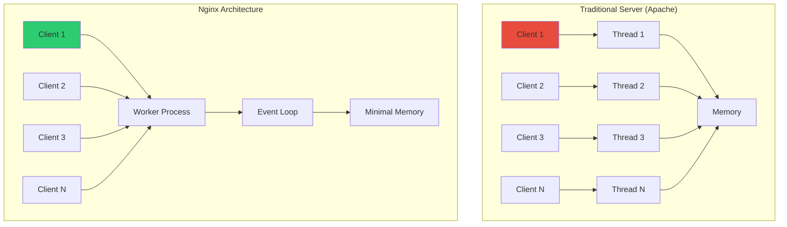
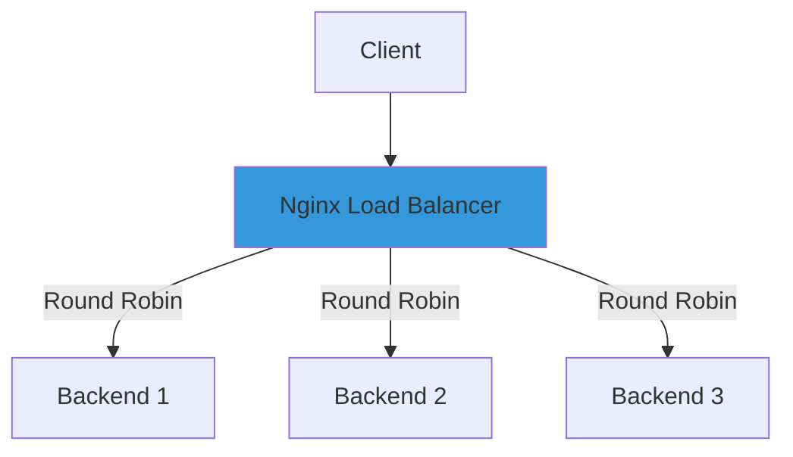
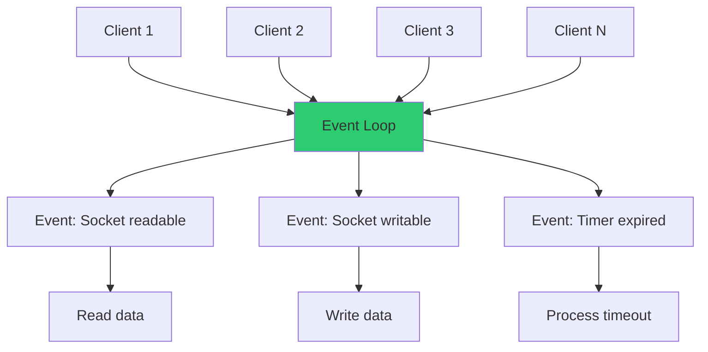

---
---


## Nginx Fundamentals

### What is Nginx

Nginx (pronounced "engine-x") is a high-performance web server, reverse proxy, load balancer, and HTTP cache.

**Created:** 2004 by Igor Sysoev  
**Purpose:** Solve the C10K problem (handling 10,000+ concurrent connections)  
**Architecture:** Event-driven, asynchronous, non-blocking

### Core Architecture



### Process Model

```
┌──────────────────────────────────────────────────────┐
│                  Nginx Process Model                 │
├──────────────────────────────────────────────────────┤
│                                                      │
│  Master Process (PID 1)                              │
│  ├── Reads configuration                             │
│  ├── Manages worker processes                        │
│  ├── Handles signals (reload, restart)               │
│  └── Binds to privileged ports (80, 443)             │
│                                                      │
│  Worker Process 1                                    │
│  ├── Handles client connections                      │
│  ├── Event-driven loop                               │
│  └── Non-blocking I/O                                │
│                                                      │
│  Worker Process 2                                    │
│  Worker Process 3                                    │
│  Worker Process N (typically = CPU cores)            │
│                                                      │
│  Cache Manager Process                               │
│  └── Manages on-disk cache                           │
│                                                      │
│  Cache Loader Process                                │
│  └── Loads cache metadata at startup                 │
│                                                      │
└──────────────────────────────────────────────────────┘
```

### Why Nginx Exists

**Problem with traditional servers:**

```
Apache (Thread-per-connection model)
━━━━━━━━━━━━━━━━━━━━━━━━━━━━━━━━━━━━
Client 1 → Thread 1 (8 MB RAM)
Client 2 → Thread 2 (8 MB RAM)
...
Client 1000 → Thread 1000 (8 GB RAM)

Result: Memory exhaustion, context switching overhead
```

**Nginx solution:**

```
Nginx (Event-driven model)
━━━━━━━━━━━━━━━━━━━━━━━━━━━━━━━━━━━━
Client 1 ┐
Client 2 ├─→ Worker Process (Event Loop)
Client 3 │   └── Minimal memory overhead
...      │
Client 10000 ┘

Result: Low memory, high concurrency
```

### Nginx Capabilities

|Capability|Description|Use Case|
|---|---|---|
|Web Server|Serve static files|HTML, CSS, JS, images|
|Reverse Proxy|Forward requests to backends|Hide backend servers|
|Load Balancer|Distribute traffic|Scale applications|
|HTTP Cache|Cache responses|Reduce backend load|
|SSL/TLS Termination|Handle encryption|Offload SSL from backend|
|API Gateway|Route API requests|Microservices|
|WebSocket Proxy|Proxy WebSocket connections|Real-time apps|
|HTTP/2 Support|Modern protocol|Performance|


## Static Content Serving

### Why Only Static Content

**What Nginx does:**

```
┌──────────────────────────────────────────────────────┐
│              Static Content Serving                  │
├──────────────────────────────────────────────────────┤
│                                                      │
│  Request: GET /index.html                            │
│           ↓                                          │
│  Nginx:   Read file from disk                        │
│           ↓                                          │
│  Response: Send file content                         │
│                                                      │
│  Speed: Extremely fast (no processing)               │
│  Memory: Minimal (sendfile syscall)                  │
│  CPU: Almost none                                    │
│                                                      │
└──────────────────────────────────────────────────────┘
```

**What Nginx does NOT do:**

```
┌──────────────────────────────────────────────────────┐
│              Dynamic Content Processing              │
├──────────────────────────────────────────────────────┤
│                                                      │
│  Request: GET /api/users                             │
│           ↓                                          │
│  Nginx:   Cannot process                             │
│           Must forward to backend                    │
│           ↓                                          │
│  Backend: PHP, Python, Node.js processes request     │
│           Queries database                           │
│           Generates response                         │
│           ↓                                          │
│  Nginx:   Receives response, sends to client         │
│                                                      │
└──────────────────────────────────────────────────────┘
```

**Comparison:**

|Feature|Static (Nginx)|Dynamic (Backend)|
|---|---|---|
|Processing|None|Business logic|
|Database|No|Yes|
|Response time|< 1ms|10-1000ms|
|Scalability|Very high|Limited|
|Examples|HTML, CSS, JS, images|API, database queries|

### Basic Static Server Configuration

**nginx.conf:**

```nginx
worker_processes auto;

events {
    worker_connections 1024;
}

http {
    include       mime.types;
    default_type  application/octet-stream;

    sendfile        on;
    tcp_nopush      on;
    tcp_nodelay     on;
    keepalive_timeout  65;

    server {
        listen 80;
        server_name localhost;
        root /usr/share/nginx/html;
        index index.html;

        location / {
            try_files $uri $uri/ =404;
        }
    }
}
```

**Directory structure:**

```
/usr/share/nginx/html/
├── index.html
├── about.html
├── css/
│   └── style.css
├── js/
│   └── app.js
└── images/
    └── logo.png
```

### Advanced Static Configuration

```nginx
http {
    # MIME types
    include mime.types;
    default_type application/octet-stream;

    # Performance
    sendfile on;
    tcp_nopush on;
    tcp_nodelay on;
    
    # Compression
    gzip on;
    gzip_vary on;
    gzip_min_length 1024;
    gzip_types text/css text/javascript application/javascript;

    server {
        listen 80;
        server_name example.com;
        root /var/www/html;
        index index.html;

        # Cache static assets
        location ~* \.(jpg|jpeg|png|gif|ico|css|js)$ {
            expires 30d;
            add_header Cache-Control "public, immutable";
        }

        # Security headers
        add_header X-Frame-Options "SAMEORIGIN" always;
        add_header X-Content-Type-Options "nosniff" always;
        add_header X-XSS-Protection "1; mode=block" always;

        # SPA fallback
        location / {
            try_files $uri $uri/ /index.html;
        }
    }
}
```


## Load Balancing

### Load Balancing Strategies



**Available algorithms:**

|Algorithm|Description|Use Case|
|---|---|---|
|Round Robin|Sequential distribution|Default, balanced servers|
|Least Connections|Send to server with fewest connections|Variable request times|
|IP Hash|Same client → same server|Session persistence|
|Weighted|More requests to powerful servers|Heterogeneous servers|

### Round Robin (Default)

```nginx
upstream backend {
    server backend1.example.com;
    server backend2.example.com;
    server backend3.example.com;
}

server {
    listen 80;
    location / {
        proxy_pass http://backend;
    }
}
```

**Request distribution:**

```
Request 1 → backend1
Request 2 → backend2
Request 3 → backend3
Request 4 → backend1 (cycle repeats)
```

### Weighted Round Robin

```nginx
upstream backend {
    server backend1.example.com weight=3;
    server backend2.example.com weight=2;
    server backend3.example.com weight=1;
}
```

**Request distribution:**

```
Out of 6 requests:
- backend1 receives 3 (50%)
- backend2 receives 2 (33%)
- backend3 receives 1 (17%)
```

### Least Connections

```nginx
upstream backend {
    least_conn;
    server backend1.example.com;
    server backend2.example.com;
    server backend3.example.com;
}
```

**How it works:**

```
┌──────────────────────────────────────────────────────┐
│         Least Connections Algorithm                  │
├──────────────────────────────────────────────────────┤
│                                                      │
│  Current state:                                      │
│  Backend 1: 5 active connections                     │
│  Backend 2: 8 active connections                     │
│  Backend 3: 3 active connections  ← New request here │
│                                                      │
│  New request sent to backend with fewest connections │
│                                                      │
└──────────────────────────────────────────────────────┘
```

### IP Hash (Session Persistence)

```nginx
upstream backend {
    ip_hash;
    server backend1.example.com;
    server backend2.example.com;
    server backend3.example.com;
}
```

**How it works:**

```
Client IP: 192.168.1.100 → hash(192.168.1.100) → backend2
Same client always routes to backend2
Useful for: Sessions, WebSockets
```

### Health Checks

```nginx
upstream backend {
    server backend1.example.com max_fails=3 fail_timeout=30s;
    server backend2.example.com max_fails=3 fail_timeout=30s;
    server backend3.example.com backup;  # Only used if others fail
}
```

**Parameters:**

|Parameter|Description|Example|
|---|---|---|
|`max_fails`|Failed attempts before marking down|`3`|
|`fail_timeout`|Time to wait before retry|`30s`|
|`backup`|Only use if primary servers fail|-|
|`down`|Permanently mark as unavailable|-|

### Complete Load Balancer Example

```nginx
upstream api_backend {
    least_conn;
    
    server 10.0.0.1:3000 weight=3 max_fails=3 fail_timeout=30s;
    server 10.0.0.2:3000 weight=2 max_fails=3 fail_timeout=30s;
    server 10.0.0.3:3000 weight=1 max_fails=3 fail_timeout=30s;
    server 10.0.0.4:3000 backup;
    
    keepalive 32;  # Connection pool
}

server {
    listen 80;
    server_name api.example.com;

    location / {
        proxy_pass http://api_backend;
        
        # Headers
        proxy_set_header Host $host;
        proxy_set_header X-Real-IP $remote_addr;
        proxy_set_header X-Forwarded-For $proxy_add_x_forwarded_for;
        
        # Connection reuse
        proxy_http_version 1.1;
        proxy_set_header Connection "";
        
        # Timeouts
        proxy_connect_timeout 5s;
        proxy_send_timeout 60s;
        proxy_read_timeout 60s;
    }
}
```


## HTTP Caching

### Cache Architecture


### Why Cache

```
┌──────────────────────────────────────────────────────┐
│              Without Cache                           │
├──────────────────────────────────────────────────────┤
│  Request 1 → Backend (200ms) → Database              │
│  Request 2 → Backend (200ms) → Database              │
│  Request 3 → Backend (200ms) → Database              │
│                                                      │
│  Backend load: High                                  │
│  Database load: High                                 │
│  Response time: 200ms                                │
└──────────────────────────────────────────────────────┘

┌──────────────────────────────────────────────────────┐
│              With Nginx Cache                        │
├──────────────────────────────────────────────────────┤
│  Request 1 → Backend (200ms) → Cache stored          │
│  Request 2 → Nginx cache (1ms)                       │
│  Request 3 → Nginx cache (1ms)                       │
│                                                      │
│  Backend load: Low                                   │
│  Database load: Low                                  │
│  Response time: 1ms                                  │
└──────────────────────────────────────────────────────┘
```

### Basic Caching Configuration

```nginx
http {
    # Cache path
    proxy_cache_path /var/cache/nginx 
                     levels=1:2 
                     keys_zone=my_cache:10m 
                     max_size=1g 
                     inactive=60m 
                     use_temp_path=off;

    server {
        listen 80;

        location / {
            proxy_cache my_cache;
            proxy_cache_valid 200 60m;
            proxy_cache_valid 404 10m;
            
            proxy_cache_use_stale error timeout updating;
            proxy_cache_background_update on;
            proxy_cache_lock on;
            
            add_header X-Cache-Status $upstream_cache_status;
            
            proxy_pass http://backend;
        }
    }
}
```

**Cache directive explanations:**

|Directive|Purpose|Example|
|---|---|---|
|`proxy_cache_path`|Cache storage location|`/var/cache/nginx`|
|`keys_zone`|Memory zone for cache keys|`10m` (10 MB)|
|`max_size`|Maximum cache size|`1g` (1 GB)|
|`inactive`|Remove if not accessed|`60m` (60 minutes)|
|`levels`|Directory structure|`1:2` (subdirectories)|

### Cache Status Header

```
X-Cache-Status values:
────────────────────────
MISS      - Not in cache, fetched from backend
HIT       - Served from cache
EXPIRED   - Cache expired, fetched fresh
STALE     - Serving stale while updating
UPDATING  - Cache being updated
BYPASS    - Cache bypassed
```

### Selective Caching

```nginx
server {
    listen 80;

    # Cache only GET requests
    proxy_cache_methods GET HEAD;

    # Don't cache authenticated requests
    proxy_cache_bypass $http_authorization;

    # Don't cache if query string contains nocache
    proxy_cache_bypass $arg_nocache;

    # Don't cache POST requests
    proxy_no_cache $request_method = POST;

    location /api {
        proxy_cache my_cache;
        proxy_cache_valid 200 5m;
        proxy_cache_key "$scheme$request_method$host$request_uri";
        
        proxy_pass http://backend;
    }
    
    # Don't cache admin pages
    location /admin {
        proxy_no_cache 1;
        proxy_cache_bypass 1;
        proxy_pass http://backend;
    }
}
```

### Cache Purging

```nginx
http {
    proxy_cache_path /var/cache/nginx keys_zone=my_cache:10m;

    map $request_method $purge_method {
        PURGE 1;
        default 0;
    }

    server {
        listen 80;

        location / {
            proxy_cache my_cache;
            proxy_cache_purge $purge_method;
            proxy_pass http://backend;
        }
    }
}
```

**Purge cache:**

```bash
curl -X PURGE http://example.com/api/users
```


## High Concurrency (C10K)

### The C10K Problem

```
┌──────────────────────────────────────────────────────┐
│              C10K Problem (Year 2000)                │
├──────────────────────────────────────────────────────┤
│                                                      │
│  Challenge: Handle 10,000 concurrent connections     │
│                                                      │
│  Traditional approach (Apache):                      │
│  - One thread per connection                         │
│  - 10,000 connections = 10,000 threads               │
│  - Memory: 10,000 × 8MB = 80 GB RAM                  │
│  - Context switching overhead                        │
│  - Result: Server crashes                            │
│                                                      │
│  Nginx solution:                                     │
│  - Event-driven architecture                         │
│  - One worker handles thousands of connections       │
│  - Memory: ~100 MB for 10,000 connections            │
│  - Non-blocking I/O                                  │
│  - Result: Server handles load easily                │
│                                                      │
└──────────────────────────────────────────────────────┘
```

### Event-Driven Architecture



**How it works:**

```
Traditional (Blocking):
Thread 1: read() → WAIT → process → write()
Thread 2: read() → WAIT → process → write()
...
Problem: Threads blocked during I/O

Nginx (Non-blocking):
Worker: 
  → Check socket 1 (ready? read data)
  → Check socket 2 (not ready? skip)
  → Check socket 3 (ready? write data)
  → Loop continues
  
Benefit: Never blocked, always progressing
```

### Configuration for High Concurrency

```nginx
# Main context
user nginx;
worker_processes auto;  # One per CPU core
worker_rlimit_nofile 65535;  # Max file descriptors

events {
    worker_connections 10000;  # Connections per worker
    use epoll;  # Efficient event method (Linux)
    multi_accept on;  # Accept multiple connections at once
}

http {
    # Connection settings
    sendfile on;
    tcp_nopush on;
    tcp_nodelay on;
    
    # Keepalive
    keepalive_timeout 65;
    keepalive_requests 100;
    
    # Buffer sizes
    client_body_buffer_size 128k;
    client_max_body_size 10m;
    client_header_buffer_size 1k;
    large_client_header_buffers 4 4k;
    output_buffers 1 32k;
    postpone_output 1460;
    
    # Timeouts
    client_header_timeout 60;
    client_body_timeout 60;
    send_timeout 60;
    
    # Compression
    gzip on;
    gzip_vary on;
    gzip_proxied any;
    gzip_comp_level 6;
    gzip_types text/plain text/css text/xml text/javascript 
               application/json application/javascript application/xml+rss;

    server {
        listen 80 reuseport;  # Socket sharing across workers
        
        location / {
            root /var/www/html;
        }
    }
}
```

### System-Level Tuning

```bash
# Increase file descriptor limit
echo "fs.file-max = 65535" | sudo tee -a /etc/sysctl.conf

# TCP tuning
echo "net.ipv4.tcp_max_syn_backlog = 4096" | sudo tee -a /etc/sysctl.conf
echo "net.core.somaxconn = 4096" | sudo tee -a /etc/sysctl.conf
echo "net.ipv4.tcp_tw_reuse = 1" | sudo tee -a /etc/sysctl.conf

# Apply changes
sudo sysctl -p

# Nginx user limits
echo "nginx soft nofile 65535" | sudo tee -a /etc/security/limits.conf
echo "nginx hard nofile 65535" | sudo tee -a /etc/security/limits.conf
```

### Performance Benchmarking

```bash
# Install Apache Bench
sudo apt install apache2-utils

# Test 10,000 requests, 1000 concurrent
ab -n 10000 -c 1000 http://localhost/

# Results interpretation:
# Requests per second: Higher is better
# Time per request: Lower is better
# Failed requests: Should be 0

# Advanced testing with wrk
wrk -t4 -c1000 -d30s http://localhost/
# -t4: 4 threads
# -c1000: 1000 connections
# -d30s: 30 second duration
```

### Monitoring High Load

```nginx
server {
    listen 80;
    
    # Status page
    location /nginx_status {
        stub_status on;
        access_log off;
        allow 127.0.0.1;
        deny all;
    }
}
```

**Check status:**

```bash
curl http://localhost/nginx_status

# Output:
# Active connections: 9856
# server accepts handled requests
#  100000 100000 200000
# Reading: 50 Writing: 200 Waiting: 9606
```


## Quick Reference

### Common Commands

|Command|Description|
|---|---|
|`nginx -t`|Test configuration|
|`nginx -s reload`|Reload configuration|
|`nginx -s stop`|Stop server|
|`nginx -s quit`|Graceful shutdown|
|`nginx -V`|Show version and compile options|
|`systemctl status nginx`|Check service status|
|`systemctl restart nginx`|Restart service|

### Configuration Directives

|Directive|Context|Purpose|
|---|---|---|
|`worker_processes`|main|Number of worker processes|
|`worker_connections`|events|Max connections per worker|
|`sendfile`|http, server|Enable efficient file sending|
|`keepalive_timeout`|http, server|Connection keep-alive time|
|`proxy_pass`|location|Forward requests to backend|
|`proxy_cache`|location|Enable caching|
|`limit_req`|location|Rate limiting|
|`ssl_certificate`|server|SSL certificate path|

### Performance Tuning Checklist

```
[ ] Set worker_processes to auto
[ ] Increase worker_connections (10000+)
[ ] Enable sendfile and tcp_nopush
[ ] Configure gzip compression
[ ] Set appropriate buffer sizes
[ ] Enable keepalive connections
[ ] Configure caching where appropriate
[ ] Set timeout values
[ ] Disable server_tokens
[ ] Monitor with stub_status
```

