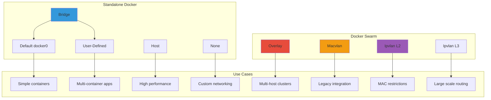
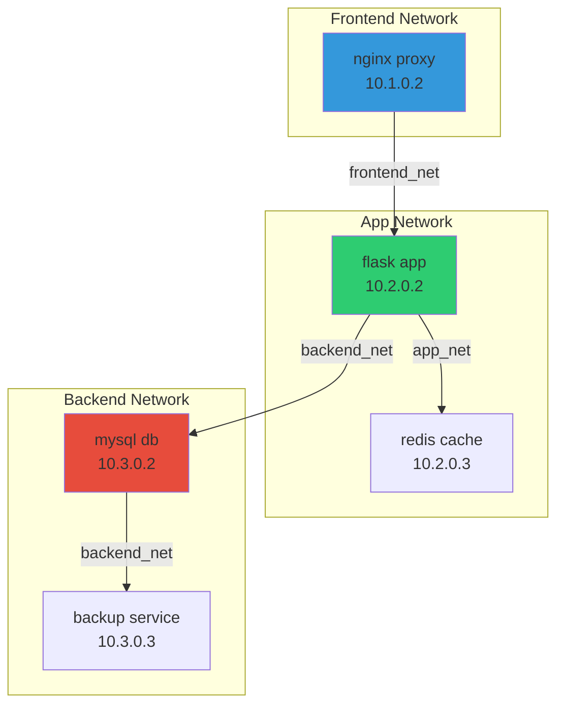
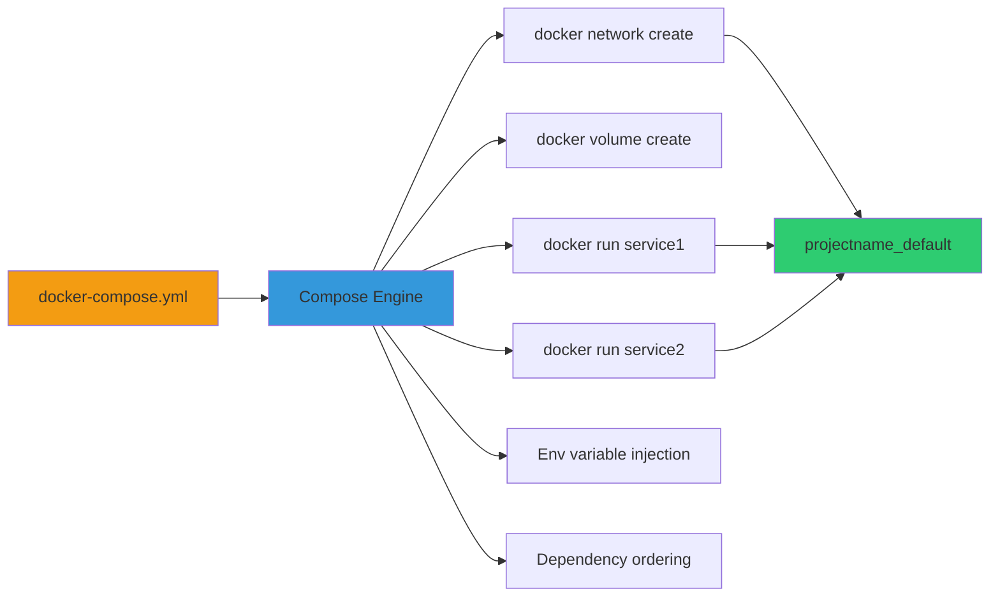
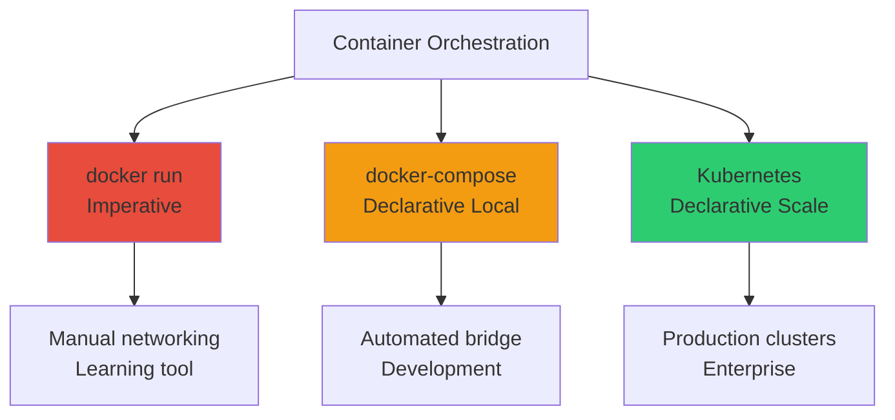
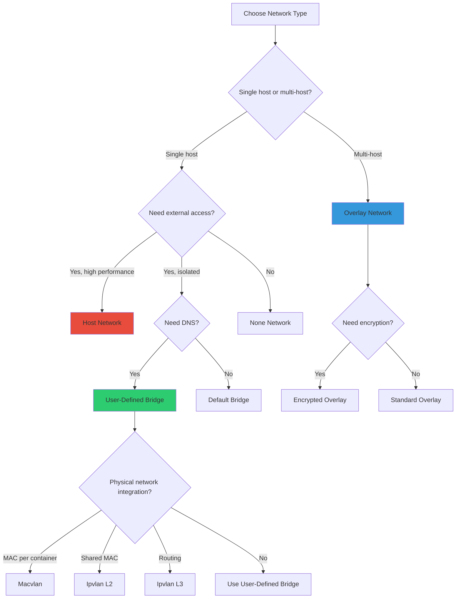
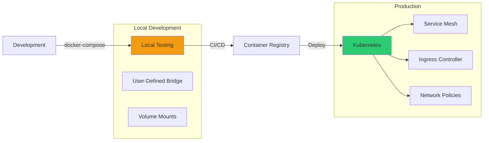
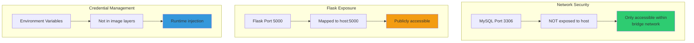
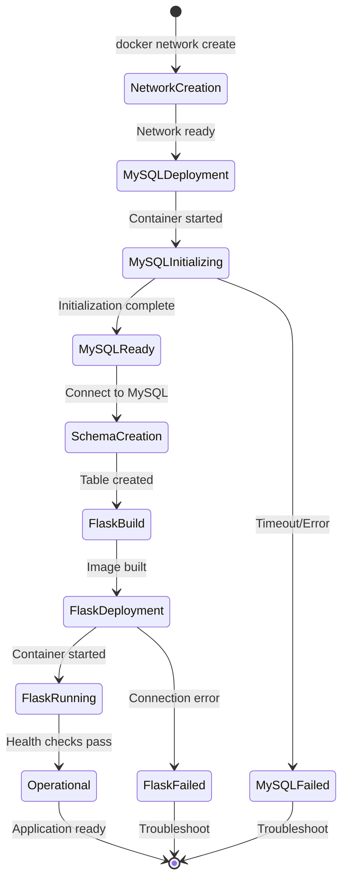
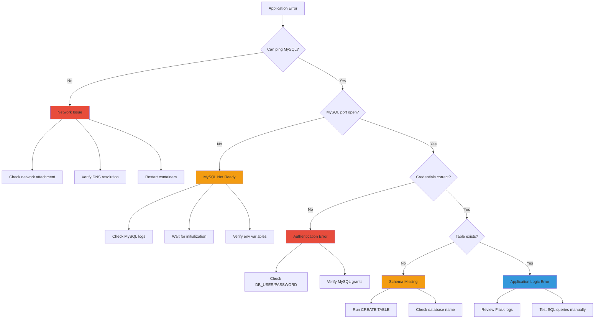

---
---


```
╔════════════════════════════════════════════════════════════════╗
║                                                                ║
║   ███╗   ██╗███████╗████████╗██╗    ██╗ ██████╗ ██████╗██╗  ██╗  ║
║   ████╗  ██║██╔════╝╚══██╔══╝██║    ██║██╔═══██╗██╔══██╗██║ ██╔╝  ║
║   ██╔██╗ ██║█████╗     ██║   ██║ █╗ ██║██║   ██║██████╔╝█████╔╝   ║
║   ██║╚██╗██║██╔══╝     ██║   ██║███╗██║██║   ██║██╔══██╗██╔═██╗   ║
║   ██║ ╚████║███████╗   ██║   ╚███╔███╔╝╚██████╔╝██║  ██║██║  ██╗  ║
║   ╚═╝  ╚═══╝╚══════╝   ╚═╝    ╚══╝╚══╝  ╚═════╝ ╚═╝  ╚═╝╚═╝  ╚═╝  ║
║                                                                ║
║              Docker Networking Deep Dive                       ║
║                                                                ║
╚════════════════════════════════════════════════════════════════╝
```


## Network Types Overview

### Complete Network Type Hierarchy

```markmap
# Docker Network Types
## Standalone Docker
### Bridge (Default)
- Default docker0 interface
- Automatic container connectivity
- NAT for external access
### User-Defined Bridge
- Custom network isolation
- Automatic DNS resolution
- Better control over IP ranges
### Host
- No network isolation
- Container uses host networking
- Best performance
### None
- No networking
- Complete isolation
- Manual configuration required
## Docker Swarm Mode
### Overlay
- Multi-host communication
- Swarm service discovery
- Encrypted data plane option
### Macvlan
- Physical MAC address per container
- Direct L2 network access
- VLAN trunk integration
### Ipvlan (L2 mode)
- Similar to macvlan
- Single MAC address
- Better for MAC address restrictions
### Ipvlan (L3 mode)
- Layer 3 routing
- No broadcast traffic
- Scalable multi-network design
```

### Network Driver Comparison Matrix




## Host Network

### Architecture

```
┌─────────────────────────────────────────────────────────────┐
│                      Host Machine                           │
│                                                             │
│               ┌─────────────────────┐                       │
│               │   eth0 (Host NIC)   │                       │
│               │   192.168.1.100     │                       │
│               └─────────────────────┘                       │
│                         │                                   │
│                         │ (Shared)                          │
│                         │                                   │
│               ┌─────────▼─────────┐                         │
│               │     Container     │                         │
│               │  (Host Network)   │                         │
│               │                   │                         │
│               │ No network        │                         │
│               │ namespace         │                         │
│               │ isolation         │                         │
│               └───────────────────┘                         │
│                                                             │
│  Container sees ALL host network interfaces                │
└─────────────────────────────────────────────────────────────┘
```

### Characteristics

**Properties:**

- Zero network isolation
- Container shares host network stack
- No port mapping needed
- Best network performance
- Container binds directly to host ports

**Use Cases:**

- High-performance networking requirements
- Network monitoring tools
- Load balancers requiring host network access
- Legacy applications expecting specific network setup

**Security Considerations:**

- Reduced isolation increases attack surface
- Container can access all host network interfaces
- Not recommended for untrusted containers
- Potential port conflicts with host services

```bash
# Run container with host network
docker run --network host nginx

# Container binds to host port directly
# No -p flag needed or allowed
docker run --network host my-app

# Verify network mode
docker inspect container_name | grep NetworkMode
```

**Key Limitation:**

- Port conflicts: Multiple containers cannot use same port
- Security risk: Full network access to host


## User-Defined Networks

### Network Management Commands

```bash
# Create network with custom subnet
docker network create \
  --driver bridge \
  --subnet 192.168.100.0/24 \
  --gateway 192.168.100.1 \
  --ip-range 192.168.100.128/25 \
  custom_network

# Create with IPv6 support
docker network create \
  --ipv6 \
  --subnet fd00:dead:beef::/48 \
  ipv6_network

# List all networks
docker network ls

# Inspect network details
docker network inspect custom_network

# Remove network
docker network rm custom_network

# Prune unused networks
docker network prune
```

### Advanced Network Features

```bash
# Connect running container to network
docker network connect app_net existing_container

# Disconnect from network
docker network disconnect app_net existing_container

# Assign static IP to container
docker run -d \
  --network custom_network \
  --ip 192.168.100.50 \
  --name web nginx

# Connect container to multiple networks
docker network connect frontend_net web_container
docker network connect backend_net web_container
```

### Multi-Network Container Architecture




## Bridge vs docker-compose

### Conceptual Comparison

```ascii
╔═══════════════════════════════════════════════════════════╗
║                                                           ║
║  Manual Bridge         vs.        docker-compose         ║
║  ──────────────                   ─────────────          ║
║                                                           ║
║  Imperative                       Declarative            ║
║  Manual commands                  YAML configuration     ║
║  Error-prone                      Reproducible           ║
║  No dependencies                  Dependency management   ║
║  Learning tool                    Production-ready        ║
║                                                           ║
╚═══════════════════════════════════════════════════════════╝
```

### What docker-compose Actually Does



### Key Truth

```
┌─────────────────────────────────────────────────────────┐
│                                                         │
│  docker-compose does NOT create new networking tech    │
│                                                         │
│  It simply AUTOMATES bridge networks + containers      │
│                                                         │
│         Compose = Bridge + Automation + Sanity         │
│                                                         │
└─────────────────────────────────────────────────────────┘
```

### Feature Comparison Table

|Feature|Manual Bridge|docker-compose|
|---|---|---|
|Network Creation|`docker network create`|Automatic|
|Container Startup|`docker run` (manual order)|`docker-compose up`|
|DNS Resolution|Yes (user-defined only)|Yes (automatic)|
|Service Discovery|Manual container names|Service names in YAML|
|Dependency Handling|None|`depends_on`|
|Environment Variables|`-e` flags|`environment` section|
|Volume Management|Manual creation|Declarative `volumes`|
|Scaling|Manual replication|`docker-compose scale`|
|Reproducibility|Poor|Excellent|
|Ideal Use|Learning, debugging|Development, testing|
|Production Use|No|No (use Kubernetes)|

### Mental Model Hierarchy




## Interview Preparation

### Critical Concepts Checklist

```ascii
╔════════════════════════════════════════════════════════════╗
║          DOCKER NETWORKING INTERVIEW CHECKLIST             ║
╠════════════════════════════════════════════════════════════╣
║                                                            ║
║  [ ] Explain bridge vs user-defined bridge                ║
║  [ ] When to use host network vs bridge                   ║
║  [ ] How Docker DNS works (127.0.0.11)                    ║
║  [ ] Difference between macvlan and ipvlan                ║
║  [ ] Overlay network architecture in Swarm                ║
║  [ ] Container to container communication                 ║
║  [ ] Port mapping vs host network                         ║
║  [ ] Network isolation principles                         ║
║  [ ] docker-compose networking automation                 ║
║  [ ] Multi-host networking strategies                     ║
║  [ ] iptables and NAT in Docker                           ║
║  [ ] Service discovery mechanisms                         ║
║                                                            ║
╚════════════════════════════════════════════════════════════╝
```

### Common Interview Questions

#### Q1: Explain Docker's embedded DNS server

**Answer:** Docker runs an embedded DNS server at `127.0.0.11` inside each container connected to user-defined networks. This DNS server:

- Resolves container names to IP addresses
- Automatically updates when containers are added/removed
- Provides service discovery without external tools
- Only works on user-defined networks, not default bridge
- Enables containers to communicate using container names instead of IPs

```bash
# Inside container, DNS queries go to 127.0.0.11
docker exec container_name cat /etc/resolv.conf
# nameserver 127.0.0.11
```

#### Q2: When would you use macvlan instead of bridge?

**Answer:** Use macvlan when:

- Legacy applications expect to be directly on physical network
- Need to integrate with VLANs
- Applications require promiscuous mode
- Network monitoring tools need direct hardware access
- Container must appear as physical device to network infrastructure

Avoid macvlan when:

- Additional MAC addresses cause issues (some cloud providers)
- Simple container-to-container communication sufficient
- Need port mapping flexibility
- Working with dynamic cloud environments

#### Q3: How does docker-compose handle networking?

**Answer:** docker-compose automatically:

1. Creates a default bridge network named `<project>_default`
2. Connects all services to this network
3. Enables DNS resolution using service names
4. Handles network cleanup on `docker-compose down`
5. Supports custom networks defined in YAML
6. Provides network isolation per project

Under the hood, compose just automates `docker network create` and `docker run --network` commands.

#### Q4: Explain the difference between ipvlan L2 and L3

**Answer:**

**Ipvlan L2:**

- Layer 2 switching within same broadcast domain
- Containers share parent interface MAC address
- Same subnet as physical network
- Simpler configuration
- Use when containers need L2 adjacency

**Ipvlan L3:**

- Layer 3 routing mode
- No broadcast/multicast traffic
- Each container can be on different subnet
- Host acts as router between subnets
- More scalable for large deployments
- Use for multi-tenant or high-scale environments

#### Q5: Why can't containers on default bridge use DNS resolution?

**Answer:** The default bridge network (`docker0`) is legacy and doesn't include the embedded DNS server. It was designed before Docker implemented automatic service discovery. Containers on default bridge must use:

- IP addresses directly
- Deprecated `--link` flag
- Manual `/etc/hosts` entries

User-defined bridge networks always include embedded DNS, making them the recommended approach for modern Docker deployments.

### Network Type Selection Decision Tree



### Production Deployment Patterns



### Interview One-Liners

```ascii
┌────────────────────────────────────────────────────────────┐
│                  INTERVIEW ONE-LINERS                      │
├────────────────────────────────────────────────────────────┤
│                                                            │
│  • "Docker containers communicate via embedded DNS on      │
│    user-defined bridges at 127.0.0.11"                    │
│                                                            │
│  • "docker-compose is orchestration automation, not a     │
│    networking requirement"                                 │
│                                                            │
│  • "Host network provides best performance but reduces    │
│    isolation"                                              │
│                                                            │
│  • "Overlay networks use VXLAN for multi-host container   │
│    communication"                                          │
│                                                            │
│  • "Macvlan assigns unique MAC per container, ipvlan      │
│    shares parent MAC"                                      │
│                                                            │
│  • "Default bridge is legacy; user-defined bridges        │
│    provide DNS"                                            │
│                                                            │
│  • "Skipping compose increases operational complexity"    │
│                                                            │
│  • "Kubernetes replaces docker-compose in production"     │
│                                                            │
└────────────────────────────────────────────────────────────┘
```

### Debugging Network Issues

```bash
# Inspect network configuration
docker network inspect <network_name>

# Check container networking
docker exec <container> ip addr show
docker exec <container> ip route show

# Test DNS resolution
docker exec <container> nslookup <other_container>
docker exec <container> cat /etc/resolv.conf

# Test connectivity
docker exec <container> ping <target>
docker exec <container> telnet <host> <port>
docker exec <container> nc -zv <host> <port>

# View iptables rules (host)
sudo iptables -t nat -L -n -v

# Capture network traffic
docker exec <container> tcpdump -i eth0 -n

# Check bridge interfaces (host)
ip link show | grep docker
brctl show
```

### Real-World DevOps Flow

```ascii
┌────────────────────────────────────────────────────────────┐
│                                                            │
│  Local Dev  ──────▶  docker-compose                       │
│                      (User-Defined Bridge)                 │
│                                                            │
│  Testing    ──────▶  docker-compose or manual             │
│                      (Learn internals)                     │
│                                                            │
│  Staging    ──────▶  Kubernetes                           │
│                      (Overlay-like CNI)                    │
│                                                            │
│  Production ──────▶  Kubernetes + Service Mesh            │
│                      (Advanced networking)                 │
│                                                            │
└────────────────────────────────────────────────────────────┘
```


**Document Version:** 1.0  
**Last Updated:** December 2025  
**Target Audience:** DevOps Engineers, System Administrators  
**Focus:** Interview Preparation, Production Deployment  
**Recommended Review:** Before technical interviews, system design discussions


# Flask + MySQL Docker Architecture - Implementation Guide

```
╔════════════════════════════════════════════════════════════════╗
║                                                                ║
║   ███████╗██╗      █████╗ ███████╗██╗  ██╗                    ║
║   ██╔════╝██║     ██╔══██╗██╔════╝██║ ██╔╝                    ║
║   █████╗  ██║     ███████║███████╗█████╔╝                     ║
║   ██╔══╝  ██║     ██╔══██║╚════██║██╔═██╗                     ║
║   ██║     ███████╗██║  ██║███████║██║  ██╗                    ║
║   ╚═╝     ╚══════╝╚═╝  ╚═╝╚══════╝╚═╝  ╚═╝                    ║
║                                                                ║
║              + MySQL + Docker Bridge Network                  ║
║                                                                ║
╚════════════════════════════════════════════════════════════════╝
```


## Problem Statement

### Objective

Build a production-style two-tier application architecture demonstrating:

- Multi-container orchestration without docker-compose
- Secure inter-container communication
- Environment-based configuration management
- Database persistence and data flow
- Manual networking fundamentals

### Requirements

```markmap
# Project Requirements
## Application Layer
### Flask web framework
### HTML form handling
### RESTful API endpoints
### Database integration
## Data Layer
### MySQL relational database
### User data persistence
### SQL operations (INSERT)
### Connection pooling
## Infrastructure
### Docker containerization
### Custom bridge network
### Environment variable injection
### No docker-compose dependency
## Security
### Network isolation
### Non-exposed database
### Credential management
### Least privilege access
```

### Technical Constraints

- Containers must communicate without docker-compose
- Environment variables managed via `.env` file
- Database not exposed to host network
- Flask publicly accessible via port mapping
- Production-ready architecture patterns


## Network Design

### Docker Bridge Network Fundamentals

**Network Name:** `line`  
**Driver:** `bridge`  
**DNS Resolution:** Automatic (container name as hostname)  
**Isolation:** Container-level network namespace

### Network Creation

```bash
docker network create line -d bridge
```

### Network Architecture Diagram

```
┌───────────────────────────────────────────────────────────────┐
│                       Docker Host                             │
│                    (Physical Machine)                         │
│                                                               │
│  ┌─────────────────────────────────────────────────────────┐ │
│  │            Bridge Network: line                         │ │
│  │            Subnet: 172.18.0.0/16 (example)              │ │
│  │                                                         │ │
│  │   ┌──────────────────────────────────────────────┐     │ │
│  │   │      Embedded DNS Server (127.0.0.11)       │     │ │
│  │   │      Hostname Resolution Service            │     │ │
│  │   │                                              │     │ │
│  │   │      flaskapp  → 172.18.0.2                 │     │ │
│  │   │      mysql     → 172.18.0.3                 │     │ │
│  │   └──────────────────────────────────────────────┘     │ │
│  │                                                         │ │
│  │   ┌─────────────────┐          ┌─────────────────┐    │ │
│  │   │   flaskapp      │          │     mysql       │    │ │
│  │   │   172.18.0.2    │◄────────►│   172.18.0.3    │    │ │
│  │   │   Port: 5000    │   DNS    │   Port: 3306    │    │ │
│  │   └─────────────────┘  Query   └─────────────────┘    │ │
│  │          │                                             │ │
│  │          │ Port Mapping                                │ │
│  └──────────┼─────────────────────────────────────────────┘ │
│             │                                               │
│             ▼                                               │
│      ┌─────────────┐                                       │
│      │   eth0      │ Host Network Interface                │
│      │   (Public)  │                                       │
│      └─────────────┘                                       │
└───────────────────────────────────────────────────────────────┘
         │
         ▼ Port 5000 (Exposed)
    External Access
```

### Why Custom Bridge Network?

```markmap
# Bridge Network Benefits
## Automatic DNS Resolution
### Container name = hostname
### No IP hardcoding required
### Dynamic service discovery
### Simplifies configuration
## Network Isolation
### Separate from default bridge
### Project-specific networking
### Controlled connectivity
### Enhanced security
## Production Patterns
### Microservices communication
### Service mesh foundation
### Container orchestration prep
### Kubernetes similarity
```

### Network Verification Commands

```bash
# List all networks
docker network ls

# Inspect network details
docker network inspect line

# View connected containers
docker network inspect line | grep -A 10 "Containers"

# Check DNS resolution from Flask container
docker exec flaskapp nslookup mysql

# Test connectivity
docker exec flaskapp ping -c 3 mysql
```


## Application Implementation

### Flask Application Code

```python
from flask import Flask, render_template, request
import mysql.connector
import os
from dotenv import load_dotenv

# Load environment variables from .env file (development fallback)
load_dotenv()

app = Flask(__name__)

# Database connection configuration
db = mysql.connector.connect(
    host=os.getenv("DB_HOST"),         # mysql (container name)
    user=os.getenv("DB_USER"),         # mukul
    password=os.getenv("DB_PASSWORD"), # 0203
    database=os.getenv("DB_NAME")      # appdb
)

cursor = db.cursor()

@app.route("/")
def index():
    """Render the main HTML form"""
    return render_template("index.html")

@app.route("/submit", methods=["POST"])
def submit():
    """Handle form submission and insert data into MySQL"""
    text = request.form["message"]
    
    # Execute parameterized query (SQL injection prevention)
    cursor.execute(
        "INSERT INTO users (name) VALUES (%s)",
        (text,)
    )
    db.commit()
    
    return "Text inserted successfully!"

if __name__ == "__main__":
    app.run(
        host=os.getenv("FLASK_HOST"),     # 0.0.0.0
        port=int(os.getenv("FLASK_PORT")) # 5000
    )
```

### Code Architecture Analysis

```markmap
# Flask Application Structure
## Imports
### Flask framework components
### MySQL connector library
### Environment variable handling
## Configuration
### Environment variable loading
### Database connection setup
### Cursor initialization
## Routes
### GET / (index)
- Render HTML form
- User interface
### POST /submit
- Process form data
- Execute SQL INSERT
- Commit transaction
- Return confirmation
## Security
### Parameterized queries
### SQL injection prevention
### Credential externalization
```

### Dependency Management

**requirements.txt:**

```text
flask
mysql-connector-python
python-dotenv
```

**Dependency Analysis:**

|Package|Version|Purpose|Criticality|
|---|---|---|---|
|flask|Latest|Web framework, routing, templating|Required|
|mysql-connector-python|Latest|MySQL database connectivity|Required|
|python-dotenv|Latest|Environment variable loading|Development|

**Note on python-dotenv:**

- Used for local development when `.env` file is present
- Not strictly required in production (uses `-e` injection)
- Provides fallback configuration mechanism
- Enables seamless local testing


## Container Configuration

### MySQL Container Deployment

```bash
docker run -d \
  --name mysql \
  --network line \
  -e MYSQL_ROOT_PASSWORD=0203 \
  -e MYSQL_DATABASE=appdb \
  -e MYSQL_USER=mukul \
  -e MYSQL_PASSWORD=0203 \
  mysql:8
```

**Configuration Breakdown:**

|Flag|Value|Purpose|
|---|---|---|
|`-d`|N/A|Detached mode (background)|
|`--name`|mysql|Container name (DNS hostname)|
|`--network`|line|Attach to custom bridge|
|`-e MYSQL_ROOT_PASSWORD`|0203|Root user password|
|`-e MYSQL_DATABASE`|appdb|Auto-create database|
|`-e MYSQL_USER`|mukul|Application user|
|`-e MYSQL_PASSWORD`|0203|Application password|
|Image|mysql:8|Official MySQL 8.0 image|

### Flask Container Deployment

```bash
docker run -d \
  --name flaskapp \
  --network line \
  -e FLASK_HOST=0.0.0.0 \
  -e FLASK_PORT=5000 \
  -e DB_HOST=mysql \
  -e DB_USER=mukul \
  -e DB_PASSWORD=0203 \
  -e DB_NAME=appdb \
  -p 5000:5000 \
  flask-app
```

**Configuration Breakdown:**

|Flag|Value|Purpose|
|---|---|---|
|`-d`|N/A|Detached mode|
|`--name`|flaskapp|Container name|
|`--network`|line|Same network as MySQL|
|`-e FLASK_HOST`|0.0.0.0|Bind to all interfaces|
|`-e FLASK_PORT`|5000|Application port|
|`-e DB_HOST`|mysql|MySQL container name|
|`-e DB_USER`|mukul|Database username|
|`-e DB_PASSWORD`|0203|Database password|
|`-e DB_NAME`|appdb|Database name|
|`-p`|5000:5000|Port mapping (host:container)|
|Image|flask-app|Custom built image|

### Security Considerations




## Deployment Procedure

### Step-by-Step Deployment Guide

#### Step 1: Network Initialization

```bash
# Create custom bridge network
docker network create line -d bridge

# Verify network creation
docker network ls | grep line

# Expected output:
# xxxxxxxxxx   line        bridge    local
```

#### Step 2: MySQL Container Deployment

```bash
# Start MySQL container
docker run -d \
  --name mysql \
  --network line \
  -e MYSQL_ROOT_PASSWORD=0203 \
  -e MYSQL_DATABASE=appdb \
  -e MYSQL_USER=mukul \
  -e MYSQL_PASSWORD=0203 \
  mysql:8

# Wait for MySQL initialization (30-60 seconds)
sleep 45

# Verify MySQL is ready
docker logs mysql 2>&1 | grep "ready for connections"
```

#### Step 3: Database Schema Creation

```bash
# Connect to MySQL container
docker exec -it mysql mysql -u mukul -p

# Enter password: 0203

# Create table
USE appdb;

CREATE TABLE users (
    id INT AUTO_INCREMENT PRIMARY KEY,
    name VARCHAR(255) NOT NULL,
    created_at TIMESTAMP DEFAULT CURRENT_TIMESTAMP
);

# Verify table creation
DESCRIBE users;

# Exit MySQL
EXIT;
```

#### Step 4: Flask Image Build

```bash
# Build Flask application image
docker build -t flask-app .

# Verify image
docker images | grep flask-app

# Expected output:
# flask-app    latest    xxxxxxxxxx    X minutes ago    XXX MB
```

#### Step 5: Flask Container Deployment

```bash
# Start Flask container
docker run -d \
  --name flaskapp \
  --network line \
  -e FLASK_HOST=0.0.0.0 \
  -e FLASK_PORT=5000 \
  -e DB_HOST=mysql \
  -e DB_USER=mukul \
  -e DB_PASSWORD=0203 \
  -e DB_NAME=appdb \
  -p 5000:5000 \
  flask-app

# Verify Flask is running
docker logs flaskapp
```

#### Step 6: Deployment Verification

```bash
# Check all running containers
docker ps

# Expected output:
# CONTAINER ID   IMAGE       COMMAND                  STATUS         PORTS
# xxxxxxxxxxxx   flask-app   "python app.py"         Up X minutes   0.0.0.0:5000->5000/tcp
# xxxxxxxxxxxx   mysql:8     "docker-entrypoint.s…"  Up X minutes   3306/tcp

# Test Flask endpoint
curl http://localhost:5000

# Expected: HTML form rendered
```

### Deployment State Machine




## Troubleshooting

### Common Issues and Solutions

```markmap
# Troubleshooting Guide
## Connection Issues
### Flask cannot connect to MySQL
- Check containers on same network
- Verify DB_HOST=mysql (not localhost)
- Ensure MySQL is fully initialized
- Check firewall rules
### DNS Resolution Fails
- Verify user-defined network (not default)
- Check container names match
- Restart Docker daemon
- Inspect network configuration
## Database Issues
### Table does not exist
- Run schema creation commands
- Verify database name matches
- Check user permissions
- Review MySQL initialization logs
### Authentication fails
- Verify credentials match
- Check MYSQL_USER and MYSQL_PASSWORD
- Ensure user has proper grants
- Reset MySQL root password if needed
## Application Issues
### Flask returns 500 error
- Check Flask logs: docker logs flaskapp
- Verify environment variables
- Test database connection manually
- Review application code
### Port already in use
- Check existing processes: lsof -i :5000
- Stop conflicting services
- Use different port mapping
- Kill zombie processes
## Container Issues
### Container exits immediately
- Check logs: docker logs <container>
- Verify CMD in Dockerfile
- Test entry point manually
- Review resource constraints
```

### Debugging Commands Reference

```bash
# Container inspection
docker inspect flaskapp
docker inspect mysql

# Network inspection
docker network inspect line

# Process inspection inside container
docker exec flaskapp ps aux
docker exec mysql ps aux

# Check environment variables
docker exec flaskapp env | grep DB_
docker exec mysql env | grep MYSQL_

# File system inspection
docker exec flaskapp ls -la /app
docker exec mysql ls -la /var/lib/mysql

# Resource usage
docker stats flaskapp mysql

# Port mapping verification
docker port flaskapp
```

### Error Diagnosis Flowchart




## Key Learnings Summary

```ascii
┌────────────────────────────────────────────────────────────┐
│                   CORE CONCEPTS MASTERED                   │
├────────────────────────────────────────────────────────────┤
│                                                            │
│  1. User-defined bridge networks enable DNS resolution    │
│                                                            │
│  2. Container name serves as hostname for connectivity    │
│                                                            │
│  3. Environment variables must be injected at runtime     │
│                                                            │
│  4. .env files outside build context require -e flags     │
│                                                            │
│  5. MySQL must not use localhost in containerized env     │
│                                                            │
│  6. Startup order matters: DB before application          │
│                                                            │
│  7. Port mapping exposes services selectively             │
│                                                            │
│  8. docker-compose simplifies but manual teaches depth    │
│                                                            │
│  9. Network isolation provides security layer             │
│                                                            │
│ 10. Manual setup foundation for Kubernetes understanding  │
│                                                            │
└────────────────────────────────────────────────────────────┘
```


**Document Version:** 1.0  
**Last Updated:** December 2025  
**Architecture Type:** Two-Tier Containerized Application  
**Deployment Method:** Manual Docker Commands  
**Target Audience:** DevOps Engineers, Backend Developers  
**Complexity Level:** Intermediate  
**Production Ready:** No (Educational/Development Setup)
