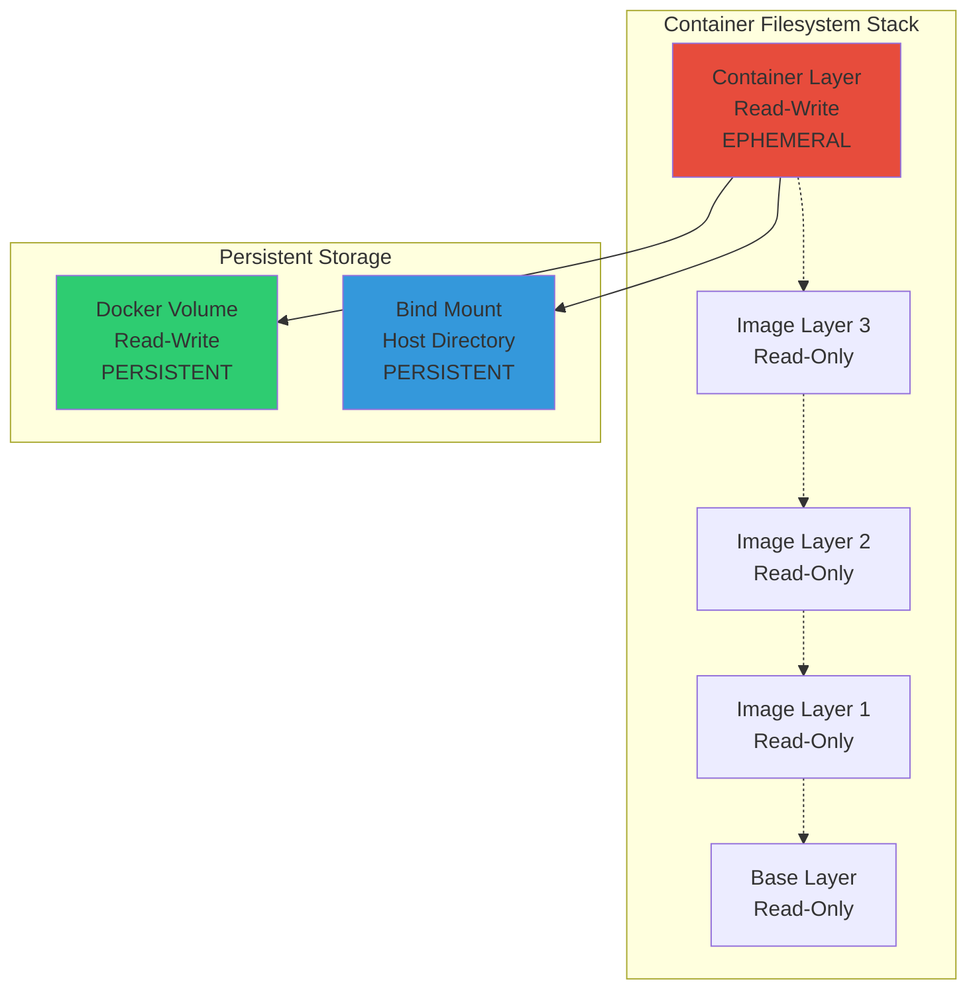
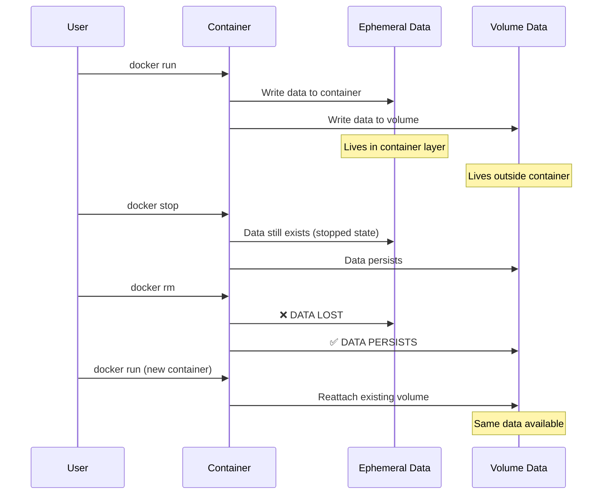
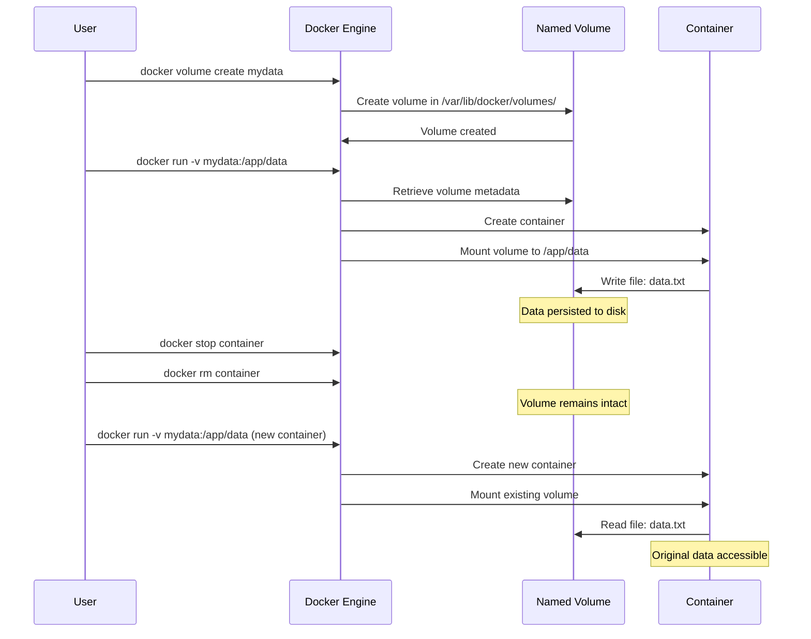
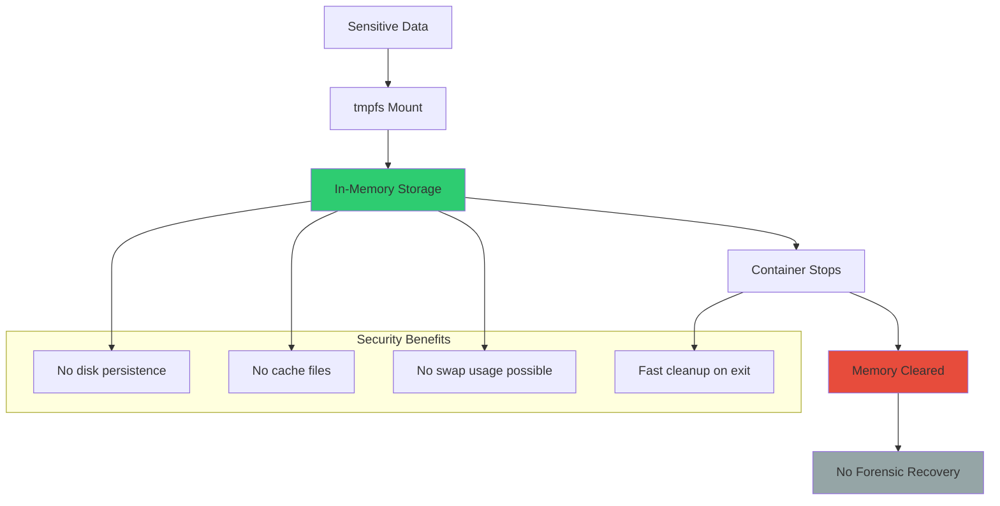
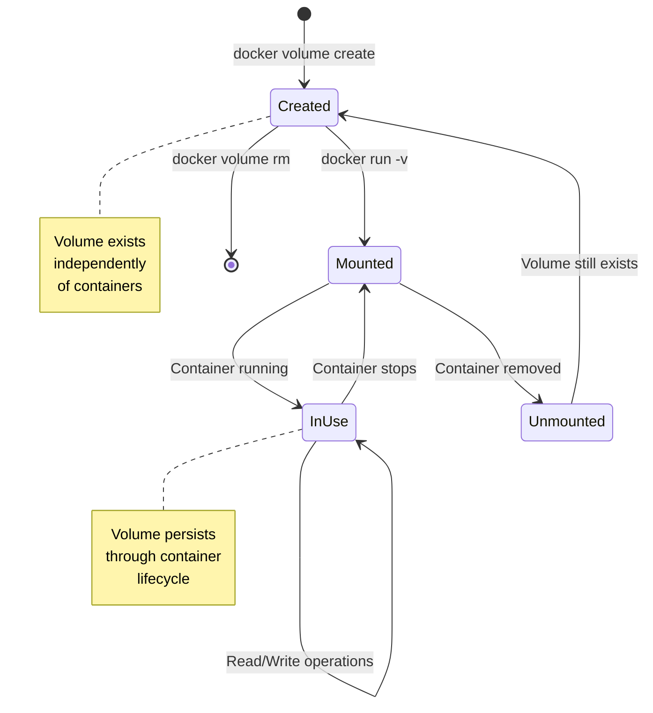
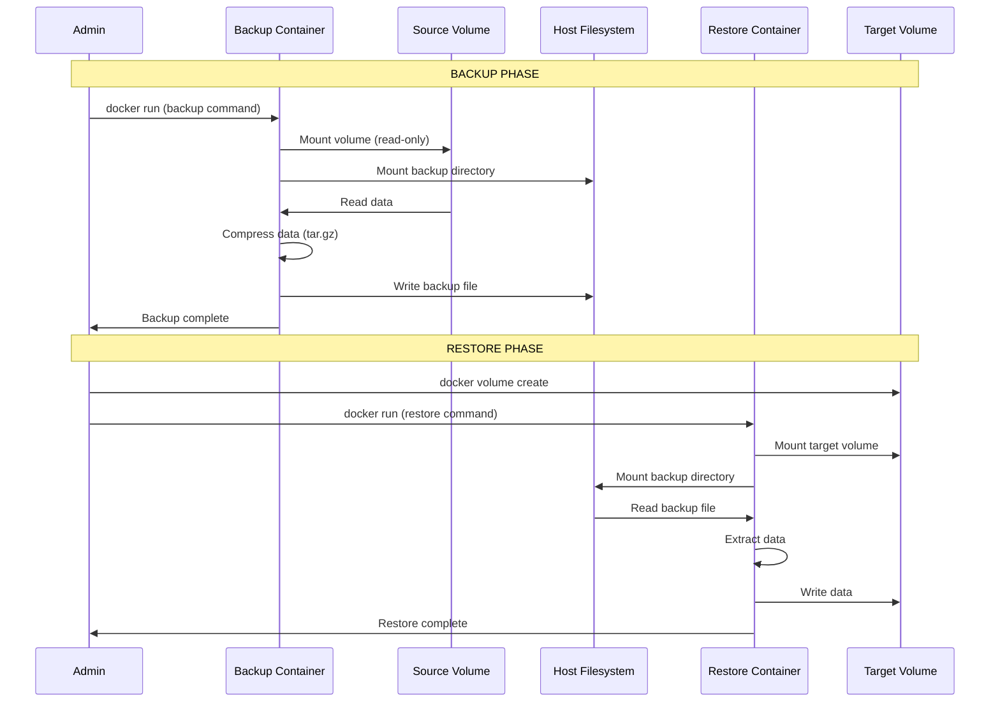
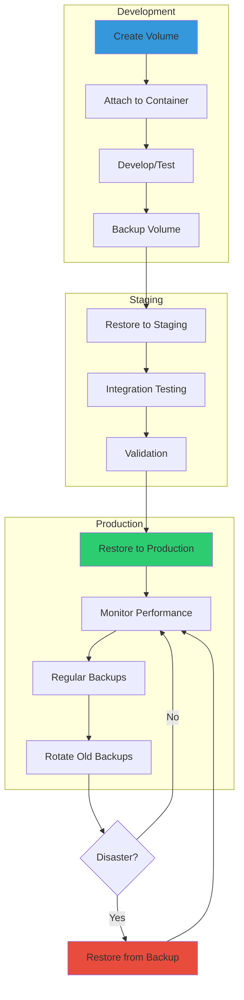

---
---
# Docker Volume & Storage - Complete Reference Guide

```
╔════════════════════════════════════════════════════════════════╗
║                                                                ║
║   ██╗   ██╗ ██████╗ ██╗     ██╗   ██╗███╗   ███╗███████╗     ║
║   ██║   ██║██╔═══██╗██║     ██║   ██║████╗ ████║██╔════╝     ║
║   ██║   ██║██║   ██║██║     ██║   ██║██╔████╔██║█████╗       ║
║   ╚██╗ ██╔╝██║   ██║██║     ██║   ██║██║╚██╔╝██║██╔══╝       ║
║    ╚████╔╝ ╚██████╔╝███████╗╚██████╔╝██║ ╚═╝ ██║███████╗     ║
║     ╚═══╝   ╚═════╝ ╚══════╝ ╚═════╝ ╚═╝     ╚═╝╚══════╝     ║
║                                                                ║
║            Data Persistence & Storage Management              ║
║                                                                ║
╚════════════════════════════════════════════════════════════════╝
```


## Storage Fundamentals

### The Container Storage Problem

```ascii
┌────────────────────────────────────────────────────────────┐
│            WHY VOLUMES ARE NECESSARY                       │
├────────────────────────────────────────────────────────────┤
│                                                            │
│  Problem: Container filesystems are ephemeral             │
│                                                            │
│  ┌──────────────┐                                         │
│  │  Container   │  When container stops/removed:          │
│  │  Filesystem  │  → All data inside is LOST              │
│  │  (Writable   │  → No persistence across restarts       │
│  │   Layer)     │  → Cannot share data between containers │
│  └──────────────┘                                         │
│                                                            │
│  Solution: Docker Volumes                                 │
│                                                            │
│  ┌──────────────┐     ┌──────────────┐                   │
│  │  Container   │────▶│   Volume     │                   │
│  │  (Temporary) │     │  (Persistent)│                   │
│  └──────────────┘     └──────────────┘                   │
│                                                            │
│  Benefits:                                                │
│  ✓ Data survives container lifecycle                     │
│  ✓ Share data between containers                         │
│  ✓ Better I/O performance                                │
│  ✓ Backup and migration capabilities                     │
│                                                            │
└────────────────────────────────────────────────────────────┘
```

### Container Filesystem Layers



### Storage Lifecycle Comparison




## Named Volumes

### What Are Named Volumes?

Named volumes are Docker-managed storage locations that persist data independently of container lifecycle. They are the recommended mechanism for production data persistence.

**Key Characteristics:**

- Fully managed by Docker
- Stored in `/var/lib/docker/volumes/` on Linux
- Referenced by name, not path
- Platform-independent
- Optimized for performance
- Easy backup and restoration
- Support for volume drivers

### Named Volume Architecture

```
┌─────────────────────────────────────────────────────────────┐
│                    Docker Engine                            │
│                                                             │
│  ┌──────────────────────────────────────────────────┐      │
│  │           Volume Management System               │      │
│  │                                                  │      │
│  │  Volume Metadata:                                │      │
│  │  - Name: postgres_data                           │      │
│  │  - Driver: local                                 │      │
│  │  - Mountpoint: /var/lib/docker/volumes/...      │      │
│  │  - Created: 2025-12-21T10:30:00Z                │      │
│  │  - Labels: {"env": "production"}                │      │
│  └──────────────────────────────────────────────────┘      │
│                         │                                   │
│                         ▼                                   │
│  ┌──────────────────────────────────────────────────┐      │
│  │     /var/lib/docker/volumes/postgres_data/       │      │
│  │                                                  │      │
│  │     _data/                                       │      │
│  │     ├── base/                                    │      │
│  │     ├── global/                                  │      │
│  │     ├── pg_wal/                                  │      │
│  │     └── postgresql.conf                          │      │
│  └──────────────────────────────────────────────────┘      │
│                         │                                   │
│                         ▼                                   │
│  ┌──────────────────────────────────────────────────┐      │
│  │            PostgreSQL Container                  │      │
│  │                                                  │      │
│  │  Mount: /var/lib/postgresql/data                │      │
│  │         ↓                                        │      │
│  │  Mapped to: postgres_data volume                │      │
│  └──────────────────────────────────────────────────┘      │
└─────────────────────────────────────────────────────────────┘
```

### Creating Named Volumes

#### Method 1: Explicit Creation

```bash
# Create a named volume
docker volume create my_volume

# Create with specific driver
docker volume create --driver local my_volume

# Create with labels
docker volume create \
  --label env=production \
  --label app=database \
  db_volume

# Create with driver options
docker volume create \
  --driver local \
  --opt type=nfs \
  --opt o=addr=192.168.1.100,rw \
  --opt device=:/path/to/dir \
  nfs_volume
```

#### Method 2: Implicit Creation (During docker run)

```bash
# Volume auto-created if it doesn't exist
docker run -d \
  --name postgres \
  -v postgres_data:/var/lib/postgresql/data \
  postgres:15

# Docker automatically creates 'postgres_data' volume
```

### Using Named Volumes

#### Basic Volume Mounting

```bash
# Mount named volume to container path
docker run -d \
  --name myapp \
  -v myapp_data:/app/data \
  myapp:latest

# Mount multiple volumes
docker run -d \
  --name webapp \
  -v app_data:/app/data \
  -v app_logs:/app/logs \
  -v app_config:/app/config \
  webapp:latest

# Read-only volume
docker run -d \
  --name readonly_app \
  -v config_volume:/app/config:ro \
  myapp:latest
```

#### Named Volume with MySQL Example

```bash
# Create volume
docker volume create mysql_data

# Run MySQL with persistent storage
docker run -d \
  --name mysql \
  -e MYSQL_ROOT_PASSWORD=secretpass \
  -e MYSQL_DATABASE=appdb \
  -v mysql_data:/var/lib/mysql \
  mysql:8

# Verify data persistence
docker exec mysql mysql -uroot -psecretpass -e "CREATE DATABASE testdb;"

# Stop and remove container
docker stop mysql
docker rm mysql

# Start new container with same volume
docker run -d \
  --name mysql_new \
  -e MYSQL_ROOT_PASSWORD=secretpass \
  -v mysql_data:/var/lib/mysql \
  mysql:8

# Data still exists
docker exec mysql_new mysql -uroot -psecretpass -e "SHOW DATABASES;"
```

### Named Volume Data Flow



### Named Volume Advantages

```ascii
╔════════════════════════════════════════════════════════════╗
║              NAMED VOLUME BENEFITS                         ║
╠════════════════════════════════════════════════════════════╣
║                                                            ║
║  ✓ Platform Independence                                  ║
║    Works on Windows, Linux, macOS without path changes    ║
║                                                            ║
║  ✓ Docker-Managed Lifecycle                               ║
║    Automatic creation, easy cleanup, metadata tracking    ║
║                                                            ║
║  ✓ Better Performance                                     ║
║    Optimized for container I/O operations                 ║
║                                                            ║
║  ✓ Flexible Drivers                                       ║
║    Support for NFS, cloud storage, custom backends        ║
║                                                            ║
║  ✓ Easy Backup/Restore                                    ║
║    Docker-native tools for volume management              ║
║                                                            ║
║  ✓ Container Portability                                  ║
║    Move containers across hosts with volume migration     ║
║                                                            ║
║  ✓ Security Isolation                                     ║
║    No direct host filesystem access                       ║
║                                                            ║
╚════════════════════════════════════════════════════════════╝
```


## tmpfs Mounts

### What Are tmpfs Mounts?

tmpfs mounts create storage in the host system's RAM. Data is never written to disk, exists only in memory, and is lost when the container stops.

**Key Characteristics:**

- In-memory storage only
- Extremely fast I/O
- No disk writes
- Data lost on container stop
- Linux-only feature
- Security for sensitive data
- No persistence by design

### tmpfs Architecture

```
┌─────────────────────────────────────────────────────────────┐
│                      Host Machine                           │
│                                                             │
│  ┌──────────────────────────────────────────────────┐      │
│  │              Physical RAM                        │      │
│  │              (Volatile Memory)                   │      │
│  │                                                  │      │
│  │  ┌────────────────────────────────────────┐     │      │
│  │  │     tmpfs Allocation                   │     │      │
│  │  │     (Memory-backed filesystem)         │     │      │
│  │  │                                        │     │      │
│  │  │  secrets/                              │     │      │
│  │  │  ├── api_key.txt                       │     │      │
│  │  │  ├── db_password.txt                   │     │      │
│  │  │  └── cert.pem                          │     │      │
│  │  └────────────────────────────────────────┘     │      │
│  └──────────────────────────────────────────────────┘      │
│                         │                                   │
│                         │ tmpfs Mount                       │
│                         ▼                                   │
│  ┌──────────────────────────────────────────────────┐      │
│  │            Container Filesystem                  │      │
│  │                                                  │      │
│  │  /run/secrets/                                   │      │
│  │  ├── api_key.txt                                 │      │
│  │  ├── db_password.txt                             │      │
│  │  └── cert.pem                                    │      │
│  │                                                  │      │
│  │  Application reads from RAM                     │      │
│  │  Never written to disk                          │      │
│  └──────────────────────────────────────────────────┘      │
│                                                             │
│  Container stops → RAM cleared → Data gone                 │
└─────────────────────────────────────────────────────────────┘
```

### Creating tmpfs Mounts

```bash
# Basic tmpfs mount
docker run -d \
  --name secure_app \
  --tmpfs /run/secrets \
  myapp:latest

# tmpfs with size limit
docker run -d \
  --name limited_app \
  --tmpfs /tmp:size=100m \
  myapp:latest

# tmpfs with specific mode
docker run -d \
  --name restricted_app \
  --tmpfs /run/secrets:mode=1770 \
  myapp:latest

# Multiple tmpfs mounts
docker run -d \
  --name multi_tmpfs \
  --tmpfs /tmp \
  --tmpfs /run/secrets:size=50m \
  --tmpfs /cache:mode=1777 \
  myapp:latest
```

### tmpfs Use Cases

#### Sensitive Data Handling

```bash
# Store API keys in memory only
docker run -d \
  --name api_service \
  --tmpfs /run/secrets:mode=0700 \
  -e API_KEY_FILE=/run/secrets/api.key \
  api-app:latest

# Application reads from tmpfs
# No disk traces of sensitive data
```

#### High-Performance Caching

```bash
# Fast temporary cache
docker run -d \
  --name cache_service \
  --tmpfs /cache:size=500m \
  redis:latest \
  redis-server --dir /cache
```

#### Build-Time Artifacts

```bash
# Temporary build files
docker run --rm \
  --name builder \
  --tmpfs /tmp/build:size=1g \
  -v $(pwd)/output:/output \
  build-image:latest
```

### tmpfs vs Disk Storage Performance

```ascii
┌────────────────────────────────────────────────────────────┐
│              I/O PERFORMANCE COMPARISON                    │
├────────────────────────────────────────────────────────────┤
│                                                            │
│  Storage Type    │  Read Speed  │  Write Speed            │
│  ───────────────────────────────────────────────────      │
│                                                            │
│  tmpfs (RAM)     │  10-20 GB/s  │  10-20 GB/s            │
│  ████████████████████████████████████████████             │
│                                                            │
│  SSD Volume      │   500 MB/s   │   300 MB/s             │
│  ████████████                                             │
│                                                            │
│  HDD Volume      │   150 MB/s   │   100 MB/s             │
│  ███                                                      │
│                                                            │
│  Network Storage │    50 MB/s   │    30 MB/s             │
│  █                                                        │
│                                                            │
│  tmpfs is 20-400x faster than disk storage                │
│                                                            │
└────────────────────────────────────────────────────────────┘
```

### tmpfs Security Benefits




## Storage Architecture

### Docker Storage Driver vs Volume Driver

```ascii
╔════════════════════════════════════════════════════════════╗
║         STORAGE DRIVER vs VOLUME DRIVER                    ║
╠════════════════════════════════════════════════════════════╣
║                                                            ║
║  Storage Driver (Graphdriver)                              ║
║  ────────────────────────────                              ║
║  • Manages container image layers                          ║
║  • Controls writable container layer                       ║
║  • Examples: overlay2, aufs, devicemapper                  ║
║  • Not for data persistence                                ║
║  • Performance impact on container operations              ║
║                                                            ║
║  Volume Driver (Plugin)                                    ║
║  ──────────────────────                                    ║
║  • Manages persistent data volumes                         ║
║  • Handles volume lifecycle                                ║
║  • Examples: local, nfs, aws-ebs, azure-file               ║
║  • Data persistence and sharing                            ║
║  • Independent of container lifecycle                      ║
║                                                            ║
╚════════════════════════════════════════════════════════════╝
```

### Complete Storage Stack

```
┌─────────────────────────────────────────────────────────────┐
│                Application Container                        │
│                                                             │
│  ┌──────────────┐  ┌──────────────┐  ┌──────────────┐     │
│  │   /app/data  │  │  /app/logs   │  │  /tmp        │     │
│  │  (Volume)    │  │  (Bind)      │  │  (tmpfs)     │     │
│  └──────┬───────┘  └──────┬───────┘  └──────┬───────┘     │
│         │                  │                  │             │
└─────────┼──────────────────┼──────────────────┼─────────────┘
          │                  │                  │
          ▼                  ▼                  ▼
┌─────────────────────────────────────────────────────────────┐
│                   Docker Engine                             │
│                                                             │
│  ┌──────────────┐  ┌──────────────┐  ┌──────────────┐     │
│  │Volume Driver │  │Bind Mount    │  │tmpfs Handler │     │
│  │  (Plugin)    │  │  (Direct)    │  │  (Memory)    │     │
│  └──────┬───────┘  └──────┬───────┘  └──────┬───────┘     │
│         │                  │                  │             │
└─────────┼──────────────────┼──────────────────┼─────────────┘
          │                  │                  │
          ▼                  ▼                  ▼
┌─────────────────────────────────────────────────────────────┐
│                   Host Operating System                     │
│                                                             │
│  ┌──────────────┐  ┌──────────────┐  ┌──────────────┐     │
│  │ /var/lib/    │  │ /host/path   │  │    RAM       │     │
│  │ docker/      │  │              │  │              │     │
│  │ volumes/     │  │              │  │              │     │
│  └──────┬───────┘  └──────┬───────┘  └──────┬───────┘     │
│         │                  │                  │             │
└─────────┼──────────────────┼──────────────────┼─────────────┘
          │                  │                  │
          ▼                  ▼                  ▼
┌─────────────────────────────────────────────────────────────┐
│              Physical Storage Layer                         │
│                                                             │
│  ┌──────────────┐  ┌──────────────┐  ┌──────────────┐     │
│  │     SSD      │  │     HDD      │  │Physical RAM  │     │
│  │   (Local)    │  │   (Local)    │  │  (Volatile)  │     │
│  └──────────────┘  └──────────────┘  └──────────────┘     │
└─────────────────────────────────────────────────────────────┘
```

### Volume Lifecycle Management




## Data Backup and Restore

### Backup Strategies

#### Method 1: Volume Backup Using Container

```bash
# Backup named volume to tar file
docker run --rm \
  -v postgres_data:/source:ro \
  -v $(pwd):/backup \
  alpine \
  tar czf /backup/postgres_backup_$(date +%Y%m%d_%H%M%S).tar.gz -C /source .

# Explanation:
# - Mount source volume as read-only
# - Mount backup destination (host directory)
# - Use alpine container to create compressed archive
# - Timestamp in filename for versioning
```

#### Method 2: Direct Volume Copy

```bash
# Create new volume from existing
docker run --rm \
  -v old_volume:/source:ro \
  -v new_volume:/dest \
  alpine \
  sh -c "cp -av /source/. /dest/"

# Verify copy
docker run --rm -v new_volume:/data alpine ls -la /data
```

#### Method 3: Database-Specific Backup

```bash
# MySQL dump backup
docker exec mysql \
  mysqldump -u root -p'password' --all-databases \
  > mysql_backup_$(date +%Y%m%d).sql

# PostgreSQL dump backup
docker exec postgres \
  pg_dumpall -U postgres \
  > postgres_backup_$(date +%Y%m%d).sql

# MongoDB dump backup
docker exec mongo \
  mongodump --out /backup/$(date +%Y%m%d)
```

### Backup Automation Script

```bash
#!/bin/bash
# volume-backup.sh

VOLUME_NAME="$1"
BACKUP_DIR="/backups/docker-volumes"
TIMESTAMP=$(date +%Y%m%d_%H%M%S)
BACKUP_FILE="${BACKUP_DIR}/${VOLUME_NAME}_${TIMESTAMP}.tar.gz"

# Create backup directory
mkdir -p "$BACKUP_DIR"

# Perform backup
echo "Backing up volume: $VOLUME_NAME"
docker run --rm \
  -v "${VOLUME_NAME}:/source:ro" \
  -v "${BACKUP_DIR}:/backup" \
  alpine \
  tar czf "/backup/${VOLUME_NAME}_${TIMESTAMP}.tar.gz" -C /source .

if [ $? -eq 0 ]; then
    echo "Backup successful: $BACKUP_FILE"
    
    # Optional: Remove backups older than 30 days
    find "$BACKUP_DIR" -name "${VOLUME_NAME}_*.tar.gz" -mtime +30 -delete
else
    echo "Backup failed!"
    exit 1
fi
```

### Restore Procedures

#### Method 1: Restore from Tar Archive

```bash
# Create new volume
docker volume create restored_volume

# Restore data from backup
docker run --rm \
  -v restored_volume:/target \
  -v $(pwd):/backup \
  alpine \
  sh -c "cd /target && tar xzf /backup/postgres_backup_20251221.tar.gz"

# Verify restored data
docker run --rm -v restored_volume:/data alpine ls -la /data
```

#### Method 2: Database Restore

```bash
# MySQL restore
docker exec -i mysql \
  mysql -u root -p'password' \
  < mysql_backup_20251221.sql

# PostgreSQL restore
docker exec -i postgres \
  psql -U postgres \
  < postgres_backup_20251221.sql

# MongoDB restore
docker exec mongo \
  mongorestore /backup/20251221
```

### Backup and Restore Workflow



### Backup Best Practices

```markmap
# Backup Best Practices
## Scheduling
### Automated cron jobs
### Off-peak hours
### Frequency based on RPO
### Retention policies
## Verification
### Test restores regularly
### Checksum validation
### Integrity checks
### Documentation
## Storage
### Off-site backups
### Multiple locations
### Encrypted storage
### Access controls
## Monitoring
### Backup success/failure alerts
### Storage capacity monitoring
### Backup age tracking
### Recovery time testing
```


## Production Patterns

### Database Persistence Pattern

```yaml
# docker-compose.yml for production database
version: '3.8'

services:
  postgres:
    image: postgres:15
    environment:
      POSTGRES_PASSWORD: ${DB_PASSWORD}
      POSTGRES_USER: ${DB_USER}
      POSTGRES_DB: ${DB_NAME}
    volumes:
      # Named volume for data persistence
      - postgres_data:/var/lib/postgresql/data
      # Bind mount for custom config
      - ./postgres.conf:/etc/postgresql/postgresql.conf:ro
      # Named volume for WAL logs
      - postgres_wal:/var/lib/postgresql/wal
    restart: unless-stopped
    healthcheck:
      test: ["CMD-SHELL", "pg_isready -U ${DB_USER}"]
      interval: 10s
      timeout: 5s
      retries: 5

volumes:
  postgres_data:
    driver: local
    driver_opts:
      type: none
      o: bind
      device: /mnt/postgres/data
  postgres_wal:
    driver: local
    driver_opts:
      type: none
      o: bind
      device: /mnt/postgres/wal
```

### Multi-Stage Application Pattern

```yaml
version: '3.8'

services:
  app:
    build: .
    volumes:
      # Application data
      - app_data:/app/data
      # Logs
      - app_logs:/app/logs
      # Configuration (read-only)
      - ./config:/app/config:ro
      # Uploads
      - uploads:/app/uploads
    tmpfs:
      # Temporary processing
      - /tmp
      # Cache
      - /app/cache
    depends_on:
      - database
      - cache

  database:
    image: postgres:15
    volumes:
      - db_data:/var/lib/postgresql/data
    
  cache:
    image: redis:7
    volumes:
      - cache_data:/data

volumes:
  app_data:
  app_logs:
  uploads:
  db_data:
  cache_data:
```

### Volume Sharing Pattern

```ascii
┌────────────────────────────────────────────────────────────┐
│              SHARED VOLUME ARCHITECTURE                    │
├────────────────────────────────────────────────────────────┤
│                                                            │
│  ┌──────────────┐         ┌──────────────┐               │
│  │   App 1      │◄───────►│ shared_logs  │               │
│  │  Container   │         │   (Volume)   │               │
│  └──────────────┘         └──────────────┘               │
│                                   ▲                        │
│                                   │                        │
│  ┌──────────────┐                 │                       │
│  │   App 2      │─────────────────┘                       │
│  │  Container   │                                         │
│  └──────────────┘                 │                       │
│                                   │                        │
│  ┌──────────────┐                 │                       │
│  │  Log Agent   │─────────────────┘                       │
│  │  Container   │                                         │
│  └──────────────┘                                         │
│                                                            │
│  Multiple containers can read/write to same volume        │
│  Use cases: Log aggregation, shared cache, config         │
│                                                            │
└────────────────────────────────────────────────────────────┘
```

### Volume Lifecycle Management Pattern



### High Availability Pattern

```yaml
version: '3.8'

services:
  mysql-master:
    image: mysql:8
    environment:
      MYSQL_ROOT_PASSWORD: ${MYSQL_ROOT_PASSWORD}
    volumes:
      - mysql_master_data:/var/lib/mysql
      - ./mysql-master.cnf:/etc/mysql/conf.d/master.cnf:ro
    networks:
      - db_network

  mysql-replica:
    image: mysql:8
    environment:
      MYSQL_ROOT_PASSWORD: ${MYSQL_ROOT_PASSWORD}
    volumes:
      - mysql_replica_data:/var/lib/mysql
      - ./mysql-replica.cnf:/etc/mysql/conf.d/replica.cnf:ro
    networks:
      - db_network
    depends_on:
      - mysql-master

volumes:
  mysql_master_data:
    driver: local
    driver_opts:
      type: none
      o: bind
      device: /mnt/mysql/master
  mysql_replica_data:
    driver: local
    driver_opts:
      type: none
      o: bind
      device: /mnt/mysql/replica

networks:
  db_network:
    driver: bridge
```


## Real-World Implementation Example

### Complete Production Setup

```yaml
# docker-compose.yml - Production-ready multi-tier application
version: '3.8'

services:
  # Web Application
  webapp:
    build: ./app
    volumes:
      # Application data (named volume)
      - app_data:/app/data
      # Upload storage
      - uploads:/app/uploads
      # Configuration (read-only bind mount)
      - ./config/app.conf:/app/config/app.conf:ro
      # Logs (named volume)
      - app_logs:/app/logs
    tmpfs:
      # Temporary processing
      - /tmp
      # Session cache
      - /app/cache:size=100m
    depends_on:
      postgres:
        condition: service_healthy
      redis:
        condition: service_started
    restart: unless-stopped
    networks:
      - frontend
      - backend

  # Database
  postgres:
    image: postgres:15
    environment:
      POSTGRES_USER: ${DB_USER}
      POSTGRES_PASSWORD: ${DB_PASSWORD}
      POSTGRES_DB: ${DB_NAME}
    volumes:
      # Database data (named volume on dedicated disk)
      - postgres_data:/var/lib/postgresql/data
      # WAL logs (separate volume)
      - postgres_wal:/var/lib/postgresql/wal
      # Custom configuration
      - ./config/postgresql.conf:/etc/postgresql/postgresql.conf:ro
      # Initialization scripts
      - ./init:/docker-entrypoint-initdb.d:ro
    restart: unless-stopped
    healthcheck:
      test: ["CMD-SHELL", "pg_isready -U ${DB_USER}"]
      interval: 10s
      timeout: 5s
      retries: 5
    networks:
      - backend

  # Cache
  redis:
    image: redis:7-alpine
    command: redis-server --appendonly yes
    volumes:
      # Redis persistence
      - redis_data:/data
      # Configuration
      - ./config/redis.conf:/usr/local/etc/redis/redis.conf:ro
    restart: unless-stopped
    networks:
      - backend

  # Log Aggregator
  fluentd:
    image: fluent/fluentd:latest
    volumes:
      # Shared log volumes
      - app_logs:/logs/app:ro
      # Fluentd configuration
      - ./config/fluentd.conf:/fluentd/etc/fluent.conf:ro
      # Output buffer
      - fluentd_buffer:/fluentd/buffer
    restart: unless-stopped
    networks:
      - backend

  # Backup Service
  backup:
    image: alpine:latest
    volumes:
      # Read-only access to all data volumes
      - postgres_data:/backup/postgres:ro
      - redis_data:/backup/redis:ro
      - app_data:/backup/app:ro
      # Backup destination
      - ./backups:/backups
    command: |
      sh -c "while true; do
        tar czf /backups/postgres_\$(date +%Y%m%d_%H%M%S).tar.gz -C /backup/postgres .
        tar czf /backups/redis_\$(date +%Y%m%d_%H%M%S).tar.gz -C /backup/redis .
        tar czf /backups/app_\$(date +%Y%m%d_%H%M%S).tar.gz -C /backup/app .
        find /backups -name '*.tar.gz' -mtime +7 -delete
        sleep 86400
      done"
    restart: unless-stopped

volumes:
  # Application volumes
  app_data:
    driver: local
    driver_opts:
      type: none
      o: bind
      device: /mnt/app/data
  
  uploads:
    driver: local
    driver_opts:
      type: none
      o: bind
      device: /mnt/app/uploads
  
  app_logs:
    driver: local
  
  # Database volumes (on dedicated SSD)
  postgres_data:
    driver: local
    driver_opts:
      type: none
      o: bind
      device: /mnt/ssd/postgres/data
  
  postgres_wal:
    driver: local
    driver_opts:
      type: none
      o: bind
      device: /mnt/ssd/postgres/wal
  
  # Cache volume
  redis_data:
    driver: local
  
  # Log aggregation buffer
  fluentd_buffer:
    driver: local

networks:
  frontend:
    driver: bridge
  backend:
    driver: bridge
    internal: true
```

### Deployment and Management Scripts

```bash
#!/bin/bash
# deploy.sh - Production deployment script

set -e

echo "=== Docker Volume Production Deployment ==="

# Pre-deployment checks
echo "Checking volumes..."
docker volume ls | grep -E "postgres_data|redis_data|app_data" || {
    echo "Creating volumes..."
    docker-compose up --no-start
}

# Backup before deployment
echo "Creating pre-deployment backup..."
./backup.sh

# Deploy services
echo "Deploying services..."
docker-compose up -d

# Health checks
echo "Waiting for services..."
docker-compose ps

# Verify volumes
echo "Verifying volume mounts..."
docker-compose exec webapp ls -la /app/data
docker-compose exec postgres ls -la /var/lib/postgresql/data

# Check logs
echo "Checking logs..."
docker-compose logs --tail=50

echo "=== Deployment Complete ==="
```


## Summary

### Key Takeaways

```ascii
╔════════════════════════════════════════════════════════════╗
║              DOCKER VOLUME KEY CONCEPTS                    ║
╠════════════════════════════════════════════════════════════╣
║                                                            ║
║  1. Container filesystems are ephemeral by design         ║
║     Volumes provide data persistence                       ║
║                                                            ║
║  2. Three storage types serve different purposes          ║
║     Named volumes: Production data                         ║
║     Bind mounts: Development and config                    ║
║     tmpfs: Sensitive temporary data                        ║
║                                                            ║
║  3. Named volumes are Docker-managed and portable         ║
║     Preferred for production environments                  ║
║                                                            ║
║  4. Volume drivers enable advanced storage                ║
║     NFS, cloud storage, distributed systems                ║
║                                                            ║
║  5. Regular backups are critical                          ║
║     Automate backup and test restore procedures            ║
║                                                            ║
║  6. Performance varies by storage type                    ║
║     tmpfs fastest, network storage slowest                 ║
║                                                            ║
║  7. Security through proper storage selection             ║
║     Sensitive data in tmpfs, isolated volumes              ║
║                                                            ║
║  8. Monitor and maintain volumes regularly                ║
║     Prune unused, track usage, optimize performance        ║
║                                                            ║
╚════════════════════════════════════════════════════════════╝
```

