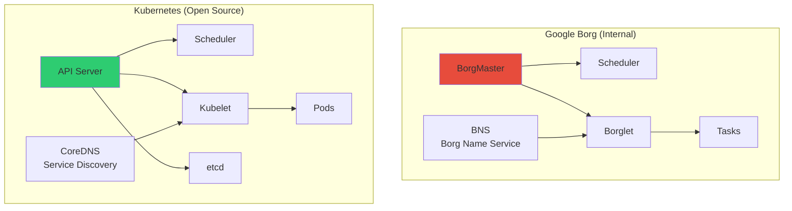
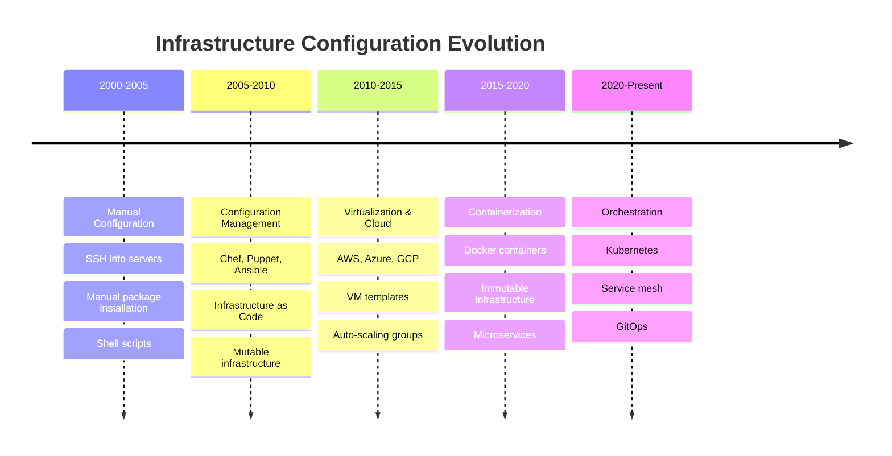
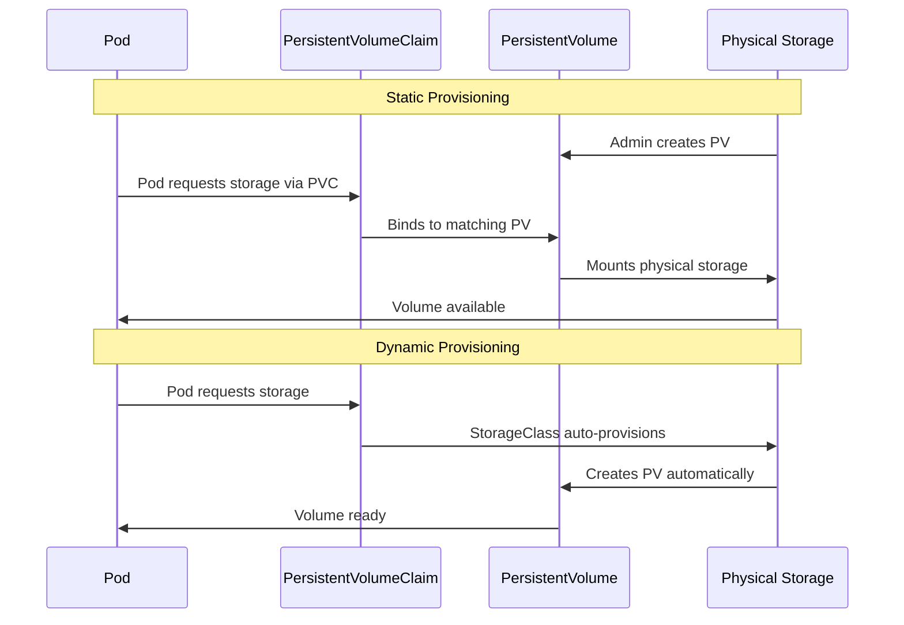
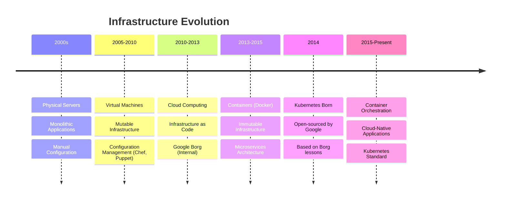

---
---
# Kubernetes Architecture - Complete DevOps Reference

```
╔════════════════════════════════════════════════════════════════╗
║                                                                ║
║   ██╗  ██╗██╗   ██╗██████╗ ███████╗██████╗ ███╗   ██╗███████╗ ║
║   ██║ ██╔╝██║   ██║██╔══██╗██╔════╝██╔══██╗████╗  ██║██╔════╝ ║
║   █████╔╝ ██║   ██║██████╔╝█████╗  ██████╔╝██╔██╗ ██║█████╗   ║
║   ██╔═██╗ ██║   ██║██╔══██╗██╔══╝  ██╔══██╗██║╚██╗██║██╔══╝   ║
║   ██║  ██╗╚██████╔╝██████╔╝███████╗██║  ██║██║ ╚████║███████╗ ║
║   ╚═╝  ╚═╝ ╚═════╝ ╚═════╝ ╚══════╝╚═╝  ╚═╝╚═╝  ╚═══╝╚══════╝ ║
║                                                                ║
║          Container Orchestration Platform                     ║
║                                                                ║
╚════════════════════════════════════════════════════════════════╝
```


## Evolution and History

### From Bare Metal to Containers

```ascii
┌────────────────────────────────────────────────────────────┐
│              INFRASTRUCTURE EVOLUTION                      │
├────────────────────────────────────────────────────────────┤
│                                                            │
│  Era 1: Physical Servers (1990s-2000s)                    │
│  ┌──────────────────────────────────────────────────┐     │
│  │  Physical Server                                 │     │
│  │  ┌────────────────────────────────────────┐     │     │
│  │  │  Application A    Application B        │     │     │
│  │  │  Dependencies     Dependencies         │     │     │
│  │  │  ────────────────────────────────────  │     │     │
│  │  │         Operating System               │     │     │
│  │  │         Hardware Resources             │     │     │
│  │  └────────────────────────────────────────┘     │     │
│  └──────────────────────────────────────────────────┘     │
│  Issues: Resource waste, no isolation, slow deployment    │
│                                                            │
│  Era 2: Virtualization (2000s-2010s)                      │
│  ┌──────────────────────────────────────────────────┐     │
│  │  Physical Server                                 │     │
│  │  ┌───────────┐  ┌───────────┐  ┌───────────┐   │     │
│  │  │    VM 1   │  │    VM 2   │  │    VM 3   │   │     │
│  │  │  App A    │  │  App B    │  │  App C    │   │     │
│  │  │  Guest OS │  │  Guest OS │  │  Guest OS │   │     │
│  │  └───────────┘  └───────────┘  └───────────┘   │     │
│  │  ┌────────────────────────────────────────┐     │     │
│  │  │         Hypervisor (VMware/KVM)        │     │     │
│  │  │         Host Operating System          │     │     │
│  │  │         Physical Hardware              │     │     │
│  │  └────────────────────────────────────────┘     │     │
│  └──────────────────────────────────────────────────┘     │
│  Benefits: Isolation, better resource use                  │
│  Issues: Heavy overhead, slow boot, large image sizes     │
│                                                            │
│  Era 3: Containers (2010s-Present)                        │
│  ┌──────────────────────────────────────────────────┐     │
│  │  Physical/Virtual Server                         │     │
│  │  ┌─────────┐  ┌─────────┐  ┌─────────┐         │     │
│  │  │Container│  │Container│  │Container│         │     │
│  │  │  App A  │  │  App B  │  │  App C  │         │     │
│  │  │  Libs   │  │  Libs   │  │  Libs   │         │     │
│  │  └─────────┘  └─────────┘  └─────────┘         │     │
│  │  ┌────────────────────────────────────────┐     │     │
│  │  │    Container Runtime (Docker)          │     │     │
│  │  │    Host Operating System               │     │     │
│  │  │    Physical/Virtual Hardware           │     │     │
│  │  └────────────────────────────────────────┘     │     │
│  └──────────────────────────────────────────────────┘     │
│  Benefits: Lightweight, fast, portable, efficient         │
│                                                            │
└────────────────────────────────────────────────────────────┘
```

### Google Borg: The Predecessor

```markmap
# Google Borg History
## Timeline
### 2003: Borg development begins
### 2004: Borg production deployment
### 2013: Borg paper published
### 2014: Kubernetes announced
### 2015: Kubernetes v1.0 released
## Borg Features
### Cluster management
### Resource scheduling
### Container orchestration
### Service discovery
### Load balancing
### Auto-scaling
## Borg to Kubernetes
### Open source vs proprietary
### Simpler architecture
### Declarative API
### Cloud-native design
### Community-driven
## Key Learnings
### Lessons from 10+ years at Google
### Billions of containers per week
### Large-scale cluster management
### Fault tolerance patterns
### Resource optimization
```

### Borg Architecture vs Kubernetes



### Why Kubernetes Exists

```ascii
╔════════════════════════════════════════════════════════════╗
║              THE ORCHESTRATION PROBLEM                     ║
╠════════════════════════════════════════════════════════════╣
║                                                            ║
║  Without Orchestration:                                   ║
║  ❌ Manual container placement                             ║
║  ❌ No automatic restart on failure                        ║
║  ❌ Manual scaling (up/down)                               ║
║  ❌ Complex networking setup                               ║
║  ❌ No service discovery                                   ║
║  ❌ Manual load balancing                                  ║
║  ❌ No rolling updates                                     ║
║  ❌ Configuration management chaos                         ║
║                                                            ║
║  With Kubernetes:                                         ║
║  ✓ Automated scheduling and placement                     ║
║  ✓ Self-healing (auto-restart)                            ║
║  ✓ Horizontal auto-scaling                                ║
║  ✓ Built-in service discovery                             ║
║  ✓ Integrated load balancing                              ║
║  ✓ Zero-downtime deployments                              ║
║  ✓ Declarative configuration                              ║
║  ✓ Secret and config management                           ║
║                                                            ║
╚════════════════════════════════════════════════════════════╝
```


## Configuration Management

### Mutable vs Immutable Infrastructure

#### Mutable Infrastructure (Traditional)

```
┌─────────────────────────────────────────────────────────────┐
│              MUTABLE INFRASTRUCTURE                         │
│                   (Configuration Drift)                     │
├─────────────────────────────────────────────────────────────┤
│                                                             │
│  Initial State (Day 1):                                     │
│  ┌──────────────────────────────────────────────────┐      │
│  │  Server A                                        │      │
│  │  - Ubuntu 20.04                                  │      │
│  │  - Apache 2.4.41                                 │      │
│  │  - PHP 7.4                                       │      │
│  │  - App v1.0                                      │      │
│  └──────────────────────────────────────────────────┘      │
│                                                             │
│  After Manual Changes (Day 30):                             │
│  ┌──────────────────────────────────────────────────┐      │
│  │  Server A                                        │      │
│  │  - Ubuntu 20.04 (security patches applied)      │      │
│  │  - Apache 2.4.43 (manual upgrade)               │      │
│  │  - PHP 7.4.3 (hotfix applied)                   │      │
│  │  - App v1.2 (direct deployment)                 │      │
│  │  - Debug tools installed                        │      │
│  │  - Config files modified                        │      │
│  └──────────────────────────────────────────────────┘      │
│                                                             │
│  Problems:                                                  │
│  ❌ Configuration drift                                     │
│  ❌ "Works on my machine" syndrome                          │
│  ❌ Difficult to reproduce                                  │
│  ❌ Snowflake servers                                       │
│  ❌ Hard to audit changes                                   │
│  ❌ Rollback complexity                                     │
│                                                             │
│  Tools: Chef, Puppet, Ansible, Salt                        │
│  Approach: Modify servers in place                         │
│                                                             │
└─────────────────────────────────────────────────────────────┘
```

#### Immutable Infrastructure (Modern)

```
┌─────────────────────────────────────────────────────────────┐
│             IMMUTABLE INFRASTRUCTURE                        │
│              (No Configuration Drift)                       │
├─────────────────────────────────────────────────────────────┤
│                                                             │
│  Version 1.0:                                               │
│  ┌──────────────────────────────────────────────────┐      │
│  │  Container Image v1.0                            │      │
│  │  - Base: Ubuntu 20.04                            │      │
│  │  - Apache 2.4.41                                 │      │
│  │  - PHP 7.4                                       │      │
│  │  - App v1.0                                      │      │
│  │  ────────────────────────────────────────────    │      │
│  │  SHA256: abc123...                               │      │
│  │  Immutable - Never Modified                      │      │
│  └──────────────────────────────────────────────────┘      │
│                    │                                        │
│                    ▼ Build new image                        │
│  Version 1.2:                                               │
│  ┌──────────────────────────────────────────────────┐      │
│  │  Container Image v1.2                            │      │
│  │  - Base: Ubuntu 20.04                            │      │
│  │  - Apache 2.4.43                                 │      │
│  │  - PHP 7.4.3                                     │      │
│  │  - App v1.2                                      │      │
│  │  ────────────────────────────────────────────    │      │
│  │  SHA256: def456...                               │      │
│  │  Immutable - Never Modified                      │      │
│  └──────────────────────────────────────────────────┘      │
│                                                             │
│  Deployment Strategy:                                       │
│  1. Build new container image                               │
│  2. Deploy new containers                                   │
│  3. Terminate old containers                                │
│  4. Rollback = Deploy old image                             │
│                                                             │
│  Benefits:                                                  │
│  ✓ No configuration drift                                   │
│  ✓ Perfect reproducibility                                  │
│  ✓ Easy rollback                                            │
│  ✓ Version control for infrastructure                       │
│  ✓ Consistent environments                                  │
│  ✓ Simple audit trail                                       │
│                                                             │
│  Tools: Docker, Kubernetes, Terraform                       │
│  Approach: Replace, don't modify                            │
│                                                             │
└─────────────────────────────────────────────────────────────┘
```

### Configuration Management Evolution




## Control Plane Components

### API Server

```
┌─────────────────────────────────────────────────────────────┐
│                      API SERVER                             │
│              (Central Management Component)                 │
├─────────────────────────────────────────────────────────────┤
│                                                             │
│  Purpose:                                                   │
│  - Single entry point for all cluster operations           │
│  - RESTful API for cluster management                      │
│  - Authenticates and authorizes requests                   │
│  - Validates and processes API objects                     │
│  - Updates etcd with cluster state                         │
│                                                             │
│  ┌───────────────────────────────────────────────────┐     │
│  │  Request Flow:                                    │     │
│  │                                                   │     │
│  │  kubectl apply -f deployment.yaml                │     │
│  │         │                                         │     │
│  │         ▼                                         │     │
│  │  ┌──────────────┐                                │     │
│  │  │ Authenticate │  (User credentials)            │     │
│  │  └──────┬───────┘                                │     │
│  │         │                                         │     │
│  │         ▼                                         │     │
│  │  ┌──────────────┐                                │     │
│  │  │  Authorize   │  (RBAC policies)               │     │
│  │  └──────┬───────┘                                │     │
│  │         │                                         │     │
│  │         ▼                                         │     │
│  │  ┌──────────────┐                                │     │
│  │  │   Validate   │  (Schema validation)           │     │
│  │  └──────┬───────┘                                │     │
│  │         │                                         │     │
│  │         ▼                                         │     │
│  │  ┌──────────────┐                                │     │
│  │  │  Store etcd  │  (Persist state)               │     │
│  │  └──────┬───────┘                                │     │
│  │         │                                         │     │
│  │         ▼                                         │     │
│  │  ┌──────────────┐                                │     │
│  │  │   Response   │  (Success/Failure)             │     │
│  │  └──────────────┘                                │     │
│  └───────────────────────────────────────────────────┘     │
│                                                             │
│  Port: 443 (HTTPS)                                         │
│  Protocol: RESTful JSON/YAML over HTTP/2                   │
│                                                             │
│  Key Features:                                             │
│  ✓ Horizontal scaling (multiple API servers)              │
│  ✓ TLS encryption                                          │
│  ✓ Admission controllers (webhooks)                        │
│  ✓ API versioning (v1, v1beta1)                           │
│                                                             │
└─────────────────────────────────────────────────────────────┘
```

### etcd

```
┌─────────────────────────────────────────────────────────────┐
│                         etcd                                │
│              (Distributed Key-Value Store)                  │
├─────────────────────────────────────────────────────────────┤
│                                                             │
│  Purpose:                                                   │
│  - Single source of truth for cluster state                │
│  - Stores all cluster configuration and state              │
│  - Consistent and highly-available data store              │
│  - Watches for changes (event-driven)                      │
│                                                             │
│  Data Stored:                                               │
│  ┌───────────────────────────────────────────────────┐     │
│  │  /registry/pods/default/nginx-abc123              │     │
│  │  /registry/services/default/my-service            │     │
│  │  /registry/deployments/default/my-app             │     │
│  │  /registry/secrets/default/db-credentials         │     │
│  │  /registry/configmaps/default/app-config          │     │
│  │  /registry/nodes/worker-node-1                    │     │
│  └───────────────────────────────────────────────────┘     │
│                                                             │
│  Architecture (High Availability):                          │
│  ┌───────────────────────────────────────────────────┐     │
│  │                                                   │     │
│  │   etcd-1  ◄────────► etcd-2  ◄────────► etcd-3   │     │
│  │  (Leader)            (Follower)        (Follower) │     │
│  │                                                   │     │
│  │  Raft Consensus Algorithm                         │     │
│  │  Quorum: (N/2) + 1 nodes must agree              │     │
│  │  Example: 3 nodes = can tolerate 1 failure       │     │
│  │           5 nodes = can tolerate 2 failures      │     │
│  └───────────────────────────────────────────────────┘     │
│                                                             │
│  Port: 2379 (client), 2380 (peer)                          │
│                                                             │
│  Critical Notes:                                           │
│  ⚠️  Backup etcd regularly (cluster state)                 │
│  ⚠️  Use odd number of nodes (3, 5, 7)                     │
│  ⚠️  Secure with TLS/certificates                          │
│  ⚠️  Fast disk required (SSD recommended)                  │
│                                                             │
└─────────────────────────────────────────────────────────────┘
```

### Scheduler

```
┌─────────────────────────────────────────────────────────────┐
│                       SCHEDULER                             │
│              (Pod Placement Decision Maker)                 │
├─────────────────────────────────────────────────────────────┤
│                                                             │
│  Purpose:                                                   │
│  - Assigns pods to nodes                                    │
│  - Considers resource requirements                          │
│  - Evaluates constraints and preferences                    │
│  - Optimizes cluster resource utilization                   │
│                                                             │
│  Scheduling Process:                                        │
│  ┌───────────────────────────────────────────────────┐     │
│  │                                                   │     │
│  │  1. Watch for unscheduled pods                    │     │
│  │     (pod.spec.nodeName == null)                   │     │
│  │                                                   │     │
│  │  2. Filtering Phase (Predicate)                   │     │
│  │     ├─ Sufficient CPU/Memory?                     │     │
│  │     ├─ Node selector match?                       │     │
│  │     ├─ Taints and tolerations?                    │     │
│  │     ├─ Affinity/Anti-affinity rules?              │     │
│  │     └─ Volume availability?                       │     │
│  │                                                   │     │
│  │  3. Scoring Phase (Priority)                      │     │
│  │     ├─ Least requested resources (balance)        │     │
│  │     ├─ Node affinity weight                       │     │
│  │     ├─ Pod topology spread                        │     │
│  │     └─ Image locality                             │     │
│  │                                                   │     │
│  │  4. Bind pod to best node                         │     │
│  │     └─ Update pod.spec.nodeName in etcd          │     │
│  │                                                   │     │
│  └───────────────────────────────────────────────────┘     │
│                                                             │
│  Example Scenario:                                          │
│  ┌───────────────────────────────────────────────────┐     │
│  │  Node A: CPU 50%, Memory 40%  Score: 85          │     │
│  │  Node B: CPU 80%, Memory 70%  Score: 45          │     │
│  │  Node C: CPU 30%, Memory 20%  Score: 95 ✓        │     │
│  │                                                   │     │
│  │  Pod scheduled to Node C (highest score)         │     │
│  └───────────────────────────────────────────────────┘     │
│                                                             │
└─────────────────────────────────────────────────────────────┘
```

### Controller Manager

```
┌─────────────────────────────────────────────────────────────┐
│                  CONTROLLER MANAGER                         │
│              (Reconciliation Loop Manager)                  │
├─────────────────────────────────────────────────────────────┤
│                                                             │
│  Purpose:                                                   │
│  - Runs controller processes                                │
│  - Watches for changes in cluster state                    │
│  - Takes action to match desired state                     │
│  - Ensures cluster health                                   │
│                                                             │
│  Built-in Controllers:                                      │
│                                                             │
│  ┌──────────────────────────────────────────────────┐      │
│  │  Node Controller                                 │      │
│  │  - Monitors node health                          │      │
│  │  - Marks nodes as NotReady after timeout         │      │
│  │  - Evicts pods from failed nodes                 │      │
│  └──────────────────────────────────────────────────┘      │
│                                                             │
│  ┌──────────────────────────────────────────────────┐      │
│  │  Replication Controller                          │      │
│  │  - Maintains correct number of pod replicas      │      │
│  │  - Creates new pods if some fail                 │      │
│  │  - Deletes excess pods                           │      │
│  └──────────────────────────────────────────────────┘      │
│                                                             │
│  ┌──────────────────────────────────────────────────┐      │
│  │  Endpoints Controller                            │      │
│  │  - Populates Endpoints object                    │      │
│  │  - Links Services to Pods                        │      │
│  │  - Updates when pods change                      │      │
│  └──────────────────────────────────────────────────┘      │
│                                                             │
│  ┌──────────────────────────────────────────────────┐      │
│  │  Service Account Controller                      │      │
│  │  - Creates default ServiceAccounts               │      │
│  │  - Manages API tokens                            │      │
│  └──────────────────────────────────────────────────┘      │
│                                                             │
│  Reconciliation Loop:                                       │
│  ┌───────────────────────────────────────────────────┐     │
│  │                                                   │     │
│  │   while (true) {                                  │     │
│  │     desired = read_from_etcd()                    │     │
│  │     current = observe_cluster()                   │     │
│  │                                                   │     │
│  │     if (desired != current) {                     │     │
│  │       take_action_to_fix()                        │     │
│  │     }                                             │     │
│  │                                                   │     │
│  │     sleep(30_seconds)                             │     │
│  │   }                                               │     │
│  │                                                   │     │
│  └───────────────────────────────────────────────────┘     │
│                                                             │
└─────────────────────────────────────────────────────────────┘
```


## Core Objects

### Pod - Smallest Deployable Unit

```
┌─────────────────────────────────────────────────────────────┐
│                           POD                               │
│              (Atomic Unit of Deployment)                    │
├─────────────────────────────────────────────────────────────┤
│                                                             │
│  Definition:                                                │
│  - Smallest deployable unit in Kubernetes                  │
│  - One or more containers sharing resources                │
│  - Ephemeral by nature (not durable)                       │
│  - Each pod has unique IP address                          │
│  - Containers in pod share network namespace               │
│                                                             │
│  Pod Structure:                                             │
│  ┌───────────────────────────────────────────────────┐     │
│  │                 Pod: nginx-abc123                 │     │
│  │                 IP: 10.244.1.5                    │     │
│  │                                                   │     │
│  │  ┌─────────────────────────────────────────────┐ │     │
│  │  │  Pause Container (Infrastructure)           │ │     │
│  │  │  - Holds network namespace                  │ │     │
│  │  │  - Minimal resource footprint               │ │     │
│  │  └─────────────────────────────────────────────┘ │     │
│  │                                                   │     │
│  │  ┌─────────────────────┐  ┌──────────────────┐  │     │
│  │  │  Main Container     │  │  Sidecar         │  │     │
│  │  │  nginx:1.21         │  │  log-collector   │  │     │
│  │  │  Port: 80           │  │  Port: 9090      │  │     │
│  │  └─────────────────────┘  └──────────────────┘  │     │
│  │                                                   │     │
│  │  Shared Resources:                                │     │
│  │  ├─ Network (localhost communication)            │     │
│  │  ├─ IPC (Inter-Process Communication)            │     │
│  │  ├─ Volumes (shared storage)                     │     │
│  │  └─ PID namespace (optional)                     │     │
│  │                                                   │     │
│  └───────────────────────────────────────────────────┘     │
│                                                             │
│  Pod Lifecycle States:                                      │
│  ┌───────────────────────────────────────────────────┐     │
│  │                                                   │     │
│  │  Pending    → Container images being pulled      │     │
│  │  Running    → At least one container running     │     │
│  │  Succeeded  → All containers terminated success  │     │
│  │  Failed     → At least one container failed      │     │
│  │  Unknown    → Cannot determine pod state         │     │
│  │                                                   │     │
│  └───────────────────────────────────────────────────┘     │
│                                                             │
│  YAML Example:                                              │
│  ```yaml                                                    │
│  apiVersion: v1                                             │
│  kind: Pod                                                  │
│  metadata:                                                  │
│    name: nginx-pod                                          │
│    labels:                                                  │
│      app: nginx                                             │
│  spec:                                                      │
│    containers:                                              │
│    - name: nginx                                            │
│      image: nginx:1.21                                      │
│      ports:                                                 │
│      - containerPort: 80                                    │
│  ```                                                        │
│                                                             │
└─────────────────────────────────────────────────────────────┘
```

### ReplicaSet - Desired State Maintenance

```
┌─────────────────────────────────────────────────────────────┐
│                       REPLICASET                            │
│            (Maintains Desired Number of Pods)               │
├─────────────────────────────────────────────────────────────┤
│                                                             │
│  Purpose:                                                   │
│  - Ensures specified number of pod replicas running        │
│  - Self-healing: Creates pods if they fail                 │
│  - Horizontal scaling capability                           │
│  - Uses label selectors to identify pods                   │
│                                                             │
│  How It Works:                                              │
│  ┌───────────────────────────────────────────────────┐     │
│  │                                                   │     │
│  │  Desired State: replicas = 3                      │     │
│  │                                                   │     │
│  │  ┌─────────┐  ┌─────────┐  ┌─────────┐          │     │
│  │  │  Pod 1  │  │  Pod 2  │  │  Pod 3  │          │     │
│  │  │ Running │  │ Running │  │ Running │          │     │
│  │  └─────────┘  └─────────┘  └─────────┘          │     │
│  │                                                   │     │
│  │  Current State: 3 pods running  ✓                │     │
│  │                                                   │     │
│  └───────────────────────────────────────────────────┘     │
│                                                             │
│  Failure Scenario:                                          │
│  ┌───────────────────────────────────────────────────┐     │
│  │                                                   │     │
│  │  Desired State: replicas = 3                      │     │
│  │                                                   │     │
│  │  ┌─────────┐  ┌─────────┐  ┌─────────┐          │     │
│  │  │  Pod 1  │  │  Pod 2  │  │  Pod 3  │          │     │
│  │  │ Running │  │ Failed  │  │ Running │          │     │
│  │  └─────────┘  └────X────┘  └─────────┘          │     │
│  │                     │                             │     │
│  │                     │ ReplicaSet detects failure │     │
│  │                     ▼                             │     │
│  │                ┌─────────┐                        │     │
│  │                │  Pod 4  │                        │     │
│  │                │ Creating│                        │     │
│  │                └─────────┘                        │     │
│  │                                                   │     │
│  │  Current State: Auto-healing in progress         │     │
│  │                                                   │     │
│  └───────────────────────────────────────────────────┘     │
│                                                             │
│  YAML Example:                                              │
│  ```yaml                                                    │
│  apiVersion: apps/v1                                        │
│  kind: ReplicaSet                                           │
│  metadata:                                                  │
│    name: nginx-rs                                           │
│  spec:                                                      │
│    replicas: 3                                              │
│    selector:                                                │
│      matchLabels:                                           │
│        app: nginx                                           │
│    template:                                                │
│      metadata:                                              │
│        labels:                                              │
│          app: nginx                                         │
│      spec:                                                  │
│        containers:                                          │
│        - name: nginx                                        │
│          image: nginx:1.21                                  │
│  ```                                                        │
│                                                             │
└─────────────────────────────────────────────────────────────┘
```

### Deployment - Declarative Updates

```
┌─────────────────────────────────────────────────────────────┐
│                       DEPLOYMENT                            │
│         (Manages ReplicaSets and Rolling Updates)           │
├─────────────────────────────────────────────────────────────┤
│                                                             │
│  Purpose:                                                   │
│  - Declarative updates for pods and ReplicaSets            │
│  - Rolling updates and rollbacks                           │
│  - Manages multiple ReplicaSet versions                    │
│  - Deployment strategies (RollingUpdate, Recreate)         │
│                                                             │
│  Hierarchy:                                                 │
│  ┌───────────────────────────────────────────────────┐     │
│  │                                                   │     │
│  │              Deployment                           │     │
│  │                  │                                │     │
│  │         ┌────────┴────────┐                      │     │
│  │         ▼                 ▼                      │     │
│  │   ReplicaSet v1      ReplicaSet v2               │     │
│  │   (replicas: 0)      (replicas: 3)               │     │
│  │                           │                       │     │
│  │                   ┌───────┼───────┐              │     │
│  │                   ▼       ▼       ▼              │     │
│  │                 Pod1    Pod2    Pod3             │     │
│  │                                                   │     │
│  └───────────────────────────────────────────────────┘     │
│                                                             │
│  Rolling Update Process:                                    │
│  ┌───────────────────────────────────────────────────┐     │
│  │                                                   │     │
│  │  Step 1: Old ReplicaSet (v1) - 3 pods            │     │
│  │  ┌─────┐  ┌─────┐  ┌─────┐                      │     │
│  │  │ v1  │  │ v1  │  │ v1  │                      │     │
│  │  └─────┘  └─────┘  └─────┘                      │     │
│  │                                                   │     │
│  │  Step 2: New ReplicaSet (v2) created             │     │
│  │  ┌─────┐  ┌─────┐  ┌─────┐  ┌─────┐             │     │
│  │  │ v1  │  │ v1  │  │ v1  │  │ v2  │             │     │
│  │  └─────┘  └─────┘  └─────┘  └─────┘             │     │
│  │                                                   │     │
│  │  Step 3: Gradually replace pods                  │     │
│  │  ┌─────┐  ┌─────┐  ┌─────┐  ┌─────┐             │     │
│  │  │ v1  │  │ v2  │  │ v2  │  │ v2  │             │     │
│  │  └─────┘  └─────┘  └─────┘  └─────┘             │     │
│  │                                                   │     │
│  │  Step 4: All pods updated to v2                  │     │
│  │  ┌─────┐  ┌─────┐  ┌─────┐                      │     │
│  │  │ v2  │  │ v2  │  │ v2  │                      │     │
│  │  └─────┘  └─────┘  └─────┘                      │     │
│  │                                                   │     │
│  │  Zero downtime during update!                    │     │
│  │                                                   │     │
│  └───────────────────────────────────────────────────┘     │
│                                                             │
│  Deployment Strategies:                                     │
│                                                             │
│  1. RollingUpdate (Default)                                 │
│     - Gradually replace old pods with new                  │
│     - maxSurge: Max new pods during update                 │
│     - maxUnavailable: Max unavailable pods                 │
│     - Zero downtime                                        │
│                                                             │
│  2. Recreate                                                │
│     - Kill all old pods first                              │
│     - Then create new pods                                 │
│     - Downtime during update                               │
│     - Simpler, faster                                      │
│                                                             │
│  YAML Example:                                              │
│  ```yaml                                                    │
│  apiVersion: apps/v1                                        │
│  kind: Deployment                                           │
│  metadata:                                                  │
│    name: nginx-deployment                                   │
│  spec:                                                      │
│    replicas: 3                                              │
│    strategy:                                                │
│      type: RollingUpdate                                    │
│      rollingUpdate:                                         │
│        maxSurge: 1                                          │
│        maxUnavailable: 1                                    │
│    selector:                                                │
│      matchLabels:                                           │
│        app: nginx                                           │
│    template:                                                │
│      metadata:                                              │
│        labels:                                              │
│          app: nginx                                         │
│      spec:                                                  │
│        containers:                                          │
│        - name: nginx                                        │
│          image: nginx:1.21                                  │
│          ports:                                             │
│          - containerPort: 80                                │
│  ```                                                        │
│                                                             │
└─────────────────────────────────────────────────────────────┘
```

### Service - Stable Network Endpoint

```
┌─────────────────────────────────────────────────────────────┐
│                        SERVICE                              │
│              (Stable Network Abstraction)                   │
├─────────────────────────────────────────────────────────────┤
│                                                             │
│  Purpose:                                                   │
│  - Stable IP and DNS name for pod group                    │
│  - Load balancing across pod replicas                      │
│  - Service discovery                                        │
│  - Decouples frontend from backend pods                    │
│                                                             │
│  Problem Without Service:                                   │
│  ┌───────────────────────────────────────────────────┐     │
│  │                                                   │     │
│  │  Frontend needs to connect to backend            │     │
│  │                                                   │     │
│  │  Backend Pods (IPs change on restart):           │     │
│  │  - Pod 1: 10.244.1.5 (killed)                    │     │
│  │  - Pod 2: 10.244.2.7 (killed)                    │     │
│  │  - Pod 3: 10.244.1.15 (new IP!)                  │     │
│  │  - Pod 4: 10.244.2.18 (new IP!)                  │     │
│  │                                                   │     │
│  │  How does frontend find backends? ❌              │     │
│  │                                                   │     │
│  └───────────────────────────────────────────────────┘     │
│                                                             │
│  Solution With Service:                                     │
│  ┌───────────────────────────────────────────────────┐     │
│  │                                                   │     │
│  │  Service: backend-service                         │     │
│  │  ClusterIP: 10.96.0.10 (stable)                  │     │
│  │  DNS: backend-service.default.svc.cluster.local  │     │
│  │                                                   │     │
│  │          │ Selector: app=backend                  │     │
│  │          ▼                                        │     │
│  │  ┌─────────────────────────────┐                 │     │
│  │  │  Backend Pods:              │                 │     │
│  │  │  - Pod A: 10.244.1.15       │                 │     │
│  │  │  - Pod B: 10.244.2.18       │                 │     │
│  │  │  - Pod C: 10.244.3.22       │                 │     │
│  │  └─────────────────────────────┘                 │     │
│  │                                                   │     │
│  │  Frontend connects to: backend-service:8080 ✓    │     │
│  │  Service load balances to healthy pods           │     │
│  │                                                   │     │
│  └───────────────────────────────────────────────────┘     │
│                                                             │
│  Service Types:                                             │
│                                                             │
│  1. ClusterIP (Default)                                     │
│     - Internal cluster IP                                  │
│     - Only accessible within cluster                       │
│     - Use for internal services                            │
│                                                             │
│  2. NodePort                                                │
│     - Exposes service on each node's IP                    │
│     - Accessible from outside cluster                      │
│     - Port range: 30000-32767                              │
│     - Format: <NodeIP>:<NodePort>                          │
│                                                             │
│  3. LoadBalancer                                            │
│     - Creates external load balancer (cloud provider)      │
│     - Gets external IP address                             │
│     - Routes traffic to NodePort                           │
│                                                             │
│  4. ExternalName                                            │
│     - Maps service to external DNS name                    │
│     - CNAME record                                         │
│     - No proxy or load balancing                           │
│                                                             │
│  YAML Example:                                              │
│  ```yaml                                                    │
│  apiVersion: v1                                             │
│  kind: Service                                              │
│  metadata:                                                  │
│    name: backend-service                                    │
│  spec:                                                      │
│    type: ClusterIP                                          │
│    selector:                                                │
│      app: backend                                           │
│    ports:                                                   │
│    - protocol: TCP                                          │
│      port: 8080         # Service port                     │
│      targetPort: 8080   # Container port                   │
│  ```                                                        │
│                                                             │
└─────────────────────────────────────────────────────────────┘
```

### ConfigMap and Secret

```
┌─────────────────────────────────────────────────────────────┐
│                 CONFIGMAP & SECRET                          │
│            (Configuration and Sensitive Data)               │
├─────────────────────────────────────────────────────────────┤
│                                                             │
│  ConfigMap - Non-sensitive Configuration                    │
│  ┌───────────────────────────────────────────────────┐     │
│  │                                                   │     │
│  │  Purpose:                                         │     │
│  │  - Store configuration data as key-value pairs    │     │
│  │  - Decouple configuration from container images  │     │
│  │  - Allow dynamic configuration updates           │     │
│  │                                                   │     │
│  │  Usage Methods:                                   │     │
│  │  1. Environment variables                         │     │
│  │  2. Command-line arguments                        │     │
│  │  3. Configuration files in volume                 │     │
│  │                                                   │     │
│  │  Example:                                         │     │
│  │  ```yaml                                          │     │
│  │  apiVersion: v1                                   │     │
│  │  kind: ConfigMap                                  │     │
│  │  metadata:                                        │     │
│  │    name: app-config                               │     │
│  │  data:                                            │     │
│  │    APP_MODE: "production"                         │     │
│  │    LOG_LEVEL: "info"                              │     │
│  │    DATABASE_HOST: "postgres.default.svc"          │     │
│  │    app.properties: |                              │     │
│  │      max.connections=100                          │     │
│  │      timeout=30                                   │     │
│  │  ```                                              │     │
│  │                                                   │     │
│  └───────────────────────────────────────────────────┘     │
│                                                             │
│  Secret - Sensitive Configuration                           │
│  ┌───────────────────────────────────────────────────┐     │
│  │                                                   │     │
│  │  Purpose:                                         │     │
│  │  - Store sensitive data (passwords, tokens, keys) │     │
│  │  - Base64 encoded (not encrypted by default!)    │     │
│  │  - More secure than ConfigMaps                    │     │
│  │  - Can be encrypted at rest (etcd encryption)    │     │
│  │                                                   │     │
│  │  Types:                                           │     │
│  │  - Opaque (default, arbitrary data)              │     │
│  │  - kubernetes.io/service-account-token            │     │
│  │  - kubernetes.io/dockerconfigjson                 │     │
│  │  - kubernetes.io/tls                              │     │
│  │                                                   │     │
│  │  Example:                                         │     │
│  │  ```yaml                                          │     │
│  │  apiVersion: v1                                   │     │
│  │  kind: Secret                                     │     │
│  │  metadata:                                        │     │
│  │    name: db-secret                                │     │
│  │  type: Opaque                                     │     │
│  │  data:                                            │     │
│  │    username: YWRtaW4=      # base64: admin       │     │
│  │    password: czNjcjN0cGFzcw==  # base64: s3cr3tpass │
│  │  ```                                              │     │
│  │                                                   │     │
│  └───────────────────────────────────────────────────┘     │
│                                                             │
│  Using ConfigMap/Secret in Pod:                             │
│  ```yaml                                                    │
│  apiVersion: v1                                             │
│  kind: Pod                                                  │
│  metadata:                                                  │
│    name: myapp                                              │
│  spec:                                                      │
│    containers:                                              │
│    - name: app                                              │
│      image: myapp:1.0                                       │
│      env:                                                   │
│      # From ConfigMap                                       │
│      - name: APP_MODE                                       │
│        valueFrom:                                           │
│          configMapKeyRef:                                   │
│            name: app-config                                 │
│            key: APP_MODE                                    │
│      # From Secret                                          │
│      - name: DB_PASSWORD                                    │
│        valueFrom:                                           │
│          secretKeyRef:                                      │
│            name: db-secret                                  │
│            key: password                                    │
│      # Mount as volume                                      │
│      volumeMounts:                                          │
│      - name: config-volume                                  │
│        mountPath: /etc/config                               │
│    volumes:                                                 │
│    - name: config-volume                                    │
│      configMap:                                             │
│        name: app-config                                     │
│  ```                                                        │
│                                                             │
└─────────────────────────────────────────────────────────────┘
```


## Storage Architecture

### Volume Types

```markmap
# Kubernetes Storage
## Ephemeral Volumes
### emptyDir
- Temporary storage
- Shared between containers
- Deleted with pod
### configMap / secret
- Configuration data
- Mounted as files
- Read-only
## Persistent Volumes
### hostPath
- Node local storage
- Testing only
- Not portable
### NFS
- Network file system
- Multi-node access
- Legacy systems
### Cloud Volumes
- AWS EBS
- Azure Disk
- GCP Persistent Disk
- Managed by provider
### CSI Drivers
- Container Storage Interface
- Vendor plugins
- Modern standard
```

### Persistent Storage Flow




## Summary

### Key Architectural Principles

```ascii
╔════════════════════════════════════════════════════════════╗
║              KUBERNETES CORE PRINCIPLES                    ║
╠════════════════════════════════════════════════════════════╣
║                                                            ║
║  1. Declarative Configuration                              ║
║     State what you want, not how to achieve it            ║
║                                                            ║
║  2. Desired State Reconciliation                           ║
║     Controllers continuously match reality to desired      ║
║                                                            ║
║  3. Self-Healing                                           ║
║     Automatic recovery from failures                       ║
║                                                            ║
║  4. Horizontal Scaling                                     ║
║     Scale by adding more pods, not bigger pods            ║
║                                                            ║
║  5. Service Abstraction                                    ║
║     Stable networking despite pod churn                    ║
║                                                            ║
║  6. Immutable Infrastructure                               ║
║     Replace, don't modify running containers              ║
║                                                            ║
║  7. Microservices-Friendly                                 ║
║     Built for distributed, loosely-coupled systems        ║
║                                                            ║
╚════════════════════════════════════════════════════════════╝
```

### Evolution Journey



### Why Kubernetes Won

```markmap
# Kubernetes Success Factors
## Technical Excellence
### Battle-tested at Google scale
### Excellent architecture
### Strong API design
### Extensible platform
## Community & Ecosystem
### CNCF governance
### Vendor-neutral
### Large contributor base
### Rich ecosystem (Helm, Istio, etc.)
## Cloud Provider Support
### AWS EKS
### Azure AKS
### Google GKE
### Managed offerings everywhere
## Industry Adoption
### Became de facto standard
### Enterprise support
### Training and certification
### Job market demand
```

### Kubernetes vs Alternatives

|Feature|Kubernetes|Docker Swarm|Nomad|Mesos|
|---|---|---|---|---|
|**Complexity**|High|Low|Medium|High|
|**Scalability**|Excellent|Good|Good|Excellent|
|**Ecosystem**|Largest|Small|Medium|Medium|
|**Learning Curve**|Steep|Gentle|Moderate|Steep|
|**Community**|Massive|Declining|Growing|Declining|
|**Cloud Support**|Universal|Limited|Good|Limited|
|**Best For**|Production|Simple setups|Multi-workload|Big data|
|**Market Share**|Dominant|Legacy|Niche|Niche|

