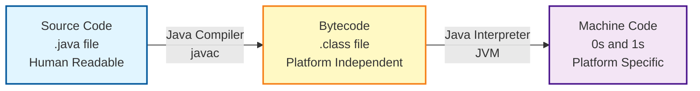
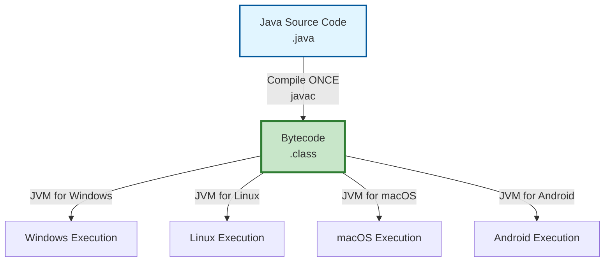
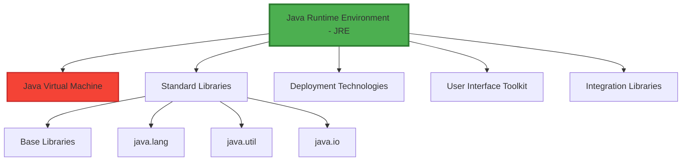
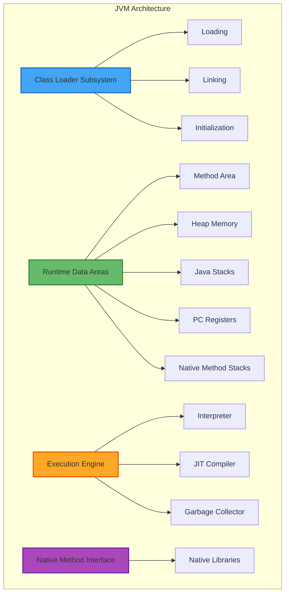
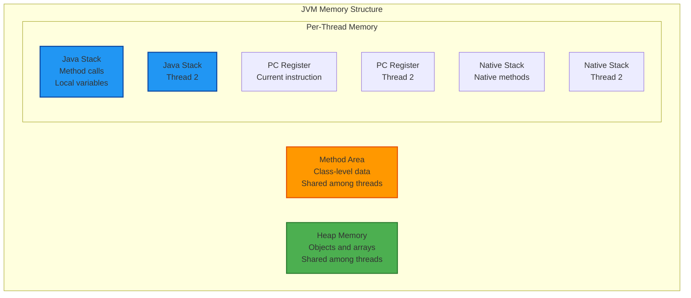
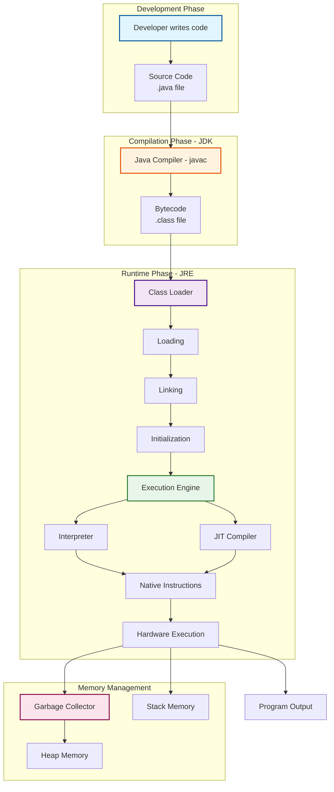

---
---


# 1. Introduction to Java and Programming Languages {#1-introduction}

## 1.1 Why Programming Languages Exist

**The Communication Challenge:**

Computers operate at the lowest level using machine code, which consists entirely of binary digits (0s and 1s). This binary representation is the only language that computer hardware directly understands and can execute. However, writing instructions in binary presents several fundamental challenges for human programmers.

**Challenges of Machine Code:**

- Binary code is extremely difficult for humans to read and comprehend
- Writing complex programs in 0s and 1s is error-prone and time-consuming
- Debugging and maintaining binary code is nearly impossible
- No abstraction or high-level constructs available
- Platform-specific instructions require different binary code for different processors

**The Solution: High-Level Programming Languages:**

Programming languages were created to bridge the gap between human thought processes and machine execution. These languages allow developers to write instructions in human-readable syntax, which are then translated into machine code that computers can execute.

**Benefits of High-Level Languages:**

- Human-readable syntax and structure
- Abstraction from hardware complexities
- Easier debugging and maintenance
- Code reusability through functions and classes
- Platform independence (in languages like Java)
- Rich standard libraries and frameworks
- Community support and documentation


# 2. Java Compilation and Execution Process {#2-compilation-execution}

## 2.1 The Two-Stage Translation Process

Java employs a unique two-stage translation process that contributes to its platform independence. Unlike languages like C or C++ that compile directly to machine code, Java introduces an intermediate bytecode format.




## 2.3 Java Interpreter

**Purpose and Function:**

The Java interpreter is a component of the Java Virtual Machine that translates bytecode into machine code that the underlying hardware can execute. This translation happens at runtime, just before the instructions are executed.

**Interpretation Process:**

The interpreter reads bytecode instructions one by one and converts them to native machine instructions. This process occurs dynamically during program execution.

**Characteristics of Interpretation:**

- Line-by-line execution of bytecode
- Runtime translation to machine code
- Platform-specific machine code generation
- Slower than pre-compiled native code
- Flexible and portable

**Interpretation Limitations:**

Traditional interpretation has performance drawbacks because each bytecode instruction must be translated every time it is encountered. If a method is called repeatedly, the interpreter must translate the same bytecode multiple times, leading to performance overhead.

**Solution: Just-In-Time (JIT) Compilation:**

To address interpretation overhead, modern JVMs include a Just-In-Time compiler that compiles frequently executed bytecode sections into native machine code, which is then cached for reuse. This dramatically improves performance while maintaining platform independence.


## 3.2 Java's Platform Independence Model

**How Java Achieves Platform Independence:**

Java introduces an abstraction layer between the compiled code and the operating system. Instead of compiling to platform-specific machine code, Java compiles to platform-independent bytecode. The Java Virtual Machine then handles the platform-specific execution.



**Key Principle:**

"Java is platform independent, but the JVM is platform dependent."

This statement encapsulates Java's architecture:
- **Java bytecode** is the same regardless of the platform
- **JVM implementation** is customized for each specific operating system and hardware combination
- The JVM acts as a translator between universal bytecode and platform-specific machine code


## 3.4 Platform-Dependent vs Platform-Independent Components

**Platform-Independent Components:**

- Java source code (.java files)
- Java bytecode (.class files)
- Java API (Application Programming Interface)
- Java language specifications
- Standard libraries and frameworks

**Platform-Dependent Components:**

- Java Virtual Machine (JVM) implementation
- Native method implementations
- Platform-specific file system access
- Hardware interaction layers
- Operating system integration

**Comparison with C/C++:**

```
C/C++ Compilation Model:
Source Code → Compiler → Platform-Specific Executable
(Must recompile for each platform)

Java Compilation Model:
Source Code → Compiler → Platform-Independent Bytecode → JVM → Execution
(Compile once, run on any platform with JVM)
```


## 4.2 JDK Components

### A) Development Tools

**Purpose:**

Development tools provide the infrastructure and utilities needed to create, build, and manage Java applications throughout the development lifecycle.

**Key Development Tools:**

1. **Java Compiler (javac):**
   - Translates Java source code to bytecode
   - Performs syntax and semantic checking
   - Generates .class files from .java files
   - Supports various compilation options and flags

2. **Java Debugger (jdb):**
   - Command-line debugging tool
   - Allows setting breakpoints
   - Inspect variables and call stack
   - Step through code execution

3. **Java Archive Tool (jar):**
   - Creates and manages JAR (Java Archive) files
   - Packages multiple class files and resources
   - Supports compression and digital signatures
   - Used for application distribution

4. **Java Documentation Generator (javadoc):**
   - Generates HTML documentation from source code comments
   - Creates API documentation automatically
   - Supports custom tags and styling
   - Essential for project documentation

5. **Java Disassembler (javap):**
   - Disassembles class files
   - Shows bytecode instructions
   - Useful for understanding compiled code
   - Debugging and optimization tool


### C) Archiver (JAR Tool)

**Java Archive Files:**

JAR files are compressed archive formats similar to ZIP files, specifically designed for distributing Java applications and libraries.

**JAR File Benefits:**

- Packages multiple class files into a single distributable unit
- Reduces download time through compression
- Preserves directory structure
- Can include metadata (manifest file)
- Supports digital signatures for security
- Executable JAR files can run directly with `java -jar`

**Creating JAR Files:**

```bash
# Create a JAR file
jar cf myapp.jar com/mycompany/*.class

# Create an executable JAR
jar cfe myapp.jar MainClass com/mycompany/*.class

# Extract JAR contents
jar xf myapp.jar

# View JAR contents
jar tf myapp.jar
```


### E) Interpreter and Loader

**Java Interpreter:**

The interpreter component executes bytecode instructions. In modern JVMs, the interpreter works in conjunction with the JIT compiler for optimal performance.

**Class Loader:**

The class loader is responsible for loading class files into memory when needed. It finds and loads classes dynamically at runtime.

**Loader Functions:**

- Locates class files (from file system or network)
- Reads bytecode into memory
- Verifies bytecode integrity
- Links classes with dependencies
- Initializes static variables


# 5. Java Runtime Environment (JRE) {#5-jre}

## 5.1 JRE Overview

**Definition:**

The Java Runtime Environment (JRE) is an installation package that provides all the necessary components to run Java applications. While it cannot compile Java source code (no compiler included), it contains everything needed to execute pre-compiled Java bytecode.

**Target Users:**

The JRE is designed for end users who need to run Java applications but do not need development capabilities. It is a smaller, lighter package compared to the JDK.

**Primary Purpose:**

The JRE creates the runtime environment in which Java applications execute. It handles all aspects of program execution, from loading classes to managing memory and providing access to system resources.




### B) Base Libraries

**Core Java Libraries:**

The base libraries provide fundamental functionality that all Java programs rely on. These libraries are written in Java and compiled to bytecode, ensuring platform independence.

**Essential Packages:**

1. **java.lang:**
   - Fundamental classes automatically imported
   - String, Math, System, Thread
   - Wrapper classes (Integer, Double, etc.)
   - Exception and Error classes

2. **java.util:**
   - Collections Framework (List, Set, Map)
   - Date and time utilities
   - Random number generation
   - Scanner for input handling

3. **java.io:**
   - Input/output operations
   - File handling
   - Stream processing
   - Serialization

4. **java.net:**
   - Network programming
   - URL handling
   - Socket communication
   - HTTP connections


### D) User Interface Toolkit

**GUI Frameworks:**

The JRE includes comprehensive libraries for building graphical user interfaces.

**Available Toolkits:**

1. **AWT (Abstract Window Toolkit):**
   - Original Java GUI framework
   - Platform-dependent components
   - Basic widgets and layouts

2. **Swing:**
   - Lightweight, pure Java components
   - Platform-independent appearance
   - Extensive component library
   - Pluggable look-and-feel

3. **JavaFX (in newer JRE versions):**
   - Modern UI framework
   - Rich multimedia support
   - CSS styling
   - Hardware-accelerated graphics


## 5.3 JRE vs JDK Comparison

```
┌──────────────────┬─────────────────────┬─────────────────────┐
│ Feature          │ JRE                 │ JDK                 │
├──────────────────┼─────────────────────┼─────────────────────┤
│ Purpose          │ Run Java programs   │ Develop and run     │
├──────────────────┼─────────────────────┼─────────────────────┤
│ Target Users     │ End users           │ Developers          │
├──────────────────┼─────────────────────┼─────────────────────┤
│ Contains JVM     │ Yes                 │ Yes                 │
├──────────────────┼─────────────────────┼─────────────────────┤
│ Contains         │ Yes                 │ Yes                 │
│ Libraries        │                     │                     │
├──────────────────┼─────────────────────┼─────────────────────┤
│ Compiler (javac) │ No                  │ Yes                 │
├──────────────────┼─────────────────────┼─────────────────────┤
│ Debugger         │ No                  │ Yes                 │
├──────────────────┼─────────────────────┼─────────────────────┤
│ JAR Tool         │ No                  │ Yes                 │
├──────────────────┼─────────────────────┼─────────────────────┤
│ Javadoc          │ No                  │ Yes                 │
├──────────────────┼─────────────────────┼─────────────────────┤
│ Size             │ Smaller             │ Larger              │
├──────────────────┼─────────────────────┼─────────────────────┤
│ Can Compile      │ No                  │ Yes                 │
│ .java files      │                     │                     │
├──────────────────┼─────────────────────┼─────────────────────┤
│ Can Run          │ Yes                 │ Yes                 │
│ .class files     │                     │                     │
└──────────────────┴─────────────────────┴─────────────────────┘
```


## 6.2 JVM Architecture Layers




## 6.4 JVM Memory Areas

The JVM divides memory into several runtime data areas, each serving a specific purpose.



### A) Method Area

**Purpose:**

The method area stores class-level data that is shared among all instances of a class.

**Contents:**

- Class structures (metadata)
- Method bytecode
- Field information
- Static variables
- Runtime constant pool
- Method and constructor code
- Special methods (class initializers)

**Characteristics:**

- Created when JVM starts
- Shared among all threads
- Garbage collected (in modern JVMs)
- Limited size (can cause OutOfMemoryError)
- Also known as "Permanent Generation" or "Metaspace" (Java 8+)


### C) Java Stack

**Purpose:**

Each thread has its own private Java stack that stores method invocations and local variables.

**Stack Frame:**

Each method invocation creates a stack frame containing:

1. **Local Variables:** Method parameters and local variables

2. **Operand Stack:** Working area for bytecode operations

3. **Frame Data:** Reference to runtime constant pool, exception handling info

**Stack Operations:**

```
Method Call Sequence:

main() called:
┌────────────────┐
│ main() frame   │
│ - local vars   │
└────────────────┘

main() calls foo():
┌────────────────┐
│ foo() frame    │
│ - local vars   │
├────────────────┤
│ main() frame   │
│ - local vars   │
└────────────────┘

foo() calls bar():
┌────────────────┐
│ bar() frame    │
│ - local vars   │
├────────────────┤
│ foo() frame    │
│ - local vars   │
├────────────────┤
│ main() frame   │
│ - local vars   │
└────────────────┘

bar() returns:
(bar frame removed)
┌────────────────┐
│ foo() frame    │
│ - local vars   │
├────────────────┤
│ main() frame   │
│ - local vars   │
└────────────────┘
```

**Characteristics:**

- Thread-private (each thread has own stack)
- LIFO (Last In, First Out) structure
- Limited size (StackOverflowError if exceeded)
- Fast allocation and deallocation
- Stores primitives and object references


### E) Native Method Stack

**Purpose:**

Native method stacks support native methods written in languages like C or C++ that are invoked through JNI (Java Native Interface).

**Characteristics:**

- Thread-private
- Used for native (non-Java) code execution
- Implementation-dependent
- Similar to Java stack but for native code


## 7.2 Loading Phase Details

**Binary Data Generation:**

When a class is loaded, the class loader reads the .class file and generates the following binary data:

1. **Fully Qualified Class Name:** Complete package and class name

2. **Immediate Parent Class Name:** Direct superclass information

3. **Modifiers:** Access modifiers (public, private, protected, etc.)

4. **Interfaces:** List of implemented interfaces

5. **Variables:** Field information with types and modifiers

6. **Methods:** Method signatures, code, and metadata

7. **Constructors:** Constructor definitions

8. **Static Initialization:** Static blocks and initializers

**Class Object Creation:**

After loading binary data, an instance of java.lang.Class is created in the heap memory. This Class object serves as an entry point to access the class metadata.

```java
// Accessing Class object
Class<?> clazz = MyClass.class;
String className = clazz.getName();
Method[] methods = clazz.getDeclaredMethods();
```


### Preparation

**Memory Allocation:**

During preparation, the JVM allocates memory for class variables (static fields) and initializes them with default values.

**Default Values by Type:**

```
Primitive Types:
- byte, short, int, long: 0
- float, double: 0.0
- char: '\u0000' (null character)
- boolean: false

Reference Types:
- All object references: null
```

**Example:**

```java
public class Example {
    static int count;           // Preparation: count = 0
    static String name;         // Preparation: name = null
    static boolean flag;        // Preparation: flag = false
    static double value;        // Preparation: value = 0.0
}
```


## 7.4 Initialization Phase

**Static Initialization:**

During initialization, static variables are assigned their actual values (as defined in code), and static initialization blocks are executed.

**Initialization Order:**

1. If the class has a superclass and it's not initialized, initialize the superclass first

2. Execute static variable initializers from top to bottom

3. Execute static initialization blocks from top to bottom

**Initialization Example:**

```java
public class Parent {
    static {
        System.out.println("Parent static block");
    }
    static int parentValue = initParent();
    
    static int initParent() {
        System.out.println("Parent static method");
        return 100;
    }
}

public class Child extends Parent {
    static {
        System.out.println("Child static block");
    }
    static int childValue = initChild();
    
    static int initChild() {
        System.out.println("Child static method");
        return 200;
    }
}

// When Child class is loaded:
// Output:
// Parent static block
// Parent static method
// Child static block
// Child static method
```

**Class Initialization Triggers:**

A class is initialized when:
- An instance is created (new keyword)
- A static method is invoked
- A static field is accessed (except compile-time constants)
- A subclass is initialized
- Designated as the startup class (contains main method)


## 8.2 Interpreter

**Purpose:**

The interpreter reads bytecode instructions one at a time and executes them directly without prior compilation to machine code.

**Interpretation Process:**

1. **Fetch:** Read next bytecode instruction

2. **Decode:** Determine what operation to perform

3. **Execute:** Perform the operation

4. **Update:** Move to next instruction

**Characteristics:**

- Line-by-line execution
- Immediate execution (no compilation delay)
- Platform-independent behavior
- Slower than compiled code
- Suitable for infrequently executed code

**Interpretation Overhead:**

The main disadvantage of interpretation is repeated translation. If a method is called 1000 times, the interpreter translates the same bytecode 1000 times.

```
Example: Method called repeatedly

Loop iteration 1: Interpret bytecode
Loop iteration 2: Interpret bytecode (again!)
Loop iteration 3: Interpret bytecode (again!)
...
Loop iteration 1000: Interpret bytecode (again!)

Total: 1000 interpretations of the same code
Problem: Wasted effort, slow execution
```


## 8.4 Garbage Collector

**Purpose:**

The garbage collector automatically manages memory by identifying and reclaiming memory occupied by objects that are no longer in use.

**Why Garbage Collection?**

In languages like C/C++, programmers must manually allocate and deallocate memory. Forgetting to free memory causes memory leaks. Freeing memory prematurely causes dangling pointers. Java's garbage collector eliminates these problems.

**Garbage Collection Process:**

1. **Mark Phase:** Identify which objects are still reachable (alive)

2. **Sweep Phase:** Reclaim memory from unreachable (dead) objects

3. **Compact Phase (optional):** Move live objects together to reduce fragmentation

**Reachability:**

An object is reachable if it can be accessed through a chain of references starting from GC roots.

**GC Roots:**

- Local variables in active methods
- Static variables
- Active threads
- JNI references

**Generational Garbage Collection:**

Most objects die young. Generational GC takes advantage of this by dividing the heap into generations:

1. **Young Generation:** 
   - New objects allocated here
   - Frequent, fast minor GC
   - Most objects die quickly

2. **Old Generation:**
   - Long-lived objects promoted here
   - Infrequent, slower major GC
   - Contains surviving objects

**Garbage Collection Algorithms:**

1. **Serial GC:** Single-threaded, simple, suitable for small applications

2. **Parallel GC:** Multi-threaded, high throughput, suitable for multi-core systems

3. **CMS (Concurrent Mark Sweep):** Low pause times, runs concurrently with application

4. **G1 (Garbage First):** Balanced throughput and latency, predictable pause times

5. **ZGC / Shenandoah:** Ultra-low pause times (< 10ms), suitable for large heaps


## 9.2 Heap Memory

**Purpose:**

Heap memory stores all objects and arrays created during program execution. All threads share the heap.

**Object Allocation:**

When you create an object with `new`, memory is allocated on the heap:

```java
Person person = new Person("Mukul", 25);
//       ↑               ↑
//    Reference      Object created
//    (on stack)      (on heap)
```

**Heap Memory Visualization:**

```
Stack (Thread 1):              Heap (Shared):
┌─────────────────┐           ┌──────────────────────┐
│ person          │──────────►│ Person Object        │
│ (reference)     │           │ ├─ name: "Mukul"     │
│ Value: 0x1234   │           │ ├─ age: 25           │
└─────────────────┘           │ └─ methods...        │
                               └──────────────────────┘
Stack (Thread 2):              
┌─────────────────┐           ┌──────────────────────┐
│ list            │──────────►│ ArrayList Object     │
│ (reference)     │           │ ├─ size: 100         │
│ Value: 0x5678   │           │ ├─ elements: [...]   │
└─────────────────┘           │ └─ methods...        │
                               └──────────────────────┘
```

**Heap Generations:**

```
┌────────────────────────────────────────────────────────┐
│                    HEAP MEMORY                         │
├────────────────────────────────────────────────────────┤
│  Young Generation                                      │
│  ┌──────────────┬─────────────┬─────────────┐        │
│  │    Eden      │  Survivor 0 │  Survivor 1 │        │
│  │   Space      │    (S0)     │    (S1)     │        │
│  │              │             │             │        │
│  │ New objects  │  Survived   │  Survived   │        │
│  │ created here │  1st GC     │  2nd GC     │        │
│  └──────────────┴─────────────┴─────────────┘        │
│                                                        │
│  Minor GC: Frequent, fast collection                  │
├────────────────────────────────────────────────────────┤
│  Old Generation (Tenured)                             │
│  ┌────────────────────────────────────────────────┐  │
│  │                                                │  │
│  │  Long-lived objects promoted from young gen   │  │
│  │  after surviving multiple minor GCs           │  │
│  │                                                │  │
│  └────────────────────────────────────────────────┘  │
│                                                        │
│  Major GC: Infrequent, slower collection              │
└────────────────────────────────────────────────────────┘
```

**Heap Characteristics:**

- Shared among all threads
- Dynamically sized (can grow/shrink)
- Managed by garbage collector
- Stores objects and arrays
- Slower allocation than stack
- Can cause OutOfMemoryError if exhausted


# 10. Complete Java Architecture {#10-complete-architecture}

## 10.1 End-to-End Execution Flow

This section presents the complete picture of how a Java program moves from source code to execution.




## 10.3 Detailed Execution Timeline

```
Complete Java Program Execution Timeline

PHASE 1: DEVELOPMENT
┌────────────────────────────────────────┐
│ Developer writes HelloWorld.java       │
│                                        │
│ public class HelloWorld {              │
│     public static void main(String[]) {│
│         System.out.println("Hello");   │
│     }                                  │
│ }                                      │
└────────────────────────────────────────┘

PHASE 2: COMPILATION (JDK - javac)
┌────────────────────────────────────────┐
│ $ javac HelloWorld.java                │
│                                        │
│ ├─ Lexical Analysis                   │
│ ├─ Syntax Checking                    │
│ ├─ Semantic Analysis                  │
│ └─ Bytecode Generation                │
│                                        │
│ Output: HelloWorld.class               │
└────────────────────────────────────────┘

PHASE 3: EXECUTION (JRE - java)
┌────────────────────────────────────────┐
│ $ java HelloWorld                      │
│                                        │
│ Step 1: CLASS LOADING                 │
│   ├─ Loading                          │
│   │   ├─ Read HelloWorld.class        │
│   │   ├─ Generate binary data         │
│   │   └─ Create Class object in heap  │
│   │                                   │
│   ├─ Linking                          │
│   │   ├─ Verification                 │
│   │   ├─ Preparation                  │
│   │   └─ Resolution                   │
│   │                                   │
│   └─ Initialization                   │
│       └─ Execute static blocks        │
│                                        │
│ Step 2: EXECUTION ENGINE              │
│   ├─ Find main() method               │
│   ├─ Create stack frame for main()    │
│   ├─ Interpreter begins execution     │
│   │   └─ Execute bytecode line by line│
│   │                                   │
│   ├─ Encounter System.out.println()   │
│   │   ├─ Load System class            │
│   │   ├─ Access 'out' field           │
│   │   ├─ Call println() method        │
│   │   └─ Print "Hello" to console     │
│   │                                   │
│   └─ main() returns                   │
│       └─ Remove stack frame           │
│                                        │
│ Step 3: TERMINATION                   │
│   ├─ All threads complete             │
│   ├─ Garbage collection (if needed)   │
│   └─ JVM exits                        │
└────────────────────────────────────────┘

OUTPUT:
Hello
```


# 11. Development Environment Setup {#11-environment-setup}

## 11.1 Required Software

To develop and run Java applications, you need to install the JDK and an Integrated Development Environment (IDE).

### A) Java Development Kit (JDK)

**Download Source:**

Official Oracle JDK: https://www.oracle.com/java/technologies/javase-downloads.html

**Alternative Distributions:**

- OpenJDK (open-source): https://openjdk.java.net/
- AdoptOpenJDK: https://adoptopenjdk.net/
- Amazon Corretto: https://aws.amazon.com/corretto/
- Azul Zulu: https://www.azul.com/downloads/zulu-community/

**Installation Steps:**

1. Download the appropriate installer for your operating system

2. Run the installer with administrator privileges

3. Follow the installation wizard

4. Set JAVA_HOME environment variable

5. Add JDK bin directory to system PATH

**Verify Installation:**

```bash
# Check Java version
java -version

# Check compiler version
javac -version

# Should display version information
```


## 11.2 Setting Up Environment Variables

### Windows

**Setting JAVA_HOME:**

1. Right-click "This PC" → Properties
2. Click "Advanced system settings"
3. Click "Environment Variables"
4. Under System Variables, click "New"
5. Variable name: `JAVA_HOME`
6. Variable value: `C:\Program Files\Java\jdk-17` (your JDK path)
7. Click OK

**Updating PATH:**

1. In Environment Variables, find "Path" under System Variables
2. Click "Edit"
3. Click "New"
4. Add: `%JAVA_HOME%\bin`
5. Click OK

**Verify:**

```cmd
echo %JAVA_HOME%
java -version
javac -version
```


### Linux

**Setting JAVA_HOME:**

Edit `.bashrc` or `.profile`:

```bash
# Open terminal and edit bashrc
nano ~/.bashrc

# Add the following lines
export JAVA_HOME=/usr/lib/jvm/java-17-openjdk-amd64
export PATH=$JAVA_HOME/bin:$PATH

# Save and reload
source ~/.bashrc
```

**Verify:**

```bash
echo $JAVA_HOME
java -version
javac -version
```


## 11.4 Common Setup Issues and Solutions

**Issue 1: 'javac' is not recognized**

Solution: Java bin directory not in PATH
- Verify JAVA_HOME is set correctly
- Ensure %JAVA_HOME%\bin (Windows) or $JAVA_HOME/bin (Linux/Mac) is in PATH
- Restart terminal/command prompt after changes

**Issue 2: Wrong Java version**

Solution: Multiple Java installations
- Check which java is being used: `which java` (Linux/Mac) or `where java` (Windows)
- Ensure JAVA_HOME points to desired version
- Update PATH to prioritize correct JDK

**Issue 3: Class not found error**

Solution: Classpath or naming issues
- Ensure class name matches file name
- Check for package declarations
- Verify you're running from correct directory

**Issue 4: Permission denied (Linux/Mac)**

Solution: Insufficient permissions
- Use sudo for system-wide installation
- Install in user directory instead
- Check file permissions: `chmod +x file`

