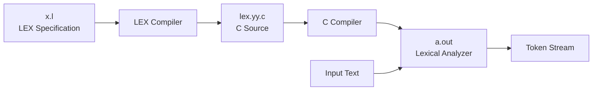

---
---

# Compiler Design: Complete Notes


## 2. Compiler Phases

### Phase Pipeline
```
┌──────────────────┐
│  Source Code     │
└────────┬─────────┘
         │
         ▼
┌──────────────────┐
│ Lexical Analysis │
└────────┬─────────┘
         │
         ▼
┌──────────────────┐
│ Syntax Analysis  │
└────────┬─────────┘
         │
         ▼
┌──────────────────┐
│ Semantic Analysis│
└────────┬─────────┘
         │
         ▼
┌──────────────────┐
│ Intermediate Code│
│   Generation     │
└────────┬─────────┘
         │
         ▼
┌──────────────────┐
│ Code Optimization│
└────────┬─────────┘
         │
         ▼
┌──────────────────┐
│ Code Generation  │
└────────┬─────────┘
         │
         ▼
┌──────────────────┐
│  Target Code     │
└──────────────────┘
```

**Key Concept:** Each phase's output serves as input to the next phase, creating a sequential pipeline.


## 4. Cross Compiler

### Definition
A compiler that runs on one machine (host) but generates code for another machine (target).

T Diagram
1) same machine 
```

Python ---> Byte                    Python ---> byte
	   |                                    |
	 c++ c++ ---> Assembly lang  Assembly lang
	         | 
	 assembly lang
```


2) different machine

let n = machine code
let m = machine code 
```

  x ---> n machine  AL             x  ---> n machine 
      |                                 |
	 c++ c++ ---> M machine AL   M machine AL
	         | 
	 M machine AL
```

### Same Machine Cross Compilation

#### Example: Python to Bytecode
```
┌────────┐     ┌─────┐
│ Python │     │ C++ │
├────────┤  +  ├─────┤  =  Python Compiler
│  C++   │     │ ASM │
├────────┤     ├─────┤
│  ASM   │     │ ASM │
└────────┘     └─────┘
```

### Different Machine Cross Compilation

#### Example: Compiler for Target Machine N
```
┌─────┐     ┌─────┐
│  X  │     │ C++ │
├─────┤  +  ├─────┤  =  Cross Compiler
│ C++ │     │  M  │
├─────┤     ├─────┤
│  N  │     │  M  │
└─────┘     └─────┘

Where:
N = Target machine code
M = Host machine code
```

### Assembly Language and Machine Dependence

**Question:** Is assembly language machine-dependent?

**Answer:** YES
- Each processor architecture has its own assembly language
- x86, ARM, MIPS have different instruction sets
- Registers, addressing modes vary by architecture

**Exception:** Virtual Machines
- JVM (Java Virtual Machine) generates bytecode
- Bytecode is platform-independent
- JVM itself is platform-specific
- Enables "Write Once, Run Anywhere"

```
┌──────────────┐
│ Java Source  │
└──────┬───────┘
       │
       ▼
┌──────────────┐
│   Compiler   │
└──────┬───────┘
       │
       ▼
┌──────────────┐
│   Bytecode   │ (Platform Independent)
└──────┬───────┘
       │
   ┌───┴───┐
   │       │
   ▼       ▼
┌─────┐ ┌─────┐
│ JVM │ │ JVM │
│ Win │ │Linux│
└─────┘ └─────┘
```


## 6. Lexical Analyzer Generator (LEX)

### Overview
LEX is a Unix utility for automatic generation of lexical analyzers.

### LEX Workflow



### Process Description

**Step 1:** Write LEX Specification File (x.l)
```
Definitions
%%
Rules
%%
User Code
```

**Step 2:** LEX Compiler processes x.l
- Reads patterns and actions
- Generates C code

**Step 3:** Produces lex.yy.c
- C source file containing lexical analyzer

**Step 4:** C Compiler compiles lex.yy.c
- Creates executable analyzer

**Step 5:** Executable a.out
- Final lexical analyzer program

### LEX Program Structure

```
┌─────────────────────────────────┐
│      DECLARATIONS SECTION       │
│  - C code in %{ }%              │
│  - Pattern definitions          │
│  - Regular definitions           │
└─────────────────────────────────┘
              │
         %%   │
              │
┌─────────────────────────────────┐
│         RULES SECTION           │
│  Pattern  { Action }            │
│  Pattern  { Action }            │
│  ...                            │
└─────────────────────────────────┘
              │
         %%   │
              │
┌─────────────────────────────────┐
│     USER CODE SECTION           │
│  - Auxiliary functions          │
│  - main() function              │
└─────────────────────────────────┘
```

### LEX Program Components

#### 1. Declarations Section
```c
%{
    #include <stdio.h>
    int token_count = 0;
%}

DIGIT    [0-9]
LETTER   [a-zA-Z]
ID       {LETTER}({LETTER}|{DIGIT})*
```

#### 2. Rules Section
```c
%%
{ID}        { printf("IDENTIFIER: %s\n", yytext); }
{DIGIT}+    { printf("NUMBER: %s\n", yytext); }
"+"         { printf("PLUS\n"); }
"-"         { printf("MINUS\n"); }
"*"         { printf("MULTIPLY\n"); }
"/"         { printf("DIVIDE\n"); }
"="         { printf("ASSIGN\n"); }
[ \t\n]     { /* skip whitespace */ }
.           { printf("UNKNOWN: %s\n", yytext); }
%%
```

#### 3. User Code Section
```c
%%
int main(int argc, char **argv) {
    yylex();
    return 0;
}

int yywrap() {
    return 1;
}
```

### Complete Example

**Input:** x.l
```
%{
#include <stdio.h>
%}

%%
[0-9]+          { printf("NUMBER: %s\n", yytext); }
[a-zA-Z]+       { printf("WORD: %s\n", yytext); }
[+\-*/=]        { printf("OPERATOR: %s\n", yytext); }
[ \t\n]         ;
.               { printf("UNKNOWN: %s\n", yytext); }
%%

int main() {
    yylex();
    return 0;
}

int yywrap() {
    return 1;
}
```

**Processing:**
```
$ lex x.l
$ gcc lex.yy.c -ll
$ echo "x = a + b * 2" | ./a.out
```

**Output:**
```
WORD: x
OPERATOR: =
WORD: a
OPERATOR: +
WORD: b
OPERATOR: *
NUMBER: 2
```


**End of Notes**


